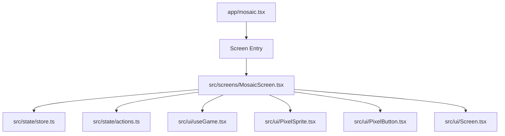
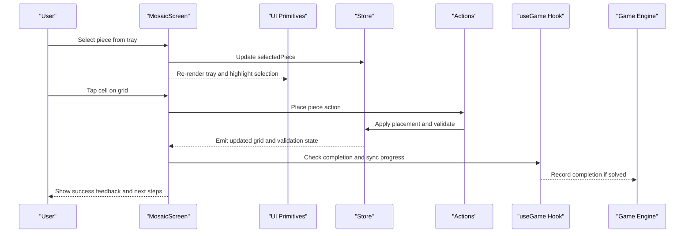
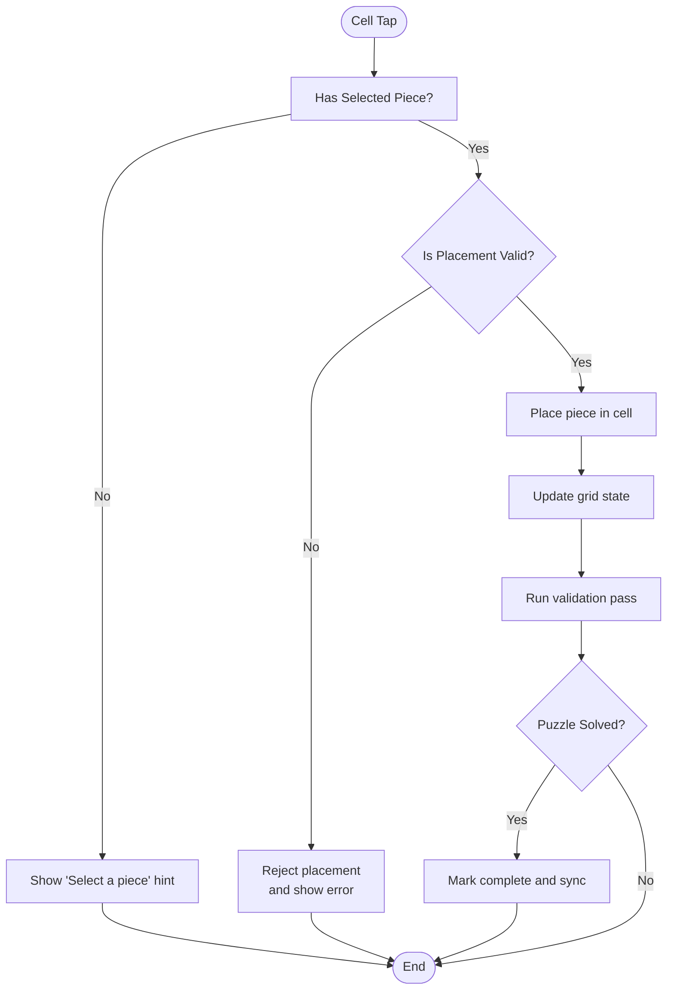
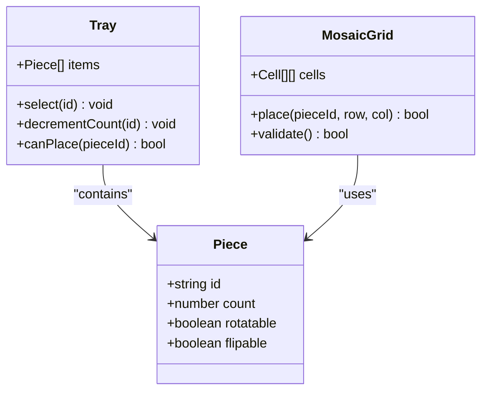
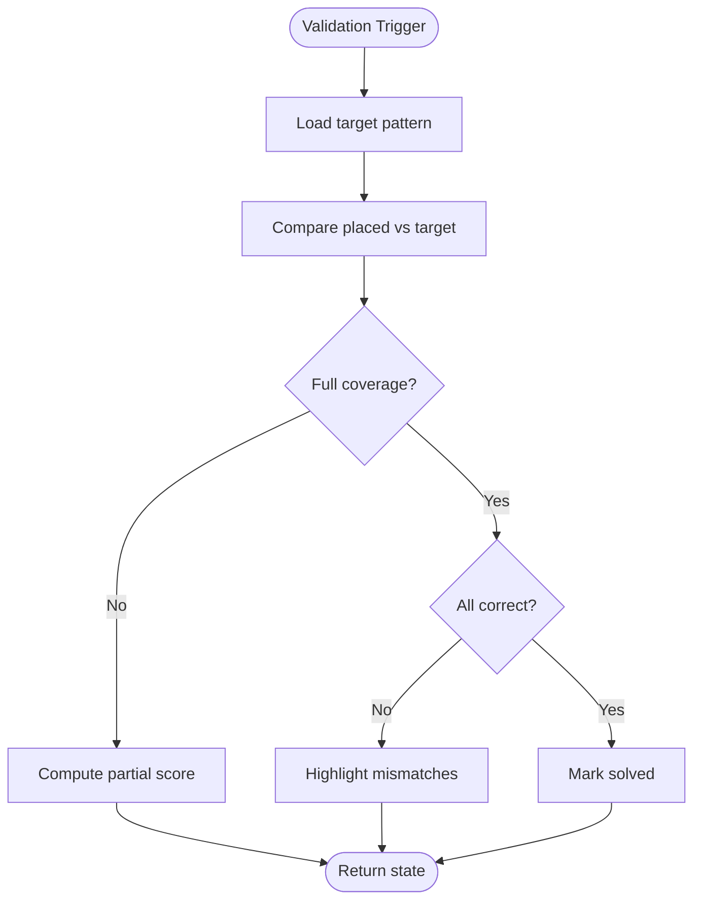
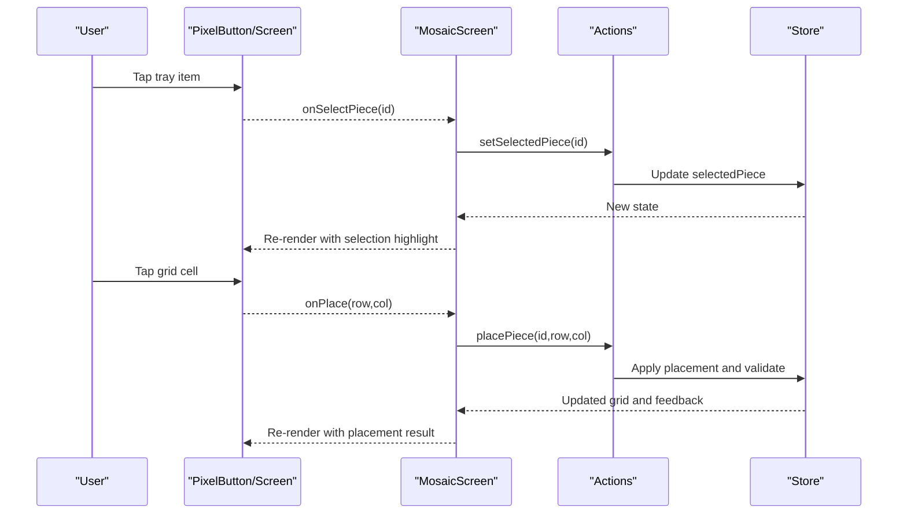
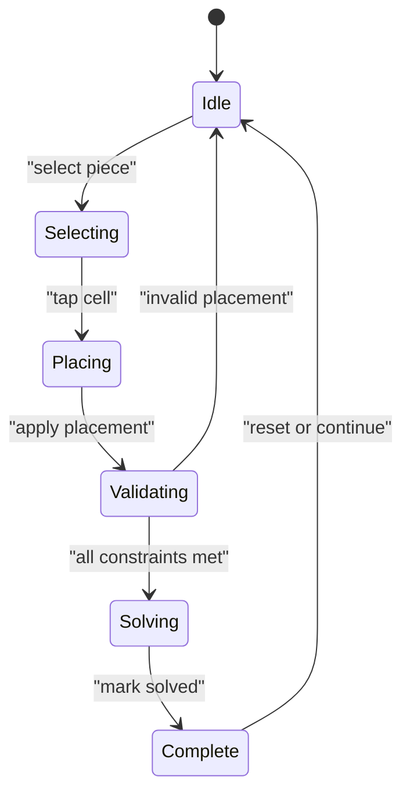
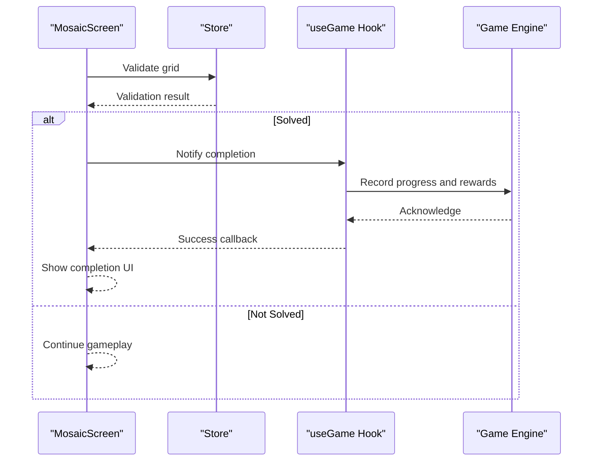
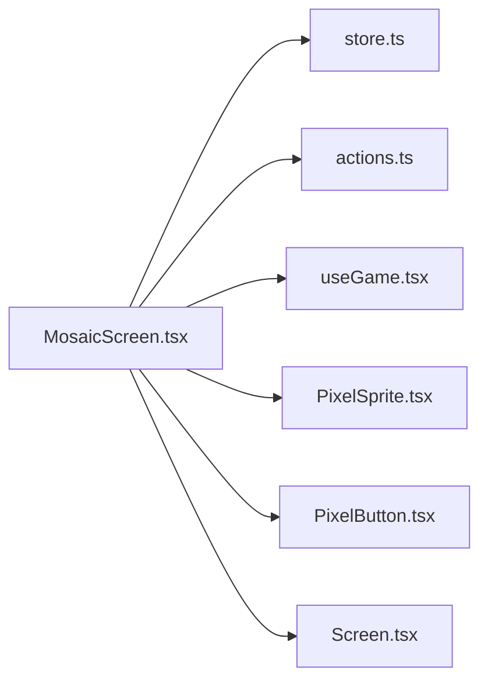

# Mosaic Screen

<cite>
**Referenced Files in This Document**
- [mosaic.tsx](file://app/mosaic.tsx)
- [MosaicScreen.tsx](file://src/screens/MosaicScreen.tsx)
- [store.ts](file://src/state/store.ts)
- [actions.ts](file://src/state/actions.ts)
- [useGame.tsx](file://src/ui/useGame.tsx)
- [PixelSprite.tsx](file://src/ui/PixelSprite.tsx)
- [PixelButton.tsx](file://src/ui/PixelButton.tsx)
- [Screen.tsx](file://src/ui/Screen.tsx)
</cite>

## Table of Contents

1. [Introduction](#introduction)
2. [Project Structure](#project-structure)
3. [Core Components](#core-components)
4. [Architecture Overview](#architecture-overview)
5. [Detailed Component Analysis](#detailed-component-analysis)
6. [Dependency Analysis](#dependency-analysis)
7. [Performance Considerations](#performance-considerations)
8. [Troubleshooting Guide](#troubleshooting-guide)
9. [Conclusion](#conclusion)

## Introduction

This document explains the MosaicScreen component that implements puzzle-solving mechanics for a mosaic grid. It covers how the mosaic grid is represented, how pieces are selected and placed, how puzzles are validated, and how user input flows through the system. It also documents puzzle state management, completion detection, difficulty levels, hint systems, progress tracking, and synchronization with the game engine.

## Project Structure

The mosaic feature spans two primary files:

- A screen entry point under app that navigates to the mosaic experience.
- The core MosaicScreen implementation under src/screens that contains the UI logic, state handling, and integration with the global store and UI primitives.

**Diagram sources**

- [mosaic.tsx](file://app/mosaic.tsx)
- [MosaicScreen.tsx](file://src/screens/MosaicScreen.tsx)
- [store.ts](file://src/state/store.ts)
- [actions.ts](file://src/state/actions.ts)
- [useGame.tsx](file://src/ui/useGame.tsx)
- [PixelSprite.tsx](file://src/ui/PixelSprite.tsx)
- [PixelButton.tsx](file://src/ui/PixelButton.tsx)
- [Screen.tsx](file://src/ui/Screen.tsx)

**Section sources**

- [mosaic.tsx](file://app/mosaic.tsx)
- [MosaicScreen.tsx](file://src/screens/MosaicScreen.tsx)

## Core Components

- MosaicScreen: Main React component that renders the mosaic grid, piece tray, controls, hints, and progress indicators. It manages selection state, placement actions, validation feedback, and completion flow.
- Store and Actions: Centralized state container and reducers/actions that persist puzzle configuration, current grid state, selected piece, hints used, and completion status.
- useGame hook: Provides access to game-level context such as level metadata, difficulty settings, and engine synchronization points.
- UI Primitives: PixelSprite for rendering pixel art tiles, PixelButton for interactive elements, and Screen as the base layout wrapper.

Key responsibilities:

- Grid representation and rendering
- Piece selection and placement via touch/click
- Validation of placements against target patterns
- Hint generation and consumption
- Progress tracking and completion detection
- State persistence and synchronization with the game engine

**Section sources**

- [MosaicScreen.tsx](file://src/screens/MosaicScreen.tsx)
- [store.ts](file://src/state/store.ts)
- [actions.ts](file://src/state/actions.ts)
- [useGame.tsx](file://src/ui/useGame.tsx)
- [PixelSprite.tsx](file://src/ui/PixelSprite.tsx)
- [PixelButton.tsx](file://src/ui/PixelButton.tsx)
- [Screen.tsx](file://src/ui/Screen.tsx)

## Architecture Overview

The MosaicScreen integrates with the global store and UI layer to provide an interactive puzzle experience. User interactions trigger actions that update the store, which re-renders the grid and related UI elements. Completion triggers engine synchronization to record progress and unlock subsequent content.

**Diagram sources**

- [MosaicScreen.tsx](file://src/screens/MosaicScreen.tsx)
- [store.ts](file://src/state/store.ts)
- [actions.ts](file://src/state/actions.ts)
- [useGame.tsx](file://src/ui/useGame.tsx)

## Detailed Component Analysis

### MosaicGrid System

- Grid model: A 2D array representing cells, each storing either empty or a piece identifier. Dimensions are derived from puzzle configuration.
- Rendering: Each cell is rendered using a pixel sprite that reflects its current state (empty, placed, highlighted).
- Interaction: Cell taps attempt to place the currently selected piece; invalid placements are rejected with visual feedback.

**Diagram sources**

- [MosaicScreen.tsx](file://src/screens/MosaicScreen.tsx)

**Section sources**

- [MosaicScreen.tsx](file://src/screens/MosaicScreen.tsx)

### Piece Tray and Selection Logic

- Tray model: A list of available pieces with counts and identifiers. Pieces can be rotated/flipped depending on puzzle rules.
- Selection: Tapping a tray item sets it as the active piece; the UI highlights the selection and updates the cursor behavior on the grid.
- Constraints: Some puzzles restrict piece usage (e.g., limited counts), enforced by the store and actions.

**Diagram sources**

- [MosaicScreen.tsx](file://src/screens/MosaicScreen.tsx)

**Section sources**

- [MosaicScreen.tsx](file://src/screens/MosaicScreen.tsx)

### Puzzle Validation Algorithm

- Target pattern: A reference grid defining the desired final state.
- Validation checks:
  - Coverage: All required cells must be filled according to the target.
  - Correctness: Placed pieces must match the target at their positions.
  - Constraints: Piece counts and orientation rules must be satisfied.
- Incremental feedback: After each placement, the system computes partial correctness and highlights mismatches.

**Diagram sources**

- [MosaicScreen.tsx](file://src/screens/MosaicScreen.tsx)

**Section sources**

- [MosaicScreen.tsx](file://src/screens/MosaicScreen.tsx)

### User Input Handling

- Input sources: Touch/click events on grid cells and tray items.
- Event pipeline:
  - Capture event coordinates
  - Map to grid/tray indices
  - Dispatch appropriate action (select piece, place piece, rotate/flip)
  - Update store and re-render UI
- Accessibility: Keyboard navigation support for selecting and placing pieces.

**Diagram sources**

- [MosaicScreen.tsx](file://src/screens/MosaicScreen.tsx)
- [PixelButton.tsx](file://src/ui/PixelButton.tsx)
- [Screen.tsx](file://src/ui/Screen.tsx)

**Section sources**

- [MosaicScreen.tsx](file://src/screens/MosaicScreen.tsx)
- [PixelButton.tsx](file://src/ui/PixelButton.tsx)
- [Screen.tsx](file://src/ui/Screen.tsx)

### Puzzle State Management

- State fields:
  - grid: Current placement state
  - target: Target pattern for validation
  - selectedPiece: Currently selected piece ID
  - hintsUsed: Number of hints consumed
  - progress: Percentage completed or step count
  - solved: Boolean indicating completion
- Persistence: Changes are persisted via the store to survive navigation and app restarts.
- Sync: On solve, the game engine is notified to update global progress and unlock rewards.

**Diagram sources**

- [MosaicScreen.tsx](file://src/screens/MosaicScreen.tsx)
- [store.ts](file://src/state/store.ts)

**Section sources**

- [MosaicScreen.tsx](file://src/screens/MosaicScreen.tsx)
- [store.ts](file://src/state/store.ts)

### Difficulty Levels

- Configuration: Difficulty affects grid size, piece complexity, rotation/flip allowances, and hint availability.
- Behavior:
  - Easy: Smaller grids, fewer rotations, more hints.
  - Medium: Moderate complexity with some constraints.
  - Hard: Larger grids, strict constraints, limited hints.
- Runtime: Difficulty is read from the game context and applied when loading puzzle data.

**Section sources**

- [MosaicScreen.tsx](file://src/screens/MosaicScreen.tsx)
- [useGame.tsx](file://src/ui/useGame.tsx)

### Hint Systems

- Types:
  - Reveal cell: Highlights a correct placement.
  - Suggest piece: Indicates which piece should go next.
  - Undo last move: Reverts the most recent placement.
- Costs: Hints may consume resources or reduce scoring based on difficulty.
- Usage: Hints are tracked in state and affect progress calculations.

**Section sources**

- [MosaicScreen.tsx](file://src/screens/MosaicScreen.tsx)

### Progress Tracking

- Metrics:
  - Cells filled vs total
  - Correct placements vs total
  - Hints used
  - Time elapsed (optional)
- Display: Progress bar and percentage shown in the UI.
- Milestones: Intermediate achievements can unlock features or rewards.

**Section sources**

- [MosaicScreen.tsx](file://src/screens/MosaicScreen.tsx)

### Completion Detection and Engine Sync

- Detection: When validation passes all constraints, the puzzle is marked solved.
- Sync: The game engine is notified to update global state, award rewards, and enable next stages.
- Feedback: Visual and audio cues confirm completion.

**Diagram sources**

- [MosaicScreen.tsx](file://src/screens/MosaicScreen.tsx)
- [useGame.tsx](file://src/ui/useGame.tsx)

**Section sources**

- [MosaicScreen.tsx](file://src/screens/MosaicScreen.tsx)
- [useGame.tsx](file://src/ui/useGame.tsx)

## Dependency Analysis

MosaicScreen depends on several modules for state, UI, and game integration.

**Diagram sources**

- [MosaicScreen.tsx](file://src/screens/MosaicScreen.tsx)
- [store.ts](file://src/state/store.ts)
- [actions.ts](file://src/state/actions.ts)
- [useGame.tsx](file://src/ui/useGame.tsx)
- [PixelSprite.tsx](file://src/ui/PixelSprite.tsx)
- [PixelButton.tsx](file://src/ui/PixelButton.tsx)
- [Screen.tsx](file://src/ui/Screen.tsx)

**Section sources**

- [MosaicScreen.tsx](file://src/screens/MosaicScreen.tsx)
- [store.ts](file://src/state/store.ts)
- [actions.ts](file://src/state/actions.ts)
- [useGame.tsx](file://src/ui/useGame.tsx)
- [PixelSprite.tsx](file://src/ui/PixelSprite.tsx)
- [PixelButton.tsx](file://src/ui/PixelButton.tsx)
- [Screen.tsx](file://src/ui/Screen.tsx)

## Performance Considerations

- Efficient grid updates: Batch state changes to minimize re-renders.
- Lazy rendering: Only render visible cells and tray items.
- Validation optimization: Compute incremental diffs rather than full recomputation where possible.
- Memory usage: Keep piece and grid data structures compact; avoid unnecessary object allocations.

[No sources needed since this section provides general guidance]

## Troubleshooting Guide

Common issues and resolutions:

- Placement rejected: Ensure the selected piece matches constraints and target pattern.
- Stuck state: Use undo hint or reset puzzle if necessary.
- Progress not syncing: Verify completion flag and engine sync callbacks.
- UI not updating: Confirm store updates and re-render triggers.

**Section sources**

- [MosaicScreen.tsx](file://src/screens/MosaicScreen.tsx)
- [store.ts](file://src/state/store.ts)

## Conclusion

The MosaicScreen component delivers a robust puzzle-solving experience through a well-structured grid system, clear piece placement logic, and comprehensive validation. It integrates seamlessly with the game engine for state synchronization, supports multiple difficulty levels, and provides helpful hint mechanisms. By following the documented interaction patterns and state management practices, developers can extend and customize the mosaic feature effectively.
