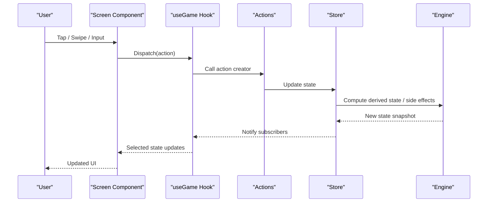
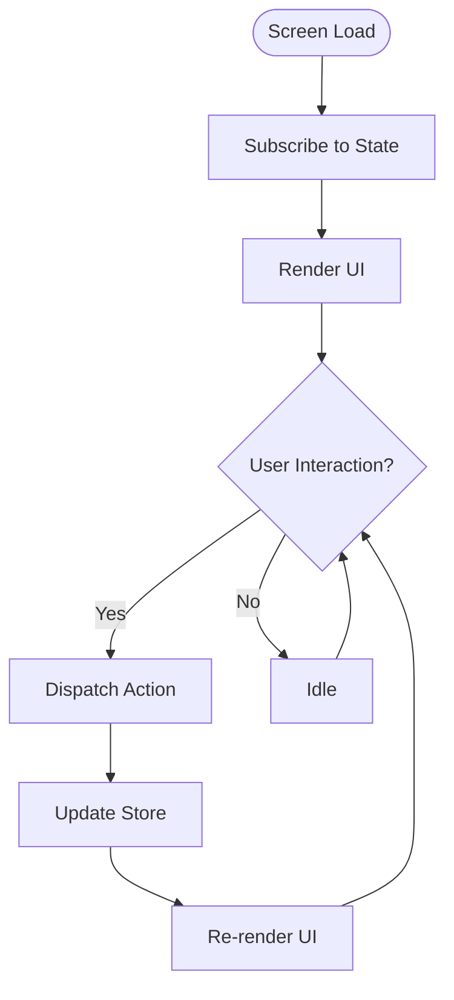
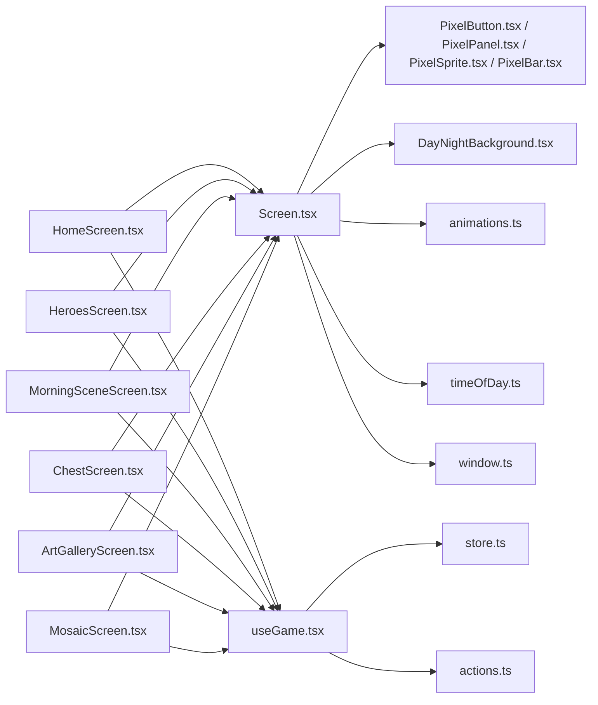

# Screen Components

<cite>
**Referenced Files in This Document**
- [HomeScreen.tsx](file://src/screens/HomeScreen.tsx)
- [HeroesScreen.tsx](file://src/screens/HeroesScreen.tsx)
- [MorningSceneScreen.tsx](file://src/screens/MorningSceneScreen.tsx)
- [ChestScreen.tsx](file://src/screens/ChestScreen.tsx)
- [ArtGalleryScreen.tsx](file://src/screens/ArtGalleryScreen.tsx)
- [MosaicScreen.tsx](file://src/screens/MosaicScreen.tsx)
- [Screen.tsx](file://src/ui/Screen.tsx)
- [useGame.tsx](file://src/ui/useGame.tsx)
- [store.ts](file://src/state/store.ts)
- [actions.ts](file://src/state/actions.ts)
- [theme.ts](file://src/ui/theme.ts)
- [PixelButton.tsx](file://src/ui/PixelButton.tsx)
- [PixelPanel.tsx](file://src/ui/PixelPanel.tsx)
- [PixelSprite.tsx](file://src/ui/PixelSprite.tsx)
- [PixelBar.tsx](file://src/ui/PixelBar.tsx)
- [SoulTether.tsx](file://src/ui/SoulTether.tsx)
- [HeroSprite.tsx](file://src/ui/HeroSprite.tsx)
- [DayNightBackground.tsx](file://src/ui/DayNightBackground.tsx)
- [animations.ts](file://src/ui/animations.ts)
- [timeOfDay.ts](file://src/ui/timeOfDay.ts)
- [window.ts](file://src/ui/window.ts)
</cite>

## Table of Contents

1. [Introduction](#introduction)
2. [Project Structure](#project-structure)
3. [Core Components](#core-components)
4. [Architecture Overview](#architecture-overview)
5. [Detailed Component Analysis](#detailed-component-analysis)
6. [Dependency Analysis](#dependency-analysis)
7. [Performance Considerations](#performance-considerations)
8. [Troubleshooting Guide](#troubleshooting-guide)
9. [Conclusion](#conclusion)

## Introduction

This document provides comprehensive documentation for the React Native screen components that implement user interfaces and interactions. It focuses on major screens: Home, Heroes, Morning Scene, Chest, Art Gallery, and Mosaic. You will learn how these screens are composed, how they navigate between routes, how they integrate with state management and the engine layer, and how they handle user interactions. Styling approaches, responsive design considerations, and accessibility features are also covered, along with examples of screen-specific functionality and integration patterns.

## Project Structure

The screen components live under src/screens and are built using shared UI primitives from src/ui. State is managed via a store and actions in src/state, while game logic resides in src/engine. The app entry points (e.g., index.tsx and _layout.tsx) wire up navigation and render the appropriate screens based on application state.

```mermaid
graph TB
subgraph "App Entry"
Layout["_layout.tsx"]
Index["index.tsx"]
end
subgraph "Screens"
Home["HomeScreen.tsx"]
Heroes["HeroesScreen.tsx"]
Morning["MorningSceneScreen.tsx"]
Chest["ChestScreen.tsx"]
Art["ArtGalleryScreen.tsx"]
Mosaic["MosaicScreen.tsx"]
end
subgraph "UI Primitives"
BaseScreen["Screen.tsx"]
Button["PixelButton.tsx"]
Panel["PixelPanel.tsx"]
Sprite["PixelSprite.tsx"]
Bar["PixelBar.tsx"]
Tether["SoulTether.tsx"]
HeroSprite["HeroSprite.tsx"]
BG["DayNightBackground.tsx"]
Anim["animations.ts"]
Time["timeOfDay.ts"]
Win["window.ts"]
end
subgraph "State"
Store["store.ts"]
Actions["actions.ts"]
end
subgraph "Engine"
Engine["engine/*"]
end
Layout --> Index
Index --> Home
Index --> Heroes
Index --> Morning
Index --> Chest
Index --> Art
Index --> Mosaic
Home --> BaseScreen
Heroes --> BaseScreen
Morning --> BaseScreen
Chest --> BaseScreen
Art --> BaseScreen
Mosaic --> BaseScreen
Home --> Store
Heroes --> Store
Morning --> Store
Chest --> Store
Art --> Store
Mosaic --> Store
Store --> Actions
Store --> Engine
```

**Diagram sources**

- [_layout.tsx](file://app/_layout.tsx)
- [index.tsx](file://app/index.tsx)
- [HomeScreen.tsx](file://src/screens/HomeScreen.tsx)
- [HeroesScreen.tsx](file://src/screens/HeroesScreen.tsx)
- [MorningSceneScreen.tsx](file://src/screens/MorningSceneScreen.tsx)
- [ChestScreen.tsx](file://src/screens/ChestScreen.tsx)
- [ArtGalleryScreen.tsx](file://src/screens/ArtGalleryScreen.tsx)
- [MosaicScreen.tsx](file://src/screens/MosaicScreen.tsx)
- [Screen.tsx](file://src/ui/Screen.tsx)
- [store.ts](file://src/state/store.ts)
- [actions.ts](file://src/state/actions.ts)

**Section sources**

- [HomeScreen.tsx](file://src/screens/HomeScreen.tsx)
- [HeroesScreen.tsx](file://src/screens/HeroesScreen.tsx)
- [MorningSceneScreen.tsx](file://src/screens/MorningSceneScreen.tsx)
- [ChestScreen.tsx](file://src/screens/ChestScreen.tsx)
- [ArtGalleryScreen.tsx](file://src/screens/ArtGalleryScreen.tsx)
- [MosaicScreen.tsx](file://src/screens/MosaicScreen.tsx)
- [Screen.tsx](file://src/ui/Screen.tsx)
- [store.ts](file://src/state/store.ts)
- [actions.ts](file://src/state/actions.ts)

## Core Components

- Base Screen Container: A shared wrapper component standardizes layout, safe areas, background rendering, and common props across all screens.
- Shared UI Primitives: Pixel-based buttons, panels, sprites, bars, and animated backgrounds provide consistent visual style and interaction affordances.
- Game Hook: A hook encapsulates reading and dispatching to the global store, exposing selectors and action creators to screens.
- Theme and Window Utilities: Centralized theme tokens and window sizing utilities ensure responsive behavior and consistent styling.

Key responsibilities:

- Base Screen: Provides layout scaffolding, background composition, and accessibility defaults.
- Primitives: Offer reusable interactive elements with pixel-art styling and animation hooks.
- Game Hook: Bridges screens to state and engine by subscribing to relevant slices and providing typed actions.

**Section sources**

- [Screen.tsx](file://src/ui/Screen.tsx)
- [PixelButton.tsx](file://src/ui/PixelButton.tsx)
- [PixelPanel.tsx](file://src/ui/PixelPanel.tsx)
- [PixelSprite.tsx](file://src/ui/PixelSprite.tsx)
- [PixelBar.tsx](file://src/ui/PixelBar.tsx)
- [SoulTether.tsx](file://src/ui/SoulTether.tsx)
- [HeroSprite.tsx](file://src/ui/HeroSprite.tsx)
- [DayNightBackground.tsx](file://src/ui/DayNightBackground.tsx)
- [animations.ts](file://src/ui/animations.ts)
- [timeOfDay.ts](file://src/ui/timeOfDay.ts)
- [window.ts](file://src/ui/window.ts)
- [useGame.tsx](file://src/ui/useGame.tsx)
- [store.ts](file://src/state/store.ts)
- [actions.ts](file://src/state/actions.ts)

## Architecture Overview

Screens follow a unidirectional data flow:

- User interactions trigger actions dispatched through the game hook.
- Actions update the store, which may call into engine modules to compute new state.
- Screens subscribe to selected state slices and re-render accordingly.
- Navigation is handled by the app’s router, typically triggered by callbacks within screens.



**Diagram sources**

- [useGame.tsx](file://src/ui/useGame.tsx)
- [actions.ts](file://src/state/actions.ts)
- [store.ts](file://src/state/store.ts)

## Detailed Component Analysis

### Home Screen

Responsibilities:

- Presents an overview of the current game state and quick actions.
- Navigates to other screens (e.g., Heroes, Morning Scene).
- Displays contextual information such as time-of-day or scene banners.

Navigation patterns:

- Uses navigation callbacks to push routes for Heroes, Morning Scene, and other destinations.

State integration:

- Subscribes to minimal slices needed for home view (e.g., current scene, player status).
- Dispatches actions to start scenes or open menus.

Interactions:

- Buttons and panels trigger navigation or state transitions.
- Background adapts to time-of-day.

Styling and responsiveness:

- Uses theme tokens and window utilities for consistent sizing and scaling.
- Adapts layout for different screen sizes.

Accessibility:

- Labels and roles applied to interactive elements.
- Focus order and announcements considered where applicable.

**Section sources**

- [HomeScreen.tsx](file://src/screens/HomeScreen.tsx)
- [Screen.tsx](file://src/ui/Screen.tsx)
- [PixelButton.tsx](file://src/ui/PixelButton.tsx)
- [PixelPanel.tsx](file://src/ui/PixelPanel.tsx)
- [DayNightBackground.tsx](file://src/ui/DayNightBackground.tsx)
- [timeOfDay.ts](file://src/ui/timeOfDay.ts)
- [useGame.tsx](file://src/ui/useGame.tsx)
- [store.ts](file://src/state/store.ts)
- [actions.ts](file://src/state/actions.ts)

### Heroes Screen

Responsibilities:

- Lists heroes and shows hero details.
- Allows selecting heroes and viewing stats or inventory.

Navigation patterns:

- Navigates to hero detail views or related screens.

State integration:

- Subscribes to hero list and selection state.
- Dispatches actions to select heroes or perform hero-related operations.

Interactions:

- List items and buttons trigger selection and navigation.
- Animated transitions for hero sprites and panels.

Styling and responsiveness:

- Pixel-style lists and panels scale across devices.
- Consistent spacing and typography via theme.

Accessibility:

- List items are accessible and announce selections.
- Keyboard navigation supported where applicable.

**Section sources**

- [HeroesScreen.tsx](file://src/screens/HeroesScreen.tsx)
- [HeroSprite.tsx](file://src/ui/HeroSprite.tsx)
- [PixelPanel.tsx](file://src/ui/PixelPanel.tsx)
- [PixelButton.tsx](file://src/ui/PixelButton.tsx)
- [useGame.tsx](file://src/ui/useGame.tsx)
- [store.ts](file://src/state/store.ts)
- [actions.ts](file://src/state/actions.ts)

### Morning Scene Screen

Responsibilities:

- Renders the morning scene with dynamic backgrounds and scene elements.
- Handles scene-specific interactions (e.g., starting the day, interacting with scene objects).

Navigation patterns:

- Navigates to gameplay or event screens after scene interactions.

State integration:

- Subscribes to scene state and time-of-day.
- Dispatches actions to advance the day or interact with scene entities.

Interactions:

- Touch targets for scene objects.
- Animated clouds, sun, and grass layers.

Styling and responsiveness:

- Scene layers adapt to device dimensions.
- Pixel art assets scaled appropriately.

Accessibility:

- Scene elements labeled for assistive technologies.
- Focus management for interactive scene objects.

**Section sources**

- [MorningSceneScreen.tsx](file://src/screens/MorningSceneScreen.tsx)
- [DayNightBackground.tsx](file://src/ui/DayNightBackground.tsx)
- [SceneClouds.tsx](file://src/ui/SceneClouds.tsx)
- [SceneSun.tsx](file://src/ui/SceneSun.tsx)
- [SceneGrass.tsx](file://src/ui/SceneGrass.tsx)
- [timeOfDay.ts](file://src/ui/timeOfDay.ts)
- [animations.ts](file://src/ui/animations.ts)
- [useGame.tsx](file://src/ui/useGame.tsx)
- [store.ts](file://src/state/store.ts)
- [actions.ts](file://src/state/actions.ts)

### Chest Screen

Responsibilities:

- Presents chest contents and allows opening or interacting with chests.

Navigation patterns:

- Navigates to inventory or reward screens upon opening.

State integration:

- Subscribes to chest state and inventory changes.
- Dispatches actions to open chests and apply rewards.

Interactions:

- Tap to open; animations for reveal.
- Confirmations for irreversible actions.

Styling and responsiveness:

- Pixel-art chest and item panels.
- Responsive grid for item display.

Accessibility:

- Announces opened items and counts.
- Clear labels for actions.

**Section sources**

- [ChestScreen.tsx](file://src/screens/ChestScreen.tsx)
- [PixelPanel.tsx](file://src/ui/PixelPanel.tsx)
- [PixelButton.tsx](file://src/ui/PixelButton.tsx)
- [useGame.tsx](file://src/ui/useGame.tsx)
- [store.ts](file://src/state/store.ts)
- [actions.ts](file://src/state/actions.ts)

### Art Gallery Screen

Responsibilities:

- Displays collected artwork or artifacts in a gallery view.

Navigation patterns:

- Navigates to artifact details or related screens.

State integration:

- Subscribes to artifact collection state.
- Dispatches actions to filter or sort gallery items.

Interactions:

- Scrollable gallery with tap-to-view details.
- Filters and sorting controls.

Styling and responsiveness:

- Grid layouts adapt to screen width.
- Consistent pixel-art presentation.

Accessibility:

- Image descriptions and focus order.
- Keyboard navigation for gallery items.

**Section sources**

- [ArtGalleryScreen.tsx](file://src/screens/ArtGalleryScreen.tsx)
- [PixelPanel.tsx](file://src/ui/PixelPanel.tsx)
- [PixelSprite.tsx](file://src/ui/PixelSprite.tsx)
- [useGame.tsx](file://src/ui/useGame.tsx)
- [store.ts](file://src/state/store.ts)
- [actions.ts](file://src/state/actions.ts)

### Mosaic Screen

Responsibilities:

- Implements mosaic puzzle or tile-based interactions.

Navigation patterns:

- Navigates to completion screens or back to main menu.

State integration:

- Subscribes to mosaic state and progress.
- Dispatches actions to place tiles and validate solutions.

Interactions:

- Drag-and-drop or tap-to-place mechanics.
- Validation feedback and animations.

Styling and responsiveness:

- Tile grid scales to device size.
- Pixel-perfect alignment and hit areas.

Accessibility:

- Tile positions announced.
- Keyboard support for placement.

**Section sources**

- [MosaicScreen.tsx](file://src/screens/MosaicScreen.tsx)
- [PixelPanel.tsx](file://src/ui/PixelPanel.tsx)
- [PixelButton.tsx](file://src/ui/PixelButton.tsx)
- [animations.ts](file://src/ui/animations.ts)
- [useGame.tsx](file://src/ui/useGame.tsx)
- [store.ts](file://src/state/store.ts)
- [actions.ts](file://src/state/actions.ts)

### Conceptual Overview

The following conceptual diagram illustrates typical screen workflows without mapping to specific files:



[No sources needed since this diagram shows conceptual workflow, not actual code structure]

## Dependency Analysis

Screens depend on:

- UI primitives for consistent visuals and interactions.
- The game hook for state subscriptions and action dispatching.
- Store and actions for state mutations and engine integration.
- Theme and window utilities for styling and responsive behavior.



**Diagram sources**

- [HomeScreen.tsx](file://src/screens/HomeScreen.tsx)
- [HeroesScreen.tsx](file://src/screens/HeroesScreen.tsx)
- [MorningSceneScreen.tsx](file://src/screens/MorningSceneScreen.tsx)
- [ChestScreen.tsx](file://src/screens/ChestScreen.tsx)
- [ArtGalleryScreen.tsx](file://src/screens/ArtGalleryScreen.tsx)
- [MosaicScreen.tsx](file://src/screens/MosaicScreen.tsx)
- [Screen.tsx](file://src/ui/Screen.tsx)
- [PixelButton.tsx](file://src/ui/PixelButton.tsx)
- [PixelPanel.tsx](file://src/ui/PixelPanel.tsx)
- [PixelSprite.tsx](file://src/ui/PixelSprite.tsx)
- [PixelBar.tsx](file://src/ui/PixelBar.tsx)
- [DayNightBackground.tsx](file://src/ui/DayNightBackground.tsx)
- [animations.ts](file://src/ui/animations.ts)
- [timeOfDay.ts](file://src/ui/timeOfDay.ts)
- [window.ts](file://src/ui/window.ts)
- [useGame.tsx](file://src/ui/useGame.tsx)
- [store.ts](file://src/state/store.ts)
- [actions.ts](file://src/state/actions.ts)

**Section sources**

- [useGame.tsx](file://src/ui/useGame.tsx)
- [store.ts](file://src/state/store.ts)
- [actions.ts](file://src/state/actions.ts)
- [Screen.tsx](file://src/ui/Screen.tsx)

## Performance Considerations

- Memoize expensive computations in selectors to avoid unnecessary re-renders.
- Use lightweight UI primitives and avoid heavy animations on low-end devices.
- Defer non-critical updates until after initial render.
- Batch state updates where possible to reduce render cycles.
- Optimize image and sprite loading with lazy loading and caching strategies.

[No sources needed since this section provides general guidance]

## Troubleshooting Guide

Common issues and resolutions:

- State not updating: Ensure actions are dispatched correctly and selectors match store shape.
- Navigation failures: Verify route names and navigation stack configuration.
- Animation jank: Reduce animation complexity and use hardware-accelerated properties.
- Accessibility problems: Add proper labels, roles, and focus indicators to interactive elements.
- Responsive layout issues: Use window utilities and theme tokens to adapt layouts.

**Section sources**

- [useGame.tsx](file://src/ui/useGame.tsx)
- [store.ts](file://src/state/store.ts)
- [actions.ts](file://src/state/actions.ts)
- [Screen.tsx](file://src/ui/Screen.tsx)
- [window.ts](file://src/ui/window.ts)
- [theme.ts](file://src/ui/theme.ts)

## Conclusion

The screen components form a cohesive system that leverages shared UI primitives, a centralized state layer, and engine integration to deliver consistent and responsive user experiences. By adhering to established patterns for navigation, state management, and accessibility, each screen can be developed and maintained effectively while ensuring performance and usability across devices.

[No sources needed since this section summarizes without analyzing specific files]
