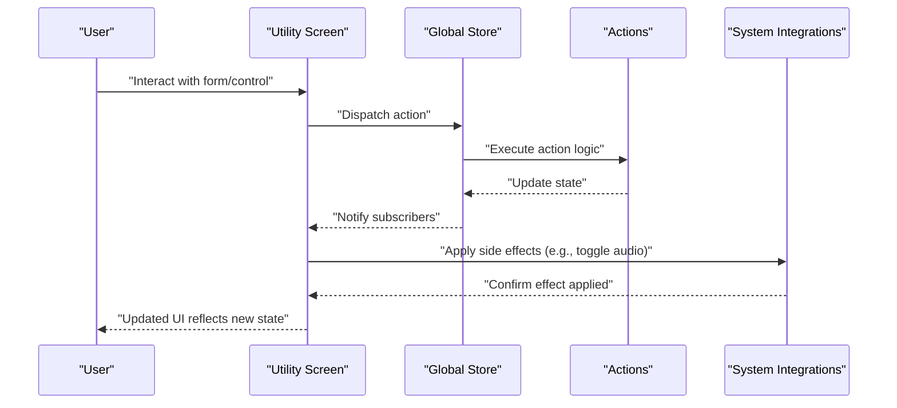
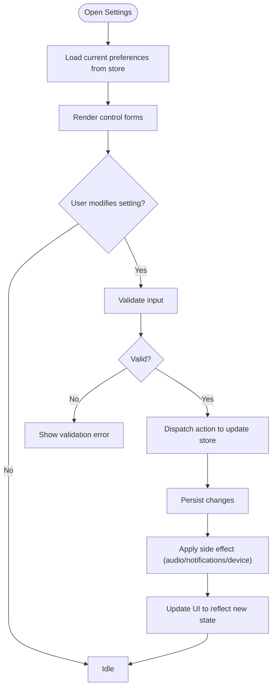
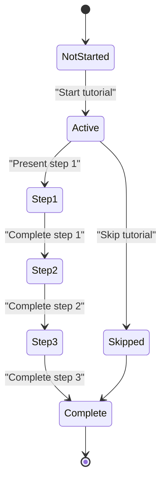
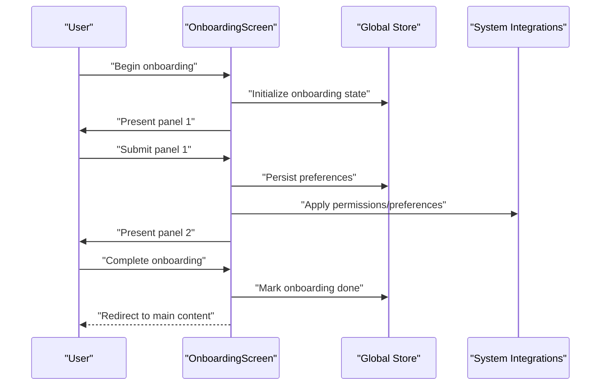
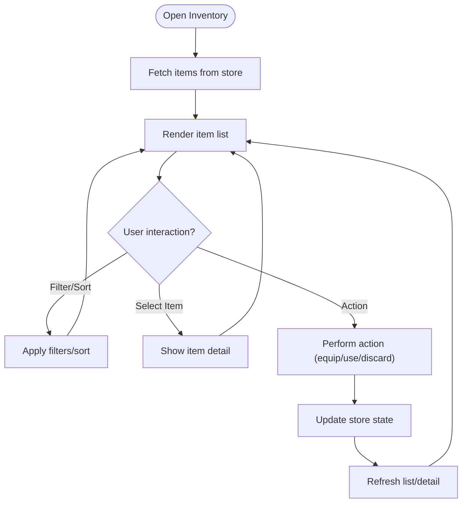
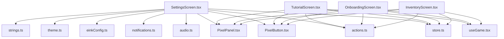

# Utility Screens

<cite>
**Referenced Files in This Document**
- [settings.tsx](file://app/settings.tsx)
- [tutorial.tsx](file://app/tutorial.tsx)
- [onboarding.tsx](file://app/onboarding.tsx)
- [inventory.tsx](file://app/inventory.tsx)
- [SettingsScreen.tsx](file://src/screens/SettingsScreen.tsx)
- [TutorialScreen.tsx](file://src/screens/TutorialScreen.tsx)
- [OnboardingScreen.tsx](file://src/screens/OnboardingScreen.tsx)
- [InventoryScreen.tsx](file://src/screens/InventoryScreen.tsx)
- [store.ts](file://src/state/store.ts)
- [actions.ts](file://src/state/actions.ts)
- [einkConfig.ts](file://src/systems/einkConfig.ts)
- [audio.ts](file://src/systems/audio.ts)
- [notifications.ts](file://src/systems/notifications.ts)
- [theme.ts](file://src/ui/theme.ts)
- [strings.ts](file://src/ui/strings.ts)
- [PixelButton.tsx](file://src/ui/PixelButton.tsx)
- [PixelPanel.tsx](file://src/ui/PixelPanel.tsx)
- [useGame.tsx](file://src/ui/useGame.tsx)
</cite>

## Table of Contents

1. [Introduction](#introduction)
2. [Project Structure](#project-structure)
3. [Core Components](#core-components)
4. [Architecture Overview](#architecture-overview)
5. [Detailed Component Analysis](#detailed-component-analysis)
6. [Dependency Analysis](#dependency-analysis)
7. [Performance Considerations](#performance-considerations)
8. [Troubleshooting Guide](#troubleshooting-guide)
9. [Conclusion](#conclusion)

## Introduction

This document provides comprehensive documentation for the utility screens that support user preferences, education, first-run experience, and item management: Settings, Tutorial, Onboarding, and Inventory. It explains how these screens handle configuration, state persistence, form interactions, educational content delivery, and inventory operations. It also covers accessibility considerations and best practices for extending or maintaining these features.

## Project Structure

The utility screens are implemented as React Native screens with a clear separation between app-level entry points (in app/) and reusable screen implementations (in src/screens/). Shared UI components live under src/ui/, while system integrations such as audio, notifications, and device-specific settings are encapsulated in src/systems/. Global state is managed via a centralized store in src/state/.

```mermaid
graph TB
subgraph "App Entry Points"
A_settings["app/settings.tsx"]
A_tutorial["app/tutorial.tsx"]
A_onboarding["app/onboarding.tsx"]
A_inventory["app/inventory.tsx"]
end
subgraph "Screen Implementations"
S_settings["src/screens/SettingsScreen.tsx"]
S_tutorial["src/screens/TutorialScreen.tsx"]
S_onboarding["src/screens/OnboardingScreen.tsx"]
S_inventory["src/screens/InventoryScreen.tsx"]
end
subgraph "State Management"
ST_store["src/state/store.ts"]
ST_actions["src/state/actions.ts"]
end
subgraph "Systems"
SY_audio["src/systems/audio.ts"]
SY_notifications["src/systems/notifications.ts"]
SY_einkConfig["src/systems/einkConfig.ts"]
end
subgraph "UI Components"
U_theme["src/ui/theme.ts"]
U_strings["src/ui/strings.ts"]
U_button["src/ui/PixelButton.tsx"]
U_panel["src/ui/PixelPanel.tsx"]
U_game["src/ui/useGame.tsx"]
end
A_settings --> S_settings
A_tutorial --> S_tutorial
A_onboarding --> S_onboarding
A_inventory --> S_inventory
S_settings --> ST_store
S_tutorial --> ST_store
S_onboarding --> ST_store
S_inventory --> ST_store
S_settings --> SY_audio
S_settings --> SY_notifications
S_settings --> SY_einkConfig
S_settings --> U_theme
S_settings --> U_strings
S_tutorial --> U_game
S_onboarding --> U_game
S_inventory --> U_game
S_settings --> U_button
S_tutorial --> U_button
S_onboarding --> U_button
S_inventory --> U_button
S_settings --> U_panel
S_tutorial --> U_panel
S_onboarding --> U_panel
S_inventory --> U_panel
```

**Diagram sources**

- [settings.tsx](file://app/settings.tsx)
- [tutorial.tsx](file://app/tutorial.tsx)
- [onboarding.tsx](file://app/onboarding.tsx)
- [inventory.tsx](file://app/inventory.tsx)
- [SettingsScreen.tsx](file://src/screens/SettingsScreen.tsx)
- [TutorialScreen.tsx](file://src/screens/TutorialScreen.tsx)
- [OnboardingScreen.tsx](file://src/screens/OnboardingScreen.tsx)
- [InventoryScreen.tsx](file://src/screens/InventoryScreen.tsx)
- [store.ts](file://src/state/store.ts)
- [actions.ts](file://src/state/actions.ts)
- [audio.ts](file://src/systems/audio.ts)
- [notifications.ts](file://src/systems/notifications.ts)
- [einkConfig.ts](file://src/systems/einkConfig.ts)
- [theme.ts](file://src/ui/theme.ts)
- [strings.ts](file://src/ui/strings.ts)
- [PixelButton.tsx](file://src/ui/PixelButton.tsx)
- [PixelPanel.tsx](file://src/ui/PixelPanel.tsx)
- [useGame.tsx](file://src/ui/useGame.tsx)

**Section sources**

- [settings.tsx](file://app/settings.tsx)
- [tutorial.tsx](file://app/tutorial.tsx)
- [onboarding.tsx](file://app/onboarding.tsx)
- [inventory.tsx](file://app/inventory.tsx)
- [SettingsScreen.tsx](file://src/screens/SettingsScreen.tsx)
- [TutorialScreen.tsx](file://src/screens/TutorialScreen.tsx)
- [OnboardingScreen.tsx](file://src/screens/OnboardingScreen.tsx)
- [InventoryScreen.tsx](file://src/screens/InventoryScreen.tsx)
- [store.ts](file://src/state/store.ts)
- [actions.ts](file://src/state/actions.ts)
- [audio.ts](file://src/systems/audio.ts)
- [notifications.ts](file://src/systems/notifications.ts)
- [einkConfig.ts](file://src/systems/einkConfig.ts)
- [theme.ts](file://src/ui/theme.ts)
- [strings.ts](file://src/ui/strings.ts)
- [PixelButton.tsx](file://src/ui/PixelButton.tsx)
- [PixelPanel.tsx](file://src/ui/PixelPanel.tsx)
- [useGame.tsx](file://src/ui/useGame.tsx)

## Core Components

- Settings Screen: Centralizes user preferences including audio, notifications, and device-specific options. Persists changes to the global store and applies them immediately where applicable.
- Tutorial Screen: Guides users through core gameplay mechanics with progressive steps and state tracking to remember progress across sessions.
- Onboarding Screen: Provides a first-time user experience flow, collecting initial preferences and gating access to main content until completion.
- Inventory Screen: Manages items collected by the player, supporting listing, filtering, and basic item operations.

Key responsibilities:

- Form handling: Controlled inputs, validation, and submission patterns.
- Data persistence: Store updates and optional local storage integration.
- Accessibility: Proper labels, focus order, and contrast-aware UI.
- State synchronization: Consistent state across screens via the central store.

**Section sources**

- [SettingsScreen.tsx](file://src/screens/SettingsScreen.tsx)
- [TutorialScreen.tsx](file://src/screens/TutorialScreen.tsx)
- [OnboardingScreen.tsx](file://src/screens/OnboardingScreen.tsx)
- [InventoryScreen.tsx](file://src/screens/InventoryScreen.tsx)
- [store.ts](file://src/state/store.ts)
- [actions.ts](file://src/state/actions.ts)

## Architecture Overview

The utility screens follow a unidirectional data flow pattern:

- User interactions trigger actions that update the global store.
- The store persists relevant state and notifies subscribers.
- System integrations apply side effects (e.g., toggling audio or notifications).
- UI components re-render based on updated state.

**Diagram sources**

- [store.ts](file://src/state/store.ts)
- [actions.ts](file://src/state/actions.ts)
- [SettingsScreen.tsx](file://src/screens/SettingsScreen.tsx)
- [TutorialScreen.tsx](file://src/screens/TutorialScreen.tsx)
- [OnboardingScreen.tsx](file://src/screens/OnboardingScreen.tsx)
- [InventoryScreen.tsx](file://src/screens/InventoryScreen.tsx)
- [audio.ts](file://src/systems/audio.ts)
- [notifications.ts](file://src/systems/notifications.ts)
- [einkConfig.ts](file://src/systems/einkConfig.ts)

## Detailed Component Analysis

### Settings Screen

Responsibilities:

- Present configuration controls for audio, notifications, and device-specific settings.
- Validate inputs and persist changes to the store.
- Apply immediate side effects via system integrations.

Form handling:

- Controlled inputs bound to store state.
- Validation feedback before saving.
- Debounced updates for performance-sensitive fields.

Data persistence:

- Updates dispatched to the store; optional persistence layer handles serialization.

Accessibility:

- Descriptive labels for all controls.
- Focus management for keyboard navigation.
- High-contrast theme support.

**Diagram sources**

- [SettingsScreen.tsx](file://src/screens/SettingsScreen.tsx)
- [store.ts](file://src/state/store.ts)
- [actions.ts](file://src/state/actions.ts)
- [audio.ts](file://src/systems/audio.ts)
- [notifications.ts](file://src/systems/notifications.ts)
- [einkConfig.ts](file://src/systems/einkConfig.ts)

**Section sources**

- [SettingsScreen.tsx](file://src/screens/SettingsScreen.tsx)
- [store.ts](file://src/state/store.ts)
- [actions.ts](file://src/state/actions.ts)
- [audio.ts](file://src/systems/audio.ts)
- [notifications.ts](file://src/systems/notifications.ts)
- [einkConfig.ts](file://src/systems/einkConfig.ts)

### Tutorial Screen

Responsibilities:

- Deliver step-by-step guidance for core features.
- Track tutorial progression and resume where the user left off.
- Provide interactive checkpoints to confirm understanding.

Progression system:

- Step index stored in the global store.
- Completion markers per step or section.
- Optional skip behavior with confirmation.

Educational content delivery:

- Contextual tips tied to current game state.
- Visual cues and animations to highlight key elements.

**Diagram sources**

- [TutorialScreen.tsx](file://src/screens/TutorialScreen.tsx)
- [store.ts](file://src/state/store.ts)
- [actions.ts](file://src/state/actions.ts)

**Section sources**

- [TutorialScreen.tsx](file://src/screens/TutorialScreen.tsx)
- [store.ts](file://src/state/store.ts)
- [actions.ts](file://src/state/actions.ts)

### Onboarding Screen

Responsibilities:

- Guide first-time users through essential setup tasks.
- Collect initial preferences and permissions.
- Gate access to main content until onboarding is complete.

Flow:

- Sequential panels covering account, preferences, and feature introductions.
- Progress indicators and ability to revisit later.
- Confirmation prompts for critical decisions.

First-time user experience:

- Minimal cognitive load with clear calls-to-action.
- Progressive disclosure of advanced options.

**Diagram sources**

- [OnboardingScreen.tsx](file://src/screens/OnboardingScreen.tsx)
- [store.ts](file://src/state/store.ts)
- [actions.ts](file://src/state/actions.ts)

**Section sources**

- [OnboardingScreen.tsx](file://src/screens/OnboardingScreen.tsx)
- [store.ts](file://src/state/store.ts)
- [actions.ts](file://src/state/actions.ts)

### Inventory Screen

Responsibilities:

- Display collected items with details and metadata.
- Support filtering, sorting, and search.
- Enable item operations such as equip, use, or discard.

Item management:

- List view with pagination or virtualization for large inventories.
- Detail modal or panel for item specifics.
- Batch operations for efficiency.

Data persistence:

- Changes persisted to the store; optional sync with external storage.

**Diagram sources**

- [InventoryScreen.tsx](file://src/screens/InventoryScreen.tsx)
- [store.ts](file://src/state/store.ts)
- [actions.ts](file://src/state/actions.ts)

**Section sources**

- [InventoryScreen.tsx](file://src/screens/InventoryScreen.tsx)
- [store.ts](file://src/state/store.ts)
- [actions.ts](file://src/state/actions.ts)

## Dependency Analysis

The utility screens depend on shared systems and UI components to deliver consistent behavior and appearance.

**Diagram sources**

- [SettingsScreen.tsx](file://src/screens/SettingsScreen.tsx)
- [TutorialScreen.tsx](file://src/screens/TutorialScreen.tsx)
- [OnboardingScreen.tsx](file://src/screens/OnboardingScreen.tsx)
- [InventoryScreen.tsx](file://src/screens/InventoryScreen.tsx)
- [store.ts](file://src/state/store.ts)
- [actions.ts](file://src/state/actions.ts)
- [audio.ts](file://src/systems/audio.ts)
- [notifications.ts](file://src/systems/notifications.ts)
- [einkConfig.ts](file://src/systems/einkConfig.ts)
- [theme.ts](file://src/ui/theme.ts)
- [strings.ts](file://src/ui/strings.ts)
- [PixelButton.tsx](file://src/ui/PixelButton.tsx)
- [PixelPanel.tsx](file://src/ui/PixelPanel.tsx)
- [useGame.tsx](file://src/ui/useGame.tsx)

**Section sources**

- [SettingsScreen.tsx](file://src/screens/SettingsScreen.tsx)
- [TutorialScreen.tsx](file://src/screens/TutorialScreen.tsx)
- [OnboardingScreen.tsx](file://src/screens/OnboardingScreen.tsx)
- [InventoryScreen.tsx](file://src/screens/InventoryScreen.tsx)
- [store.ts](file://src/state/store.ts)
- [actions.ts](file://src/state/actions.ts)
- [audio.ts](file://src/systems/audio.ts)
- [notifications.ts](file://src/systems/notifications.ts)
- [einkConfig.ts](file://src/systems/einkConfig.ts)
- [theme.ts](file://src/ui/theme.ts)
- [strings.ts](file://src/ui/strings.ts)
- [PixelButton.tsx](file://src/ui/PixelButton.tsx)
- [PixelPanel.tsx](file://src/ui/PixelPanel.tsx)
- [useGame.tsx](file://src/ui/useGame.tsx)

## Performance Considerations

- Debounce frequent updates in Settings to avoid excessive re-renders.
- Use memoization for derived data in Inventory lists.
- Lazy-load heavy assets in Tutorial and Onboarding panels.
- Avoid synchronous I/O during render; batch store updates.
- Prefer virtualized lists for large inventories.

[No sources needed since this section provides general guidance]

## Troubleshooting Guide

Common issues and resolutions:

- Settings not persisting: Verify actions dispatch correctly and store subscriptions are active. Check system integration calls for errors.
- Tutorial progress lost: Ensure progression state is saved after each step and restored on screen mount.
- Onboarding loop: Confirm completion flag is set and gating logic respects it.
- Inventory lag: Optimize list rendering and reduce unnecessary re-renders by selecting only needed state slices.

**Section sources**

- [store.ts](file://src/state/store.ts)
- [actions.ts](file://src/state/actions.ts)
- [SettingsScreen.tsx](file://src/screens/SettingsScreen.tsx)
- [TutorialScreen.tsx](file://src/screens/TutorialScreen.tsx)
- [OnboardingScreen.tsx](file://src/screens/OnboardingScreen.tsx)
- [InventoryScreen.tsx](file://src/screens/InventoryScreen.tsx)

## Conclusion

The utility screens provide a cohesive foundation for user preferences, education, first-run experience, and item management. By leveraging a centralized store, modular systems, and accessible UI components, they ensure consistent behavior and extensibility. Following the patterns outlined here will help maintain reliability and performance as features evolve.

[No sources needed since this section summarizes without analyzing specific files]
