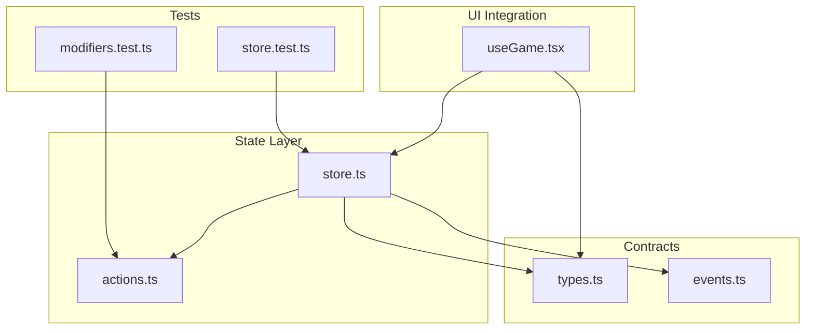
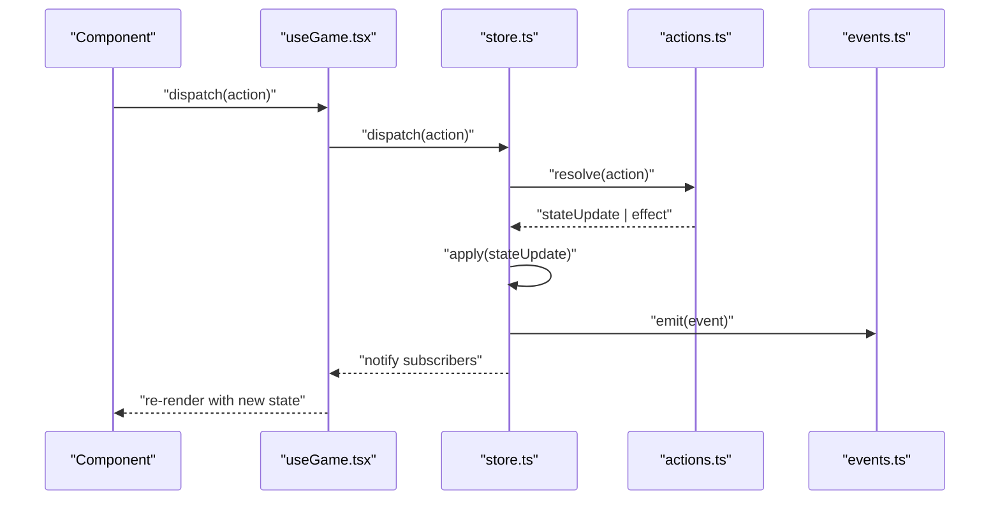
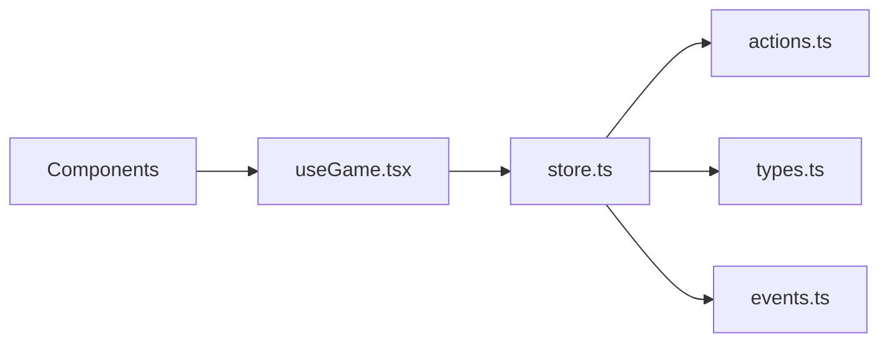

# State Management

<cite>
**Referenced Files in This Document**
- [store.ts](file://src/state/store.ts)
- [actions.ts](file://src/state/actions.ts)
- [events.ts](file://src/contracts/events.ts)
- [types.ts](file://src/contracts/types.ts)
- [useGame.tsx](file://src/ui/useGame.tsx)
- [store.test.ts](file://src/state/__tests__/store.test.ts)
- [modifiers.test.ts](file://src/state/__tests__/modifiers.test.ts)
</cite>

## Table of Contents

1. [Introduction](#introduction)
2. [Project Structure](#project-structure)
3. [Core Components](#core-components)
4. [Architecture Overview](#architecture-overview)
5. [Detailed Component Analysis](#detailed-component-analysis)
6. [Dependency Analysis](#dependency-analysis)
7. [Performance Considerations](#performance-considerations)
8. [Troubleshooting Guide](#troubleshooting-guide)
9. [Conclusion](#conclusion)
10. [Appendices](#appendices)

## Introduction

This document explains the centralized state management system that powers the game’s data flow. It covers the store architecture, action creators, and state update patterns; type definitions and contracts ensuring consistency; an event system for decoupled communication; persistence and migration strategies; debugging techniques; common operations; testing approaches; performance optimizations; and synchronization across application parts.

## Project Structure

The state management layer is organized under src/state with supporting contracts and UI integration:

- Store and actions: src/state/store.ts, src/state/actions.ts
- Contracts (types and events): src/contracts/types.ts, src/contracts/events.ts
- UI integration hook: src/ui/useGame.tsx
- Tests: src/state/**tests**/store.test.ts, src/state/**tests**/modifiers.test.ts

**Diagram sources**

- [store.ts](file://src/state/store.ts)
- [actions.ts](file://src/state/actions.ts)
- [types.ts](file://src/contracts/types.ts)
- [events.ts](file://src/contracts/events.ts)
- [useGame.tsx](file://src/ui/useGame.tsx)
- [store.test.ts](file://src/state/__tests__/store.test.ts)
- [modifiers.test.ts](file://src/state/__tests__/modifiers.test.ts)

**Section sources**

- [store.ts](file://src/state/store.ts)
- [actions.ts](file://src/state/actions.ts)
- [types.ts](file://src/contracts/types.ts)
- [events.ts](file://src/contracts/events.ts)
- [useGame.tsx](file://src/ui/useGame.tsx)
- [store.test.ts](file://src/state/__tests__/store.test.ts)
- [modifiers.test.ts](file://src/state/__tests__/modifiers.test.ts)

## Core Components

- Store: Centralized state container exposing a typed state snapshot and methods to dispatch actions and subscribe to updates.
- Actions: Pure functions describing state transitions; they return immutable updates or effects to be applied by the store.
- Types: Shared interfaces defining the shape of state, actions, and events to ensure consistency across modules.
- Events: Lightweight pub/sub mechanism enabling decoupled communication between components and systems.
- UI Hook: Provides components with read-only access to state and safe ways to trigger actions.

Key responsibilities:

- Enforce single source of truth for game state.
- Provide deterministic updates via actions.
- Emit events for side effects and cross-cutting concerns.
- Keep UI reactive through subscriptions.

**Section sources**

- [store.ts](file://src/state/store.ts)
- [actions.ts](file://src/state/actions.ts)
- [types.ts](file://src/contracts/types.ts)
- [events.ts](file://src/contracts/events.ts)
- [useGame.tsx](file://src/ui/useGame.tsx)

## Architecture Overview

The state architecture follows a unidirectional data flow:

- UI triggers actions via the hook.
- Actions compute new state deterministically.
- Store applies updates and emits events.
- Subscribers (UI and systems) react to changes.

**Diagram sources**

- [useGame.tsx](file://src/ui/useGame.tsx)
- [store.ts](file://src/state/store.ts)
- [actions.ts](file://src/state/actions.ts)
- [events.ts](file://src/contracts/events.ts)

## Detailed Component Analysis

### Store

Responsibilities:

- Holds the canonical state snapshot.
- Exposes a typed API to dispatch actions and subscribe to updates.
- Applies state updates atomically and safely.
- Emits events after successful updates.

Patterns:

- Immutable updates: state is never mutated in place; new snapshots are produced.
- Batched updates: multiple actions can be composed before notifying subscribers.
- Subscription model: stable references where possible to minimize re-renders.

Common operations:

- Initialize store with default or persisted state.
- Dispatch actions and receive updated state.
- Subscribe/unsubscribe to state changes.
- Read current state snapshot without coupling to internals.

**Section sources**

- [store.ts](file://src/state/store.ts)

### Actions

Responsibilities:

- Encapsulate intent to change state.
- Compute pure state transitions based on current state and input.
- Optionally produce side-effect payloads for the store to handle.

Patterns:

- Pure functions: no hidden side effects; deterministic output.
- Discriminated unions: strongly-typed action shapes.
- Validation: guard against invalid inputs early.

Common operations:

- Create/update entities.
- Toggle flags and settings.
- Advance game logic (e.g., turns, time).
- Compose complex sequences using helper utilities.

**Section sources**

- [actions.ts](file://src/state/actions.ts)

### Types and Contracts

Responsibilities:

- Define the shape of state, actions, and events.
- Provide shared interfaces used by store, actions, and UI.
- Ensure compile-time safety across modules.

Patterns:

- Strict typing for all public APIs.
- Enumerations for finite sets of states and flags.
- Event schemas for consistent messaging.

Common operations:

- Extend types when adding new features.
- Validate runtime payloads against types where needed.

**Section sources**

- [types.ts](file://src/contracts/types.ts)

### Event System

Responsibilities:

- Decouple components from direct dependencies.
- Broadcast domain-specific events (e.g., level complete, hero updated).
- Allow multiple listeners to react independently.

Patterns:

- Typed event names and payloads.
- One-way broadcast; no synchronous mutation of other subsystems.
- Optional throttling/debouncing for high-frequency events.

Common operations:

- Subscribe to named events.
- Emit events after state changes.
- Unsubscribe to prevent leaks.

**Section sources**

- [events.ts](file://src/contracts/events.ts)

### UI Integration Hook

Responsibilities:

- Provide components with a stable, typed state slice.
- Expose safe dispatch helpers bound to actions.
- Manage subscription lifecycle automatically.

Patterns:

- Memoization of selectors to avoid unnecessary re-renders.
- Batching of updates to reduce render cycles.
- Error boundaries around dispatch to keep UI resilient.

Common operations:

- Read derived values from state.
- Trigger actions from user interactions.
- Listen to specific events if needed.

**Section sources**

- [useGame.tsx](file://src/ui/useGame.tsx)

## Dependency Analysis

High-level relationships:

- useGame depends on store and types to expose a typed interface to components.
- store depends on actions and types to process updates and enforce contracts.
- events are emitted by store and consumed by various systems and UI.

**Diagram sources**

- [useGame.tsx](file://src/ui/useGame.tsx)
- [store.ts](file://src/state/store.ts)
- [actions.ts](file://src/state/actions.ts)
- [types.ts](file://src/contracts/types.ts)
- [events.ts](file://src/contracts/events.ts)

**Section sources**

- [useGame.tsx](file://src/ui/useGame.tsx)
- [store.ts](file://src/state/store.ts)
- [actions.ts](file://src/state/actions.ts)
- [types.ts](file://src/contracts/types.ts)
- [events.ts](file://src/contracts/events.ts)

## Performance Considerations

- Prefer immutable updates to enable efficient diffing and memoization.
- Use selectors to derive expensive computations only when inputs change.
- Batch multiple state changes into a single update cycle.
- Debounce or throttle frequent events to avoid excessive work.
- Avoid deep object cloning; prefer shallow copies and targeted updates.
- Keep action payloads minimal to reduce serialization overhead.

[No sources needed since this section provides general guidance]

## Troubleshooting Guide

Common issues and resolutions:

- Unexpected re-renders: verify selector stability and avoid creating new objects on each render.
- Stale state: ensure actions do not mutate existing state; always return new snapshots.
- Missing events: confirm event emission occurs after successful state updates.
- Type mismatches: align action payloads with defined types; add runtime checks if necessary.
- Memory leaks: unsubscribe from events and store listeners when components unmount.

Debugging techniques:

- Log action payloads and resulting state diffs during development.
- Snapshot state at key milestones to compare expected vs actual.
- Isolate failing actions with unit tests to pinpoint regressions.

**Section sources**

- [store.test.ts](file://src/state/__tests__/store.test.ts)
- [modifiers.test.ts](file://src/state/__tests__/modifiers.test.ts)

## Conclusion

The centralized state management system enforces a clear, predictable data flow through a typed store, pure actions, and an event-driven architecture. By adhering to immutable updates, strong contracts, and careful subscription management, the application maintains consistency, testability, and performance while enabling decoupled communication across components.

[No sources needed since this section summarizes without analyzing specific files]

## Appendices

### Common State Operations

- Initialize store with defaults or persisted data.
- Dispatch actions to create, update, or delete entities.
- Subscribe to state changes and events for reactive UI.
- Compose multiple actions into a single transactional update.

**Section sources**

- [store.ts](file://src/state/store.ts)
- [actions.ts](file://src/state/actions.ts)
- [events.ts](file://src/contracts/events.ts)

### Testing Approaches

- Unit-test actions for deterministic behavior.
- Mock store subscriptions to validate UI reactions.
- Assert event emissions for side effects.
- Use fixtures to represent realistic state slices.

**Section sources**

- [store.test.ts](file://src/state/__tests__/store.test.ts)
- [modifiers.test.ts](file://src/state/__tests__/modifiers.test.ts)

### State Persistence and Migration

- Persist the latest state snapshot to storage on relevant updates.
- On startup, load persisted state and apply version migrations if needed.
- Maintain a migration registry keyed by version numbers.
- Validate migrated state against current types before activation.

[No sources needed since this section provides general guidance]

### Synchronization Between Parts of the Application

- Use events to coordinate cross-module behavior without tight coupling.
- Derive UI state from the central store to avoid duplication.
- Apply idempotent handlers to tolerate out-of-order or duplicate events.
- Debounce rapid updates to maintain responsiveness.

[No sources needed since this section provides general guidance]
