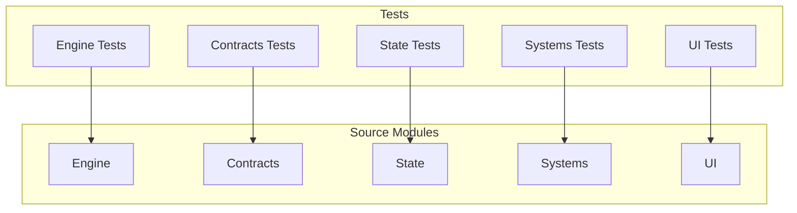
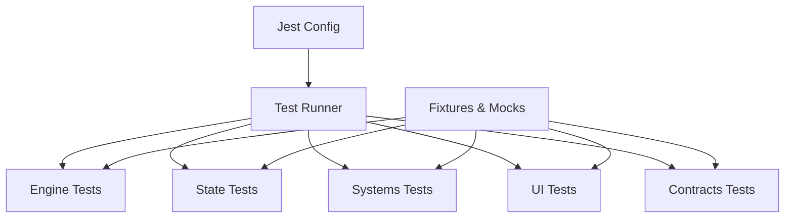
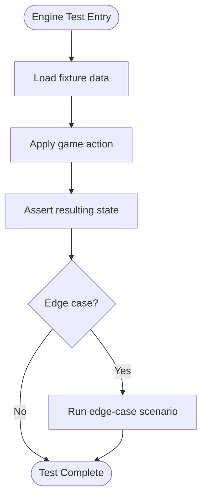
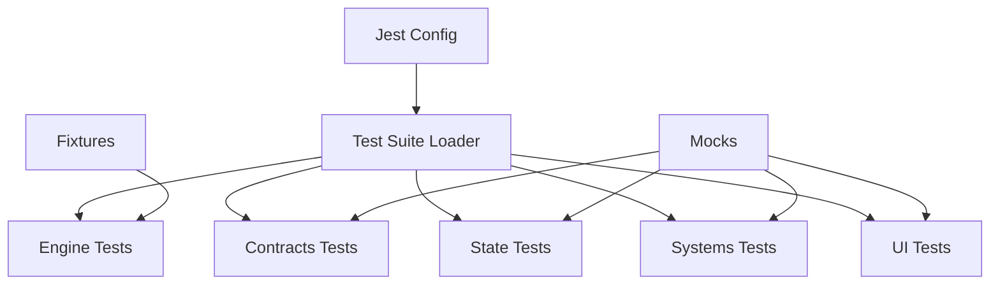

# Testing Strategy

<cite>
**Referenced Files in This Document**
- [jest.config.js](file://jest.config.js)
- [jest.setup.ts](file://jest.setup.ts)
- [package.json](file://package.json)
- [src/engine/__tests__/artifacts.test.ts](file://src/engine/__tests__/artifacts.test.ts)
- [src/engine/__tests__/chest.test.ts](file://src/engine/__tests__/chest.test.ts)
- [src/engine/__tests__/fixtures.ts](file://src/engine/__tests__/fixtures.ts)
- [src/engine/__tests__/hero.test.ts](file://src/engine/__tests__/hero.test.ts)
- [src/engine/__tests__/levels.test.ts](file://src/engine/__tests__/levels.test.ts)
- [src/engine/__tests__/night.test.ts](file://src/engine/__tests__/night.test.ts)
- [src/engine/__tests__/resurrection.test.ts](file://src/engine/__tests__/resurrection.test.ts)
- [src/engine/__tests__/turn.test.ts](file://src/engine/__tests__/turn.test.ts)
- [src/contracts/__tests__/mock.test.ts](file://src/contracts/__tests__/mock.test.ts)
- [src/state/__tests__/modifiers.test.ts](file://src/state/__tests__/modifiers.test.ts)
- [src/state/__tests__/store.test.ts](file://src/state/__tests__/store.test.ts)
- [src/systems/__tests__/demoNights.test.ts](file://src/systems/__tests__/demoNights.test.ts)
- [src/systems/__tests__/parseDeviceId.test.ts](file://src/systems/__tests__/parseDeviceId.test.ts)
- [src/systems/__tests__/scheduleMath.test.ts](file://src/systems/__tests__/scheduleMath.test.ts)
- [src/ui/__tests__/soulTetherLogic.test.ts](file://src/ui/__tests__/soulTetherLogic.test.ts)
- [src/ui/__tests__/window.test.ts](file://src/ui/__tests__/window.test.ts)
</cite>

## Table of Contents

1. [Introduction](#introduction)
2. [Project Structure](#project-structure)
3. [Core Components](#core-components)
4. [Architecture Overview](#architecture-overview)
5. [Detailed Component Analysis](#detailed-component-analysis)
6. [Dependency Analysis](#dependency-analysis)
7. [Performance Considerations](#performance-considerations)
8. [Troubleshooting Guide](#troubleshooting-guide)
9. [Conclusion](#conclusion)
10. [Appendices](#appendices)

## Introduction

This document explains the testing strategy and implementation across the application. It covers Jest configuration, test utilities, mocking strategies, and testing approaches for engine logic, UI components, state management, and system integrations. It also details test fixtures, mock implementations, assertion patterns, and provides guidelines for writing maintainable test suites. The goal is to help contributors understand how tests are organized, what they validate, and how to extend coverage effectively.

## Project Structure

The project uses a feature-based organization with dedicated test directories colocated next to their source modules under **tests** folders. This structure keeps tests close to the code they verify and makes it easy to locate relevant tests when modifying functionality.

Key areas:

- Engine tests validate core game mechanics (artifacts, chests, heroes, levels, nights, resurrection, turns).
- Contracts tests cover shared types and mocks used by other modules.
- State tests ensure store behavior and modifiers work as expected.
- Systems tests cover cross-cutting concerns like demo mode, scheduling math, and device parsing.
- UI tests focus on pure logic within UI modules and window utilities.

[No sources needed since this diagram shows conceptual workflow, not actual code structure]

## Core Components

This section outlines the foundational pieces that enable consistent testing across the codebase.

- Jest configuration
  - Centralized setup via jest.config.js defines test environment, module name mapper, and any global settings required for React Native or TypeScript.
  - Global setup file jest.setup.ts initializes test-specific behaviors such as polyfills, timers, or custom matchers.

- Package scripts
  - package.json includes scripts to run tests and potentially linting or type checks alongside tests.

- Test organization
  - Each feature area has a corresponding **tests** directory colocated with its source files.
  - Shared fixtures live near the code they support (e.g., src/engine/**tests**/fixtures.ts).

- Assertion patterns
  - Tests use standard Jest assertions to validate state transitions, function outputs, and edge cases.
  - For deterministic behavior, tests rely on explicit inputs and controlled time/scheduling where applicable.

**Section sources**

- [jest.config.js](file://jest.config.js)
- [jest.setup.ts](file://jest.setup.ts)
- [package.json](file://package.json)

## Architecture Overview

The testing architecture follows a layered approach:

- Unit tests for pure functions and small modules (engine logic, UI helpers).
- Integration tests for interactions between modules (state actions, systems).
- Mocks and fixtures isolate external dependencies and provide stable inputs.

[No sources needed since this diagram shows conceptual workflow, not actual code structure]

## Detailed Component Analysis

### Engine Logic Testing

Engine tests validate core game mechanics such as artifacts, chests, heroes, levels, nights, resurrection, and turn progression. These tests typically:

- Provide deterministic inputs via fixtures.
- Assert state changes after operations.
- Cover edge cases like invalid inputs or boundary conditions.

Common patterns:

- Use fixtures from src/engine/**tests**/fixtures.ts to construct consistent initial states.
- Validate transitions using explicit snapshots or equality checks.
- Isolate side effects by avoiding real timers or network calls.

Examples of well-structured tests:

- Artifacts: Verify artifact acquisition and effect application.
- Chest: Ensure opening logic updates inventory and flags correctly.
- Hero: Check hero stats, abilities, and lifecycle events.
- Levels: Confirm level progression rules and thresholds.
- Night: Validate night cycle transitions and associated state changes.
- Resurrection: Test revival mechanics and penalties.
- Turn: Ensure turn order and action resolution.

**Section sources**

- [src/engine/**tests**/artifacts.test.ts](file://src/engine/__tests__/artifacts.test.ts)
- [src/engine/**tests**/chest.test.ts](file://src/engine/__tests__/chest.test.ts)
- [src/engine/**tests**/fixtures.ts](file://src/engine/__tests__/fixtures.ts)
- [src/engine/**tests**/hero.test.ts](file://src/engine/__tests__/hero.test.ts)
- [src/engine/**tests**/levels.test.ts](file://src/engine/__tests__/levels.test.ts)
- [src/engine/**tests**/night.test.ts](file://src/engine/__tests__/night.test.ts)
- [src/engine/**tests**/resurrection.test.ts](file://src/engine/__tests__/resurrection.test.ts)
- [src/engine/**tests**/turn.test.ts](file://src/engine/__tests__/turn.test.ts)

### Contracts Testing

Contracts tests ensure shared types, events, flags, and mocks behave consistently across modules. They often:

- Validate shape and constraints of contract objects.
- Exercise mock implementations to guarantee predictable behavior.

Example focus:

- Mock validation and usage patterns in src/contracts/**tests**/mock.test.ts.

**Section sources**

- [src/contracts/**tests**/mock.test.ts](file://src/contracts/__tests__/mock.test.ts)

### State Management Testing

State tests verify store behavior and modifiers:

- Store tests check initialization, persistence, and selector correctness.
- Modifiers tests ensure actions update state deterministically and handle errors gracefully.

Patterns:

- Create minimal store instances per test.
- Dispatch actions and assert resulting state slices.
- Use deep equality checks for complex state shapes.

**Section sources**

- [src/state/**tests**/store.test.ts](file://src/state/__tests__/store.test.ts)
- [src/state/**tests**/modifiers.test.ts](file://src/state/__tests__/modifiers.test.ts)

### Systems Testing

Systems tests cover cross-cutting features:

- Demo mode: Validate toggling and behavior integration.
- Schedule math: Ensure calculations for timing and intervals are correct.
- Device parsing: Confirm robust handling of device identifiers.

Approach:

- Isolate external dependencies with mocks.
- Use deterministic inputs for mathematical functions.
- Assert outcomes against expected values.

**Section sources**

- [src/systems/**tests**/demoNights.test.ts](file://src/systems/__tests__/demoNights.test.ts)
- [src/systems/**tests**/parseDeviceId.test.ts](file://src/systems/__tests__/parseDeviceId.test.ts)
- [src/systems/**tests**/scheduleMath.test.ts](file://src/systems/__tests__/scheduleMath.test.ts)

### UI Testing

UI tests focus on pure logic within UI modules and utilities:

- Soul tether logic: Validate tether calculations and visual state transitions.
- Window utilities: Ensure layout and sizing computations are correct.

Guidelines:

- Avoid rendering full component trees; test logic functions directly.
- Use minimal props and fixtures to simulate scenarios.
- Assert computed outputs rather than DOM nodes when possible.

**Section sources**

- [src/ui/**tests**/soulTetherLogic.test.ts](file://src/ui/__tests__/soulTetherLogic.test.ts)
- [src/ui/**tests**/window.test.ts](file://src/ui/__tests__/window.test.ts)

## Dependency Analysis

Tests are organized to mirror source modules, minimizing coupling and maximizing clarity. Fixtures and mocks centralize shared test data and behaviors.

[No sources needed since this diagram shows conceptual workflow, not actual code structure]

**Section sources**

- [jest.config.js](file://jest.config.js)
- [jest.setup.ts](file://jest.setup.ts)

## Performance Considerations

- Keep unit tests fast and isolated; avoid heavy I/O or network calls.
- Use fixtures to reduce setup overhead.
- Prefer shallow or logic-only tests for UI modules to minimize render costs.
- Leverage Jest’s parallel execution by splitting large test suites into focused files.

[No sources needed since this section provides general guidance]

## Troubleshooting Guide

Common issues and resolutions:

- Environment setup failures: Ensure jest.setup.ts initializes necessary polyfills or globals.
- Flaky tests: Replace timers with controlled clocks or deterministic inputs.
- Mock misbehavior: Verify mock implementations align with expected interfaces and return values.
- State mutation surprises: Use immutable updates and deep equality checks to catch unintended changes.

Practical steps:

- Run individual test files to isolate failures.
- Add descriptive logs only during debugging; remove them before committing.
- Review fixtures for outdated assumptions when tests fail after refactors.

[No sources needed since this section provides general guidance]

## Conclusion

The testing strategy emphasizes clear separation of concerns, deterministic inputs, and isolated verification. By colocating tests with source modules, using shared fixtures and mocks, and focusing on pure logic where possible, the suite remains maintainable and reliable. Following the patterns outlined here will help keep tests readable, fast, and effective at catching regressions.

[No sources needed since this section summarizes without analyzing specific files]

## Appendices

### Jest Configuration Highlights

- Centralized settings in jest.config.js define environment, module mapping, and test discovery.
- Global setup in jest.setup.ts configures runtime behaviors for all tests.

**Section sources**

- [jest.config.js](file://jest.config.js)
- [jest.setup.ts](file://jest.setup.ts)

### Scripts and Execution

- Use npm/pnpm scripts defined in package.json to run tests, lint, and type-check.
- CI pipelines can execute these scripts to ensure quality gates.

**Section sources**

- [package.json](file://package.json)

### Example Test Patterns

- Engine: Load fixtures, apply actions, assert state transitions.
- Contracts: Validate shapes and mock behaviors.
- State: Initialize store, dispatch actions, assert slices.
- Systems: Mock external dependencies, assert deterministic outputs.
- UI: Test logic functions with minimal props, assert computed results.

[No sources needed since this section provides general guidance]
