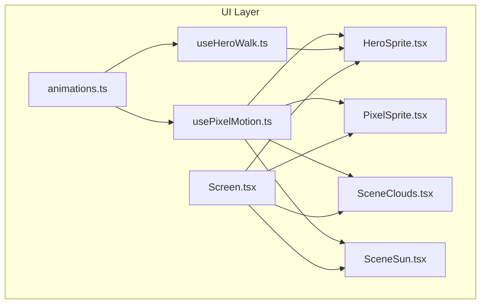
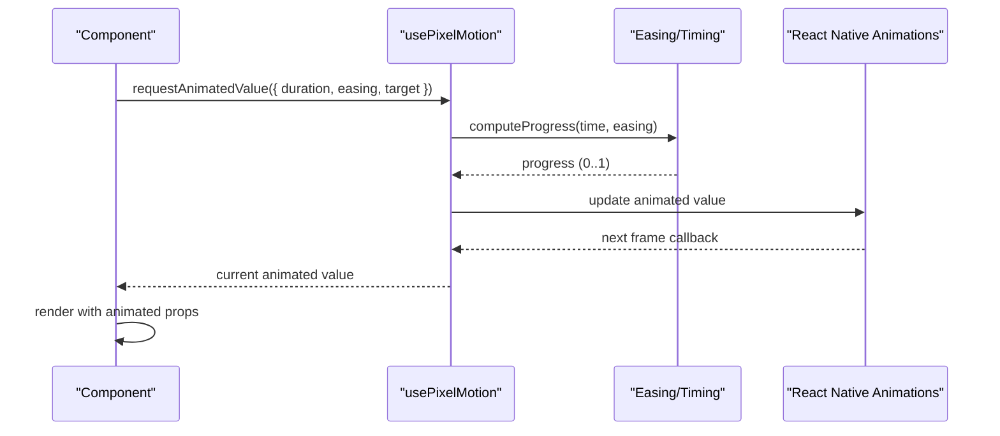
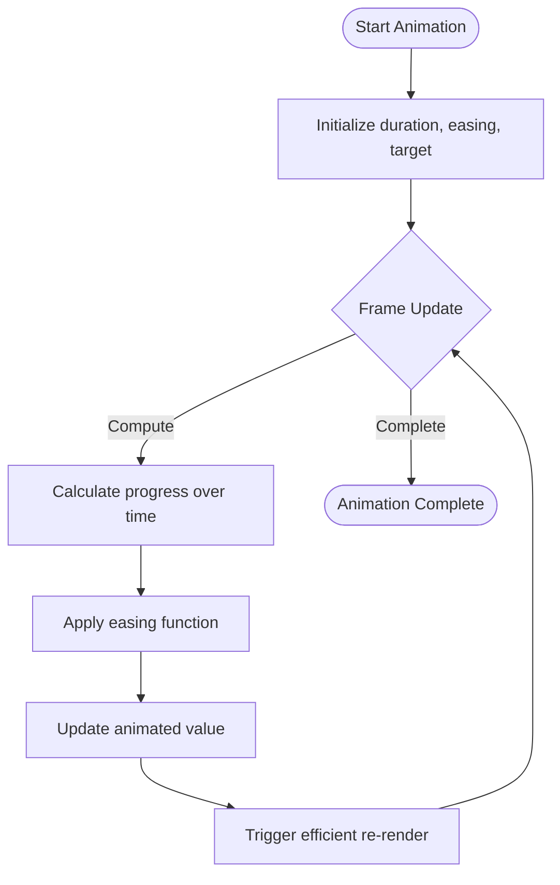
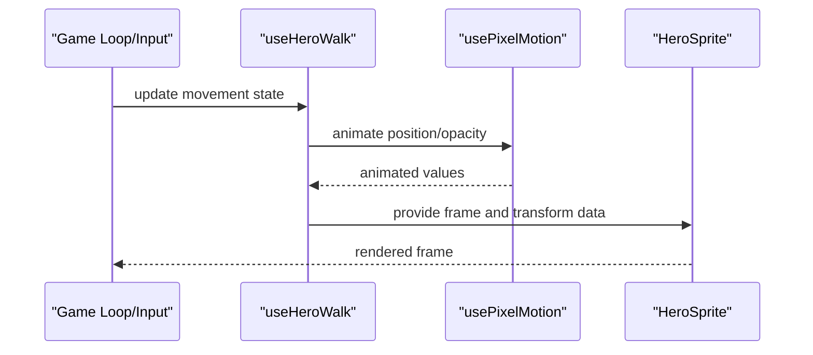
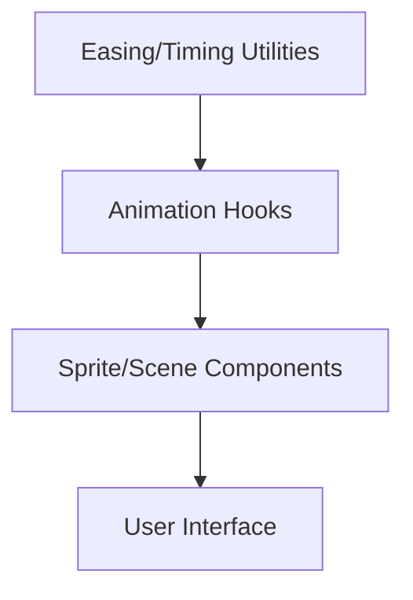
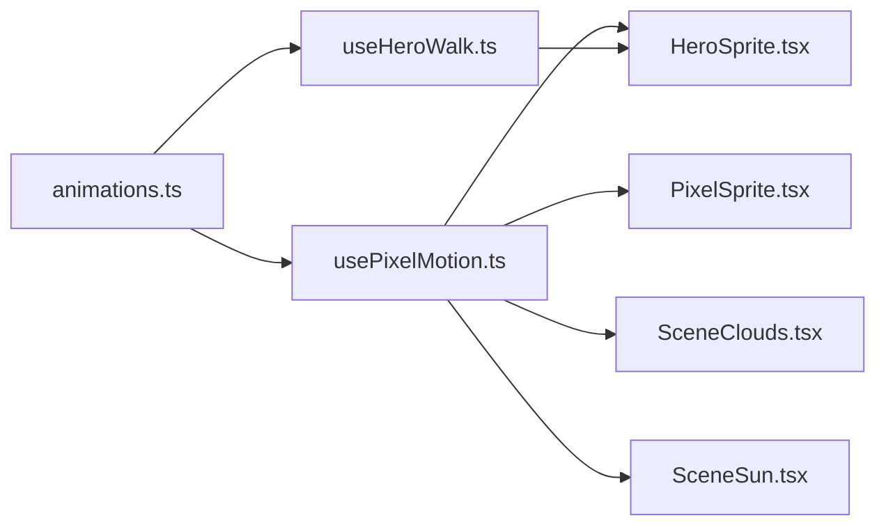

# Animation System

<cite>
**Referenced Files in This Document**
- [animations.ts](file://src/ui/animations.ts)
- [usePixelMotion.ts](file://src/ui/usePixelMotion.ts)
- [useHeroWalk.ts](file://src/ui/useHeroWalk.ts)
- [HeroSprite.tsx](file://src/ui/HeroSprite.tsx)
- [PixelSprite.tsx](file://src/ui/PixelSprite.tsx)
- [SceneClouds.tsx](file://src/ui/SceneClouds.tsx)
- [SceneSun.tsx](file://src/ui/SceneSun.tsx)
- [Screen.tsx](file://src/ui/Screen.tsx)
</cite>

## Table of Contents

1. [Introduction](#introduction)
2. [Project Structure](#project-structure)
3. [Core Components](#core-components)
4. [Architecture Overview](#architecture-overview)
5. [Detailed Component Analysis](#detailed-component-analysis)
6. [Dependency Analysis](#dependency-analysis)
7. [Performance Considerations](#performance-considerations)
8. [Troubleshooting Guide](#troubleshooting-guide)
9. [Conclusion](#conclusion)
10. [Appendices](#appendices)

## Introduction

This document explains the animation system architecture and implementation used across the project’s UI layer. It focuses on core utilities, easing functions, timing controls, and two primary hooks: usePixelMotion for smooth animated values and transitions, and useHeroWalk for character movement animations. It also covers composition patterns, performance optimization techniques, and best practices for mobile-friendly animations, along with guidance for creating custom animations and integrating with React Native’s animation APIs.

## Project Structure

The animation system is implemented within the UI layer and consumed by screens and components that render pixel art and scene elements. Key files include:

- Core animation utilities and easing definitions
- Hooks for driving animated values and orchestrating motion
- Sprite and scene components that consume these hooks to animate visuals

**Diagram sources**

- [animations.ts](file://src/ui/animations.ts)
- [usePixelMotion.ts](file://src/ui/usePixelMotion.ts)
- [useHeroWalk.ts](file://src/ui/useHeroWalk.ts)
- [HeroSprite.tsx](file://src/ui/HeroSprite.tsx)
- [PixelSprite.tsx](file://src/ui/PixelSprite.tsx)
- [SceneClouds.tsx](file://src/ui/SceneClouds.tsx)
- [SceneSun.tsx](file://src/ui/SceneSun.tsx)
- [Screen.tsx](file://src/ui/Screen.tsx)

**Section sources**

- [animations.ts](file://src/ui/animations.ts)
- [usePixelMotion.ts](file://src/ui/usePixelMotion.ts)
- [useHeroWalk.ts](file://src/ui/useHeroWalk.ts)
- [HeroSprite.tsx](file://src/ui/HeroSprite.tsx)
- [PixelSprite.tsx](file://src/ui/PixelSprite.tsx)
- [SceneClouds.tsx](file://src/ui/SceneClouds.tsx)
- [SceneSun.tsx](file://src/ui/SceneSun.tsx)
- [Screen.tsx](file://src/ui/Screen.tsx)

## Core Components

- Easing and timing utilities: Centralized definitions for easing curves and timing helpers used across animations.
- Animated value hook (usePixelMotion): Provides a consistent way to compute interpolated values over time with easing and frame-rate independence.
- Character movement hook (useHeroWalk): Orchestrates sprite-based walking animations, including direction, speed, and frame sequencing.
- Consuming components: Sprite and scene components that apply animated transforms or opacity using the hooks.

Key responsibilities:

- Decouple animation logic from rendering via hooks.
- Provide reusable easing and timing primitives.
- Ensure smooth, performant animations on mobile devices.

**Section sources**

- [animations.ts](file://src/ui/animations.ts)
- [usePixelMotion.ts](file://src/ui/usePixelMotion.ts)
- [useHeroWalk.ts](file://src/ui/useHeroWalk.ts)

## Architecture Overview

The animation system follows a layered approach:

- Utilities layer: Easing functions and timing helpers.
- Hooks layer: Encapsulate animation state and update loops.
- Components layer: Consume hooks to drive visual changes.

**Diagram sources**

- [usePixelMotion.ts](file://src/ui/usePixelMotion.ts)
- [animations.ts](file://src/ui/animations.ts)

## Detailed Component Analysis

### Easing and Timing Utilities

- Purpose: Provide standardized easing curves and timing calculations to ensure consistent motion feel.
- Typical usage: Convert elapsed time into normalized progress values; apply easing to produce smooth acceleration/deceleration.
- Performance considerations: Pure functions, minimal allocations, memoization where appropriate.

Best practices:

- Use linear interpolation for simple fades and translations.
- Apply ease-in-out for natural-feeling transitions.
- Avoid heavy computations inside update loops.

**Section sources**

- [animations.ts](file://src/ui/animations.ts)

### usePixelMotion Hook

- Purpose: Drive smooth animated values with configurable duration, easing, and targets.
- Behavior: Computes progress over time, applies easing, updates an animated value, and triggers re-renders efficiently.
- Integration: Works with React Native’s animation APIs to minimize layout thrash and maintain 60fps on mobile.

Usage pattern:

- Initialize with target value and animation config.
- Trigger animation on user actions or lifecycle events.
- Read the animated value in render to update style properties.

**Diagram sources**

- [usePixelMotion.ts](file://src/ui/usePixelMotion.ts)
- [animations.ts](file://src/ui/animations.ts)

**Section sources**

- [usePixelMotion.ts](file://src/ui/usePixelMotion.ts)
- [animations.ts](file://src/ui/animations.ts)

### useHeroWalk Hook

- Purpose: Orchestrate character walking animations, including directional movement, speed control, and frame cycling.
- Behavior: Manages internal state for walk cycles, updates position or sprite frames based on input or game state, and integrates with the rendering pipeline.
- Composition: Often composed with usePixelMotion for smooth positional transitions and with sprite components for frame rendering.

Typical flow:

- Input event or game loop tick triggers movement update.
- Hook computes new position or frame index.
- Animated values are updated via usePixelMotion or direct style application.
- Component renders updated sprite state.

**Diagram sources**

- [useHeroWalk.ts](file://src/ui/useHeroWalk.ts)
- [usePixelMotion.ts](file://src/ui/usePixelMotion.ts)
- [HeroSprite.tsx](file://src/ui/HeroSprite.tsx)

**Section sources**

- [useHeroWalk.ts](file://src/ui/useHeroWalk.ts)
- [HeroSprite.tsx](file://src/ui/HeroSprite.tsx)

### Sprite and Scene Components

- HeroSprite: Renders hero sprites with frame selection and transforms driven by useHeroWalk and usePixelMotion.
- PixelSprite: Generic pixel art renderer that accepts animated props for positioning and effects.
- SceneClouds and SceneSun: Background elements that use usePixelMotion for subtle parallax or fade effects.

Integration points:

- Consume animated values to set transform, opacity, or frame indices.
- Avoid expensive recalculations in render; rely on memoization and stable references.

**Section sources**

- [HeroSprite.tsx](file://src/ui/HeroSprite.tsx)
- [PixelSprite.tsx](file://src/ui/PixelSprite.tsx)
- [SceneClouds.tsx](file://src/ui/SceneClouds.tsx)
- [SceneSun.tsx](file://src/ui/SceneSun.tsx)

### Conceptual Overview

Conceptually, the animation system separates concerns between:

- Easing and timing (pure math utilities)
- Stateful animation orchestration (hooks)
- Rendering (components)

This separation enables reuse, testability, and performance tuning without affecting UI structure.

[No sources needed since this diagram shows conceptual workflow, not actual code structure]

## Dependency Analysis

- Easing/Timing utilities are consumed by both usePixelMotion and useHeroWalk.
- usePixelMotion is widely used across components for smooth transitions.
- useHeroWalk composes usePixelMotion for positional animations while managing sprite frames.
- Components depend on hooks rather than direct utility calls to keep rendering logic clean.

**Diagram sources**

- [animations.ts](file://src/ui/animations.ts)
- [usePixelMotion.ts](file://src/ui/usePixelMotion.ts)
- [useHeroWalk.ts](file://src/ui/useHeroWalk.ts)
- [HeroSprite.tsx](file://src/ui/HeroSprite.tsx)
- [PixelSprite.tsx](file://src/ui/PixelSprite.tsx)
- [SceneClouds.tsx](file://src/ui/SceneClouds.tsx)
- [SceneSun.tsx](file://src/ui/SceneSun.tsx)

**Section sources**

- [animations.ts](file://src/ui/animations.ts)
- [usePixelMotion.ts](file://src/ui/usePixelMotion.ts)
- [useHeroWalk.ts](file://src/ui/useHeroWalk.ts)
- [HeroSprite.tsx](file://src/ui/HeroSprite.tsx)
- [PixelSprite.tsx](file://src/ui/PixelSprite.tsx)
- [SceneClouds.tsx](file://src/ui/SceneClouds.tsx)
- [SceneSun.tsx](file://src/ui/SceneSun.tsx)

## Performance Considerations

- Prefer hardware-accelerated properties (transform, opacity) to avoid layout recalculation.
- Keep animation durations short and easing functions simple to reduce CPU load.
- Memoize computed values and avoid unnecessary re-renders by stabilizing references.
- Batch updates where possible; avoid frequent state changes within tight loops.
- On mobile, limit concurrent animations and prefer lightweight effects for background elements.

[No sources needed since this section provides general guidance]

## Troubleshooting Guide

Common issues and resolutions:

- Janky animations: Check for heavy computations in render; move logic to hooks or memoized functions.
- Stutter on low-end devices: Reduce number of simultaneous animations; simplify easing curves.
- Incorrect timing: Verify duration and frame rate assumptions; ensure progress calculation accounts for device refresh rates.
- Memory leaks: Ensure cleanup of timers or listeners when components unmount.

Debugging tips:

- Log progress and eased values during development.
- Isolate problematic components by disabling non-essential animations.
- Use profiling tools to identify bottlenecks in the animation loop.

[No sources needed since this section provides general guidance]

## Conclusion

The animation system leverages clear separation of concerns through utilities, hooks, and components. usePixelMotion provides a robust foundation for smooth transitions, while useHeroWalk orchestrates character movement with frame-based rendering. By adhering to performance best practices and composition patterns, the system delivers responsive, mobile-friendly animations that integrate seamlessly with React Native’s animation APIs.

[No sources needed since this section summarizes without analyzing specific files]

## Appendices

### Creating Custom Animations

Steps to create a custom animation:

- Define easing and timing parameters in the utilities module.
- Implement a hook that computes progress and updates an animated value.
- Consume the hook in a component to apply animated props.
- Test across devices to ensure smoothness and responsiveness.

Integration with React Native:

- Use animated values compatible with React Native’s animation engine.
- Leverage built-in interpolators for common transformations.
- Combine multiple animated values for complex effects.

[No sources needed since this section provides general guidance]

### Best Practices for Mobile-Friendly Animations

- Favor transform and opacity for GPU acceleration.
- Keep animation durations under 300ms for snappy interactions.
- Avoid blocking the main thread; offload heavy work to workers if necessary.
- Profile animations on target devices to catch regressions early.

[No sources needed since this section provides general guidance]
