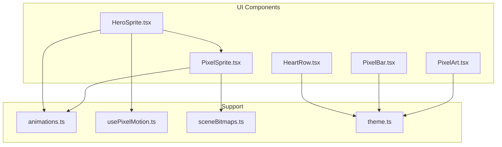
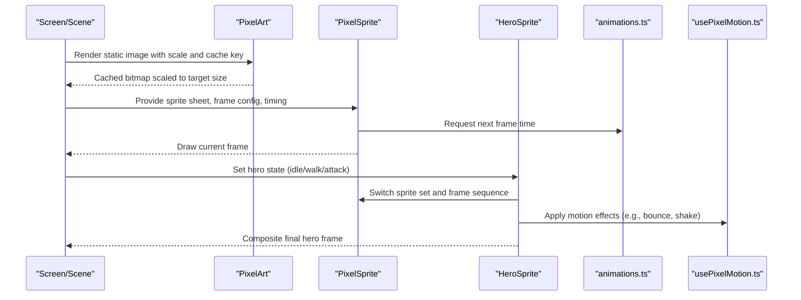
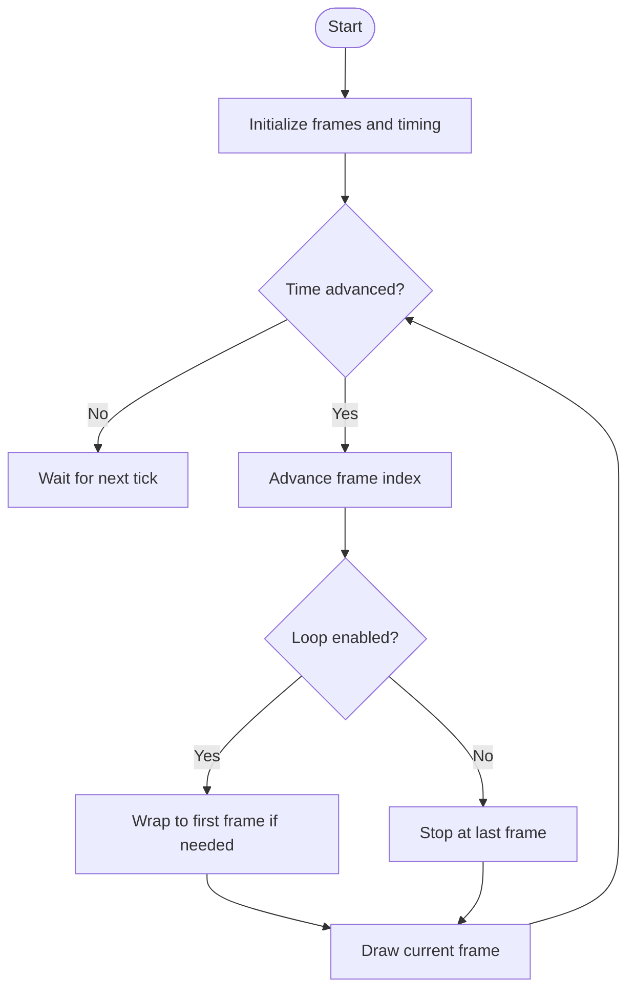
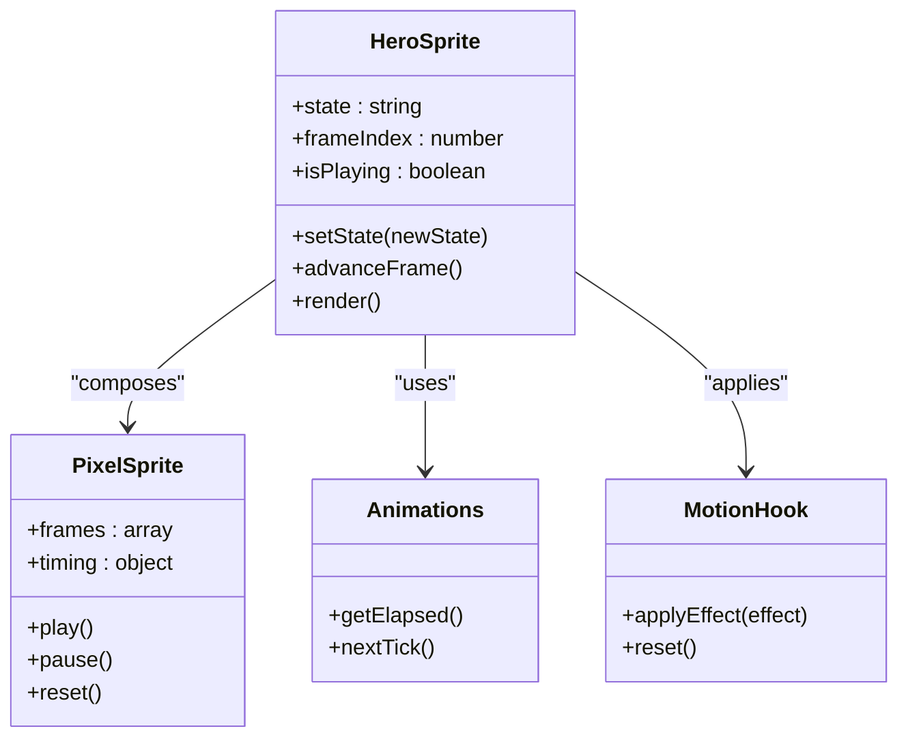
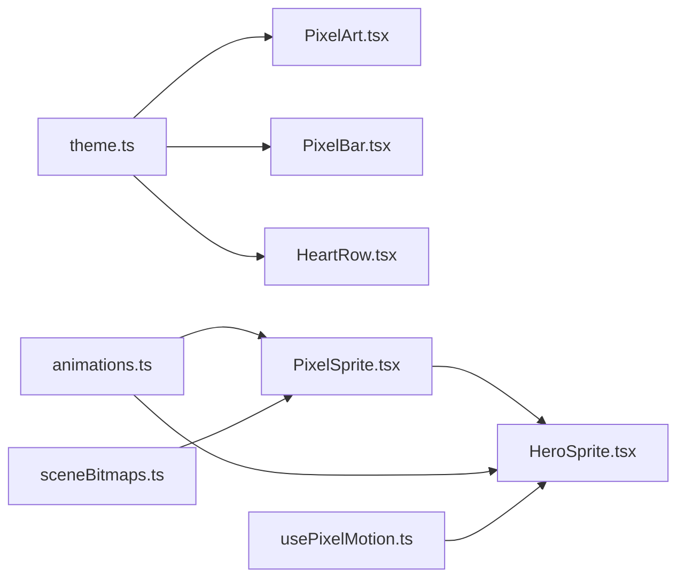

# Pixel Art Components

<cite>
**Referenced Files in This Document**
- [PixelArt.tsx](file://src/ui/PixelArt.tsx)
- [PixelSprite.tsx](file://src/ui/PixelSprite.tsx)
- [HeroSprite.tsx](file://src/ui/HeroSprite.tsx)
- [PixelBar.tsx](file://src/ui/PixelBar.tsx)
- [HeartRow.tsx](file://src/ui/HeartRow.tsx)
- [animations.ts](file://src/ui/animations.ts)
- [usePixelMotion.ts](file://src/ui/usePixelMotion.ts)
- [sceneBitmaps.ts](file://src/ui/sceneBitmaps.ts)
- [theme.ts](file://src/ui/theme.ts)
</cite>

## Table of Contents

1. [Introduction](#introduction)
2. [Project Structure](#project-structure)
3. [Core Components](#core-components)
4. [Architecture Overview](#architecture-overview)
5. [Detailed Component Analysis](#detailed-component-analysis)
6. [Dependency Analysis](#dependency-analysis)
7. [Performance Considerations](#performance-considerations)
8. [Troubleshooting Guide](#troubleshooting-guide)
9. [Conclusion](#conclusion)
10. [Appendices](#appendices)

## Introduction

This document explains the pixel art rendering system and specialized components used to display static graphics, animated sprites, character states, and UI indicators. It focuses on:

- PixelArt for static pixel graphics with scaling and caching
- PixelSprite for animated sprite sheets and frame management
- HeroSprite for character rendering with states and animations
- Utility components PixelBar and HeartRow for progress and health visuals
  It also provides guidelines for creating pixel-perfect assets, optimizing sprite rendering, and maintaining visual consistency across the app.

## Project Structure

The pixel art components live under src/ui and are consumed by screens and scenes. Supporting utilities include animation helpers, motion hooks, scene bitmaps, and theme definitions.

**Diagram sources**

- [PixelArt.tsx](file://src/ui/PixelArt.tsx)
- [PixelSprite.tsx](file://src/ui/PixelSprite.tsx)
- [HeroSprite.tsx](file://src/ui/HeroSprite.tsx)
- [PixelBar.tsx](file://src/ui/PixelBar.tsx)
- [HeartRow.tsx](file://src/ui/HeartRow.tsx)
- [animations.ts](file://src/ui/animations.ts)
- [usePixelMotion.ts](file://src/ui/usePixelMotion.ts)
- [sceneBitmaps.ts](file://src/ui/sceneBitmaps.ts)
- [theme.ts](file://src/ui/theme.ts)

**Section sources**

- [PixelArt.tsx](file://src/ui/PixelArt.tsx)
- [PixelSprite.tsx](file://src/ui/PixelSprite.tsx)
- [HeroSprite.tsx](file://src/ui/HeroSprite.tsx)
- [PixelBar.tsx](file://src/ui/PixelBar.tsx)
- [HeartRow.tsx](file://src/ui/HeartRow.tsx)
- [animations.ts](file://src/ui/animations.ts)
- [usePixelMotion.ts](file://src/ui/usePixelMotion.ts)
- [sceneBitmaps.ts](file://src/ui/sceneBitmaps.ts)
- [theme.ts](file://src/ui/theme.ts)

## Core Components

- PixelArt: Renders a single bitmap at a specified scale with optional caching to avoid re-renders. Ideal for static icons, backgrounds, and tiles.
- PixelSprite: Manages sprite sheet frames, timing, and playback state. Supports looping, direction flipping, and frame stepping.
- HeroSprite: Specialized sprite component for characters. Composes multiple sprite sets (idle, walk, attack, etc.) and transitions between states.
- PixelBar: Displays a segmented or smooth progress bar using pixel-aligned segments.
- HeartRow: Renders a row of heart icons representing health or score.

These components share common concerns:

- Pixel-perfect scaling via integer multipliers
- Caching strategies to minimize work
- Consistent theming and color palettes
- Animation timing and frame control

**Section sources**

- [PixelArt.tsx](file://src/ui/PixelArt.tsx)
- [PixelSprite.tsx](file://src/ui/PixelSprite.tsx)
- [HeroSprite.tsx](file://src/ui/HeroSprite.tsx)
- [PixelBar.tsx](file://src/ui/PixelBar.tsx)
- [HeartRow.tsx](file://src/ui/HeartRow.tsx)

## Architecture Overview

The rendering pipeline emphasizes deterministic frame updates and minimal recomputation. Static images go through PixelArt with caching; animated sequences use PixelSprite with a controlled tick loop; HeroSprite orchestrates state transitions and composes underlying sprite logic.

**Diagram sources**

- [PixelArt.tsx](file://src/ui/PixelArt.tsx)
- [PixelSprite.tsx](file://src/ui/PixelSprite.tsx)
- [HeroSprite.tsx](file://src/ui/HeroSprite.tsx)
- [animations.ts](file://src/ui/animations.ts)
- [usePixelMotion.ts](file://src/ui/usePixelMotion.ts)

## Detailed Component Analysis

### PixelArt: Static Pixel Graphics with Scaling and Caching

Purpose:

- Display a single bitmap at an exact pixel scale
- Cache results to prevent unnecessary re-rendering
- Support orientation and flip options when needed

Key behaviors:

- Accepts a source asset and a scale factor
- Computes a stable cache key from asset identity, scale, and flags
- Returns a memoized rendered output

Usage patterns:

- Use for icons, background tiles, and fixed-position elements
- Prefer integer scales to maintain crisp edges

Best practices:

- Keep assets aligned to grid boundaries
- Avoid fractional scaling unless intentional blur is desired
- Reuse cache keys across renders to leverage memoization

**Section sources**

- [PixelArt.tsx](file://src/ui/PixelArt.tsx)
- [theme.ts](file://src/ui/theme.ts)

### PixelSprite: Animated Sprite Sheets and Frame Management

Purpose:

- Manage sprite sheet resources and frame sequencing
- Control playback speed, looping, and direction
- Expose frame index and timing for custom logic

Key behaviors:

- Parses frame layout and duration per frame or per group
- Advances frames based on elapsed time
- Supports flipping and mirroring for directional movement

Animation flow:

Optimization tips:

- Batch similar animations to reduce state churn
- Precompute frame rectangles where possible
- Pause offscreen animations to save CPU

**Section sources**

- [PixelSprite.tsx](file://src/ui/PixelSprite.tsx)
- [animations.ts](file://src/ui/animations.ts)
- [sceneBitmaps.ts](file://src/ui/sceneBitmaps.ts)

### HeroSprite: Character Rendering with States and Animations

Purpose:

- Represent a character with multiple animation states (idle, walk, attack, etc.)
- Transition smoothly between states while preserving frame alignment
- Integrate motion effects like bounce or shake

State management:

- Maintains current state and previous state for transitions
- Queues state changes to avoid flicker mid-frame
- Composes sprite sets per state and applies global transforms

Interaction with motion:

- Uses motion hooks to apply subtle effects without breaking pixel alignment
- Ensures transforms remain within integer bounds when necessary

Guidelines:

- Define clear state boundaries and transition rules
- Keep frame counts consistent across related states
- Use integer-based transforms to preserve crispness

**Section sources**

- [HeroSprite.tsx](file://src/ui/HeroSprite.tsx)
- [PixelSprite.tsx](file://src/ui/PixelSprite.tsx)
- [animations.ts](file://src/ui/animations.ts)
- [usePixelMotion.ts](file://src/ui/usePixelMotion.ts)

### PixelBar: Progress Indicators

Purpose:

- Visualize progress, health, or resource levels with pixel-aligned segments
- Support both filled and empty segment styles

Behavior:

- Calculates fill ratio and maps it to discrete segments
- Optionally animates transitions between values
- Respects theme colors and contrast requirements

Design tips:

- Choose segment sizes that align with the overall pixel grid
- Ensure high contrast against backgrounds
- Animate only when user attention is required

**Section sources**

- [PixelBar.tsx](file://src/ui/PixelBar.tsx)
- [theme.ts](file://src/ui/theme.ts)

### HeartRow: Health Display

Purpose:

- Render a row of heart icons indicating health or score
- Support partial fills and animations for feedback

Behavior:

- Maps numeric value to full, half, and empty hearts
- Applies subtle animations on change
- Aligns spacing and sizing to the pixel grid

Accessibility:

- Provide descriptive labels for screen readers
- Maintain sufficient color contrast

**Section sources**

- [HeartRow.tsx](file://src/ui/HeartRow.tsx)
- [theme.ts](file://src/ui/theme.ts)

## Dependency Analysis

The components form a layered dependency structure:

- PixelArt depends on theme for colors and scaling conventions
- PixelSprite depends on animations and scene bitmaps for timing and frame data
- HeroSprite composes PixelSprite and uses animations and motion hooks
- PixelBar and HeartRow depend on theme for consistent styling

**Diagram sources**

- [theme.ts](file://src/ui/theme.ts)
- [PixelArt.tsx](file://src/ui/PixelArt.tsx)
- [PixelBar.tsx](file://src/ui/PixelBar.tsx)
- [HeartRow.tsx](file://src/ui/HeartRow.tsx)
- [animations.ts](file://src/ui/animations.ts)
- [sceneBitmaps.ts](file://src/ui/sceneBitmaps.ts)
- [PixelSprite.tsx](file://src/ui/PixelSprite.tsx)
- [HeroSprite.tsx](file://src/ui/HeroSprite.tsx)
- [usePixelMotion.ts](file://src/ui/usePixelMotion.ts)

**Section sources**

- [theme.ts](file://src/ui/theme.ts)
- [PixelArt.tsx](file://src/ui/PixelArt.tsx)
- [PixelSprite.tsx](file://src/ui/PixelSprite.tsx)
- [HeroSprite.tsx](file://src/ui/HeroSprite.tsx)
- [PixelBar.tsx](file://src/ui/PixelBar.tsx)
- [HeartRow.tsx](file://src/ui/HeartRow.tsx)
- [animations.ts](file://src/ui/animations.ts)
- [sceneBitmaps.ts](file://src/ui/sceneBitmaps.ts)
- [usePixelMotion.ts](file://src/ui/usePixelMotion.ts)

## Performance Considerations

- Prefer integer scaling factors for crisp rendering and predictable memory usage
- Cache static assets aggressively using stable keys to avoid recomputation
- Pause offscreen animations and defer updates until visible
- Batch frame updates to minimize render cycles
- Keep sprite sheets compact and well-organized to reduce parsing overhead
- Use memoization around expensive computations such as frame rectangle calculations
- Limit heavy operations during frame transitions to avoid jank

[No sources needed since this section provides general guidance]

## Troubleshooting Guide

Common issues and resolutions:

- Blurry or jagged edges: Ensure integer scaling and proper alignment to the pixel grid
- Stuttering animations: Verify frame timing and consider reducing frame count or complexity
- Incorrect frame display: Check sprite sheet layout and frame indices
- Inconsistent colors: Confirm theme usage and palette alignment
- Memory growth: Validate cache invalidation and ensure unique cache keys

Debugging tips:

- Log frame indices and timing deltas to identify misalignment
- Temporarily disable motion effects to isolate performance bottlenecks
- Inspect cache keys to confirm deduplication behavior

**Section sources**

- [PixelArt.tsx](file://src/ui/PixelArt.tsx)
- [PixelSprite.tsx](file://src/ui/PixelSprite.tsx)
- [HeroSprite.tsx](file://src/ui/HeroSprite.tsx)
- [animations.ts](file://src/ui/animations.ts)
- [usePixelMotion.ts](file://src/ui/usePixelMotion.ts)

## Conclusion

The pixel art system centers on precise scaling, robust caching, and clean animation management. PixelArt handles static assets efficiently, PixelSprite manages frame sequences deterministically, and HeroSprite orchestrates character states with motion effects. PixelBar and HeartRow provide consistent UI indicators. Following the provided guidelines ensures crisp visuals, optimal performance, and cohesive aesthetics across the application.

[No sources needed since this section summarizes without analyzing specific files]

## Appendices

### Guidelines for Creating Pixel-Perfect Assets

- Design on a strict grid and avoid anti-aliasing
- Use consistent color palettes defined in theme
- Export sprite sheets with uniform cell sizes and clear frame order
- Test at target scales to verify crispness and readability

### Optimizing Sprite Rendering

- Group related frames into shared sprite sheets
- Precompute frame rectangles and reuse them
- Deactivate animations when not visible
- Use memoization for derived values like bounding boxes

### Maintaining Visual Consistency

- Centralize colors, spacing, and typography in theme
- Standardize animation durations and easing curves
- Establish naming conventions for states and frames
- Review assets regularly for alignment and contrast

[No sources needed since this section provides general guidance]
