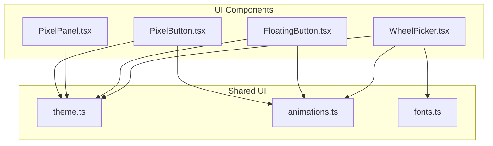
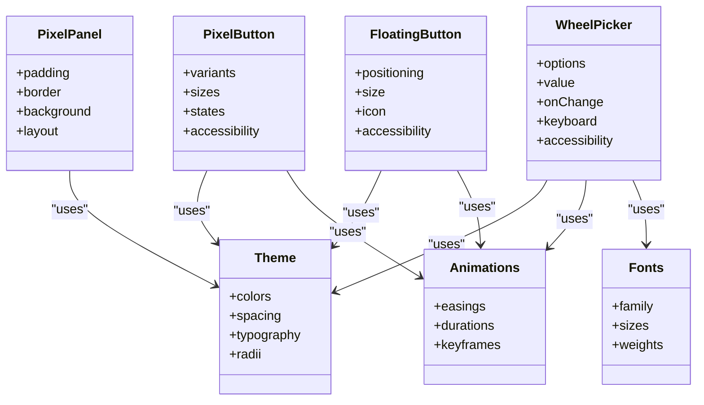
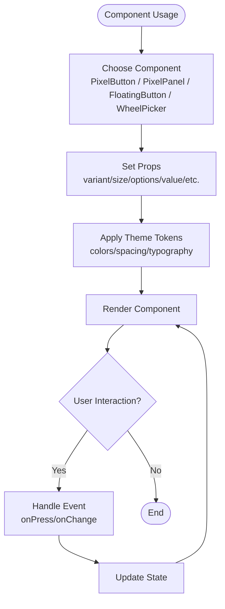
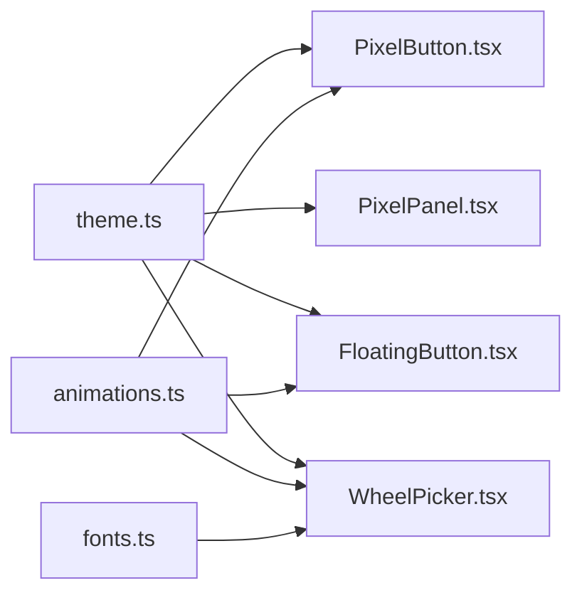

# Reusable Components

<cite>
**Referenced Files in This Document**
- [PixelButton.tsx](file://src/ui/PixelButton.tsx)
- [PixelPanel.tsx](file://src/ui/PixelPanel.tsx)
- [FloatingButton.tsx](file://src/ui/FloatingButton.tsx)
- [WheelPicker.tsx](file://src/ui/WheelPicker.tsx)
- [theme.ts](file://src/ui/theme.ts)
- [animations.ts](file://src/ui/animations.ts)
- [fonts.ts](file://src/ui/fonts.ts)
</cite>

## Table of Contents

1. [Introduction](#introduction)
2. [Project Structure](#project-structure)
3. [Core Components](#core-components)
4. [Architecture Overview](#architecture-overview)
5. [Detailed Component Analysis](#detailed-component-analysis)
6. [Dependency Analysis](#dependency-analysis)
7. [Performance Considerations](#performance-considerations)
8. [Troubleshooting Guide](#troubleshooting-guide)
9. [Conclusion](#conclusion)
10. [Appendices](#appendices)

## Introduction

This document provides comprehensive documentation for the reusable UI component library focused on pixel-styled, accessible components. It covers PixelButton (with variants and states), PixelPanel (for consistent layouts and containers), FloatingButton (action buttons), and WheelPicker (selection interfaces). For each component, you will find prop specifications, usage guidance, styling customization options, and accessibility considerations. The guide also includes best practices for creating new reusable components that align with established patterns.

## Project Structure

The UI components live under src/ui and are organized by feature/component. Shared concerns such as theme, animations, and fonts are centralized to ensure consistency across components.

**Diagram sources**

- [PixelButton.tsx](file://src/ui/PixelButton.tsx)
- [PixelPanel.tsx](file://src/ui/PixelPanel.tsx)
- [FloatingButton.tsx](file://src/ui/FloatingButton.tsx)
- [WheelPicker.tsx](file://src/ui/WheelPicker.tsx)
- [theme.ts](file://src/ui/theme.ts)
- [animations.ts](file://src/ui/animations.ts)
- [fonts.ts](file://src/ui/fonts.ts)

**Section sources**

- [PixelButton.tsx](file://src/ui/PixelButton.tsx)
- [PixelPanel.tsx](file://src/ui/PixelPanel.tsx)
- [FloatingButton.tsx](file://src/ui/FloatingButton.tsx)
- [WheelPicker.tsx](file://src/ui/WheelPicker.tsx)
- [theme.ts](file://src/ui/theme.ts)
- [animations.ts](file://src/ui/animations.ts)
- [fonts.ts](file://src/ui/fonts.ts)

## Core Components

This section summarizes the purpose and key capabilities of each core component:

- PixelButton: A pixel-styled button supporting multiple variants, sizes, and interactive states. Designed for accessibility and theming.
- PixelPanel: A container component providing consistent padding, borders, backgrounds, and layout behavior aligned with the pixel aesthetic.
- FloatingButton: A floating action button designed for primary actions, with emphasis on visibility and touch targets.
- WheelPicker: A selection interface presenting a scrollable wheel of options with keyboard and screen reader support.

**Section sources**

- [PixelButton.tsx](file://src/ui/PixelButton.tsx)
- [PixelPanel.tsx](file://src/ui/PixelPanel.tsx)
- [FloatingButton.tsx](file://src/ui/FloatingButton.tsx)
- [WheelPicker.tsx](file://src/ui/WheelPicker.tsx)

## Architecture Overview

The components share common design tokens from the theme system and leverage shared animation utilities. Fonts are centrally managed to maintain visual consistency.

**Diagram sources**

- [theme.ts](file://src/ui/theme.ts)
- [animations.ts](file://src/ui/animations.ts)
- [fonts.ts](file://src/ui/fonts.ts)
- [PixelButton.tsx](file://src/ui/PixelButton.tsx)
- [PixelPanel.tsx](file://src/ui/PixelPanel.tsx)
- [FloatingButton.tsx](file://src/ui/FloatingButton.tsx)
- [WheelPicker.tsx](file://src/ui/WheelPicker.tsx)

## Detailed Component Analysis

### PixelButton

PixelButton is a versatile, themed button component with multiple variants, sizes, and states. It emphasizes accessibility and consistent interaction feedback.

Key aspects:

- Variants: Primary, secondary, tertiary, destructive, and others defined by the theme.
- Sizes: Small, medium, large; controlled via spacing tokens.
- States: Default, hover, pressed, disabled, loading; animated transitions where applicable.
- Customization: Color overrides, icon placement, text alignment, and internal spacing.
- Accessibility: Proper roles, labels, focus management, and contrast compliance.

Prop specification (representative):

- variant: string | enum
- size: string | enum
- disabled: boolean
- loading: boolean
- onPress: function
- label: string
- icon: node or symbol reference
- style: object for overrides
- accessibilityLabel: string
- accessibilityHint: string

Usage examples:

- Basic primary button with label and onPress handler.
- Secondary button with an icon and custom label.
- Destructive variant for delete actions.
- Disabled state to indicate unavailable actions.
- Loading state with spinner and reduced opacity.

Styling customization:

- Use theme colors and spacing tokens for consistent look.
- Override styles sparingly; prefer props and theme extensions.
- Ensure sufficient contrast for all states.

Accessibility considerations:

- Provide clear labels and hints.
- Maintain focus order and visible focus indicators.
- Announce state changes (e.g., loading) to assistive technologies.

**Section sources**

- [PixelButton.tsx](file://src/ui/PixelButton.tsx)
- [theme.ts](file://src/ui/theme.ts)
- [animations.ts](file://src/ui/animations.ts)

### PixelPanel

PixelPanel provides a consistent container for grouping content with pixel-style borders, backgrounds, and spacing.

Key aspects:

- Layout: Padding, margins, and internal spacing based on theme tokens.
- Visuals: Borders, background fills, and corner radii aligned with pixel aesthetics.
- Composition: Supports nested panels and flexible child layouts.
- Theming: Colors and spacing derived from the central theme.

Prop specification (representative):

- padding: number | spacing token
- border: boolean | width | color
- background: color token
- radius: number | radius token
- children: node(s)
- style: object for overrides
- role: semantic role if needed

Usage examples:

- Content card with padding and border.
- Nested panels for hierarchical sections.
- Full-width panel with centered content.

Styling customization:

- Prefer theme tokens for colors and spacing.
- Use radius and border props to match design language.
- Avoid inline styles unless necessary for dynamic values.

Accessibility considerations:

- Use appropriate roles and labels when panels convey meaningful semantics.
- Ensure content remains readable and navigable within panels.

**Section sources**

- [PixelPanel.tsx](file://src/ui/PixelPanel.tsx)
- [theme.ts](file://src/ui/theme.ts)

### FloatingButton

FloatingButton is a prominent action button designed to float above content, typically used for primary actions.

Key aspects:

- Positioning: Fixed or relative positioning with elevation effects.
- Size: Consistent touch target sizing.
- Icon: Centralized icon display with optional label.
- Animation: Subtle press and focus animations.

Prop specification (representative):

- onPress: function
- icon: node or symbol reference
- label: string
- position: object or enum for placement
- size: number | enum
- style: object for overrides
- accessibilityLabel: string
- accessibilityHint: string

Usage examples:

- Primary action button at bottom-right.
- Secondary floating action with label.
- Disabled state for unavailable actions.

Styling customization:

- Use theme colors for fill and shadow.
- Keep icons legible and appropriately sized.
- Ensure contrast against varied backgrounds.

Accessibility considerations:

- Provide descriptive labels and hints.
- Support keyboard activation and announce state changes.
- Ensure focus visibility and avoid overlapping critical content.

**Section sources**

- [FloatingButton.tsx](file://src/ui/FloatingButton.tsx)
- [theme.ts](file://src/ui/theme.ts)
- [animations.ts](file://src/ui/animations.ts)

### WheelPicker

WheelPicker presents a vertical or horizontal wheel of selectable options with smooth scrolling and accessibility features.

Key aspects:

- Options: Array of items with labels and values.
- Value binding: Controlled value and onChange callback.
- Interaction: Touch, mouse, and keyboard navigation.
- Animation: Smooth scrolling and selection highlighting.

Prop specification (representative):

- options: array of {label, value}
- value: any
- onChange: function(value)
- orientation: "vertical" | "horizontal"
- itemHeight: number
- visibleItems: number
- accessibilityLabel: string
- accessibilityHint: string
- style: object for overrides

Usage examples:

- Vertical picker for selecting difficulty levels.
- Horizontal picker for choosing time slots.
- Controlled picker integrated with form state.

Styling customization:

- Align item height and spacing with theme tokens.
- Highlight selected item consistently.
- Ensure readability for all option labels.

Accessibility considerations:

- Announce current selection and total count.
- Support arrow keys and swipe gestures.
- Provide clear focus indicators and labels.

**Section sources**

- [WheelPicker.tsx](file://src/ui/WheelPicker.tsx)
- [theme.ts](file://src/ui/theme.ts)
- [animations.ts](file://src/ui/animations.ts)
- [fonts.ts](file://src/ui/fonts.ts)

### Conceptual Overview

The following conceptual diagram illustrates how these components interact with shared resources and typical usage flows.

[No sources needed since this diagram shows conceptual workflow, not actual code structure]

## Dependency Analysis

Components depend on shared theme, animations, and fonts to ensure consistent visuals and interactions.

**Diagram sources**

- [theme.ts](file://src/ui/theme.ts)
- [animations.ts](file://src/ui/animations.ts)
- [fonts.ts](file://src/ui/fonts.ts)
- [PixelButton.tsx](file://src/ui/PixelButton.tsx)
- [PixelPanel.tsx](file://src/ui/PixelPanel.tsx)
- [FloatingButton.tsx](file://src/ui/FloatingButton.tsx)
- [WheelPicker.tsx](file://src/ui/WheelPicker.tsx)

**Section sources**

- [theme.ts](file://src/ui/theme.ts)
- [animations.ts](file://src/ui/animations.ts)
- [fonts.ts](file://src/ui/fonts.ts)
- [PixelButton.tsx](file://src/ui/PixelButton.tsx)
- [PixelPanel.tsx](file://src/ui/PixelPanel.tsx)
- [FloatingButton.tsx](file://src/ui/FloatingButton.tsx)
- [WheelPicker.tsx](file://src/ui/WheelPicker.tsx)

## Performance Considerations

- Minimize re-renders by memoizing expensive computations and stabilizing props.
- Use theme tokens instead of inline styles to reduce style churn.
- Debounce frequent events (e.g., scroll handlers in WheelPicker) to maintain smoothness.
- Keep animation durations short and use hardware-accelerated properties where possible.
- Avoid heavy image assets inside frequently updated components; prefer vector icons.

[No sources needed since this section provides general guidance]

## Troubleshooting Guide

Common issues and resolutions:

- Contrast problems: Verify theme color combinations meet accessibility standards; adjust palette if needed.
- Focus not visible: Ensure focus styles are applied and not overridden by custom styles.
- WheelPicker not announcing selection: Confirm accessibilityLabel and aria-live regions are set correctly.
- Button not responding: Check disabled/loading states and event handlers; validate prop types.
- Panel layout overflow: Adjust padding and container constraints; verify nested panel spacing.

**Section sources**

- [PixelButton.tsx](file://src/ui/PixelButton.tsx)
- [PixelPanel.tsx](file://src/ui/PixelPanel.tsx)
- [FloatingButton.tsx](file://src/ui/FloatingButton.tsx)
- [WheelPicker.tsx](file://src/ui/WheelPicker.tsx)

## Conclusion

The reusable UI component library provides a cohesive set of pixel-styled components built on shared themes and animations. By following the prop specifications, styling guidelines, and accessibility recommendations outlined here, developers can create consistent, accessible, and performant user interfaces. When extending the library, adhere to the established patterns to maintain cohesion and ease of maintenance.

[No sources needed since this section summarizes without analyzing specific files]

## Appendices

### Guidelines for Creating New Reusable Components

- Follow the established naming conventions and file organization under src/ui.
- Use theme tokens for colors, spacing, typography, and radii to ensure consistency.
- Implement robust accessibility attributes (roles, labels, hints) and keyboard support.
- Provide clear prop interfaces with sensible defaults and type safety.
- Include animations only when they enhance usability; keep them subtle and fast.
- Test across devices and input methods; validate contrast and focus behavior.
- Document usage examples, prop specs, and customization options alongside implementation.

[No sources needed since this section provides general guidance]
