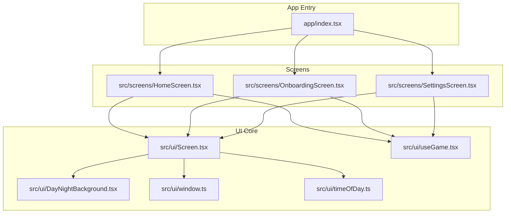
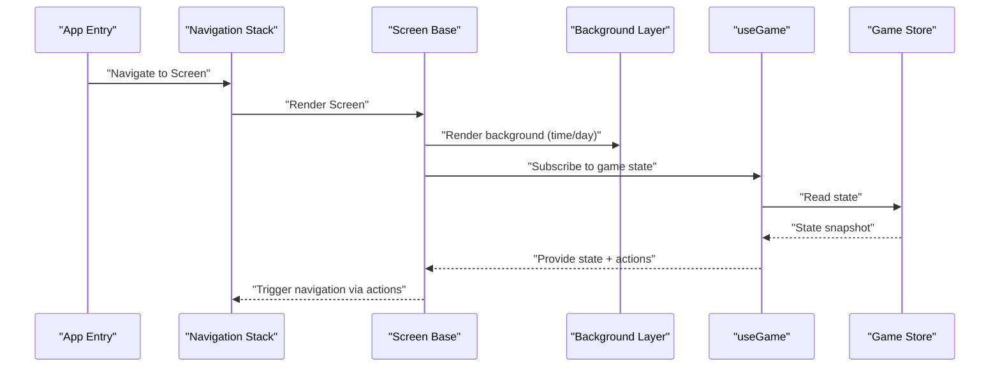
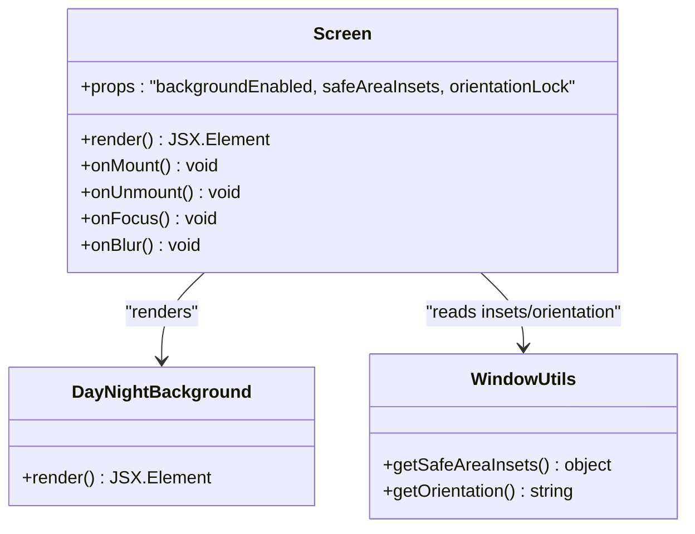
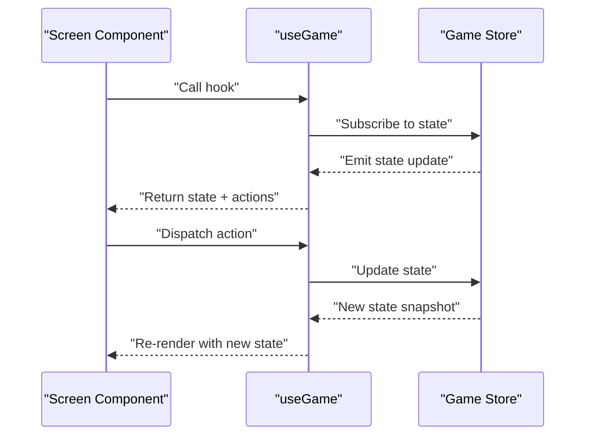
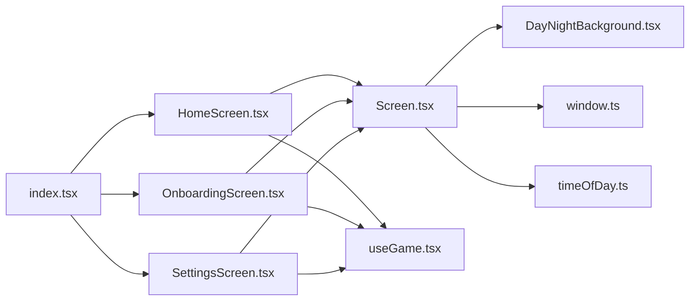

# Screen Base Component

<cite>
**Referenced Files in This Document**
- [Screen.tsx](file://src/ui/Screen.tsx)
- [useGame.tsx](file://src/ui/useGame.tsx)
- [HomeScreen.tsx](file://src/screens/HomeScreen.tsx)
- [OnboardingScreen.tsx](file://src/screens/OnboardingScreen.tsx)
- [SettingsScreen.tsx](file://src/screens/SettingsScreen.tsx)
- [DayNightBackground.tsx](file://src/ui/DayNightBackground.tsx)
- [window.ts](file://src/ui/window.ts)
- [timeOfDay.ts](file://src/ui/timeOfDay.ts)
- [index.tsx](file://app/index.tsx)
</cite>

## Table of Contents

1. [Introduction](#introduction)
2. [Project Structure](#project-structure)
3. [Core Components](#core-components)
4. [Architecture Overview](#architecture-overview)
5. [Detailed Component Analysis](#detailed-component-analysis)
6. [Dependency Analysis](#dependency-analysis)
7. [Performance Considerations](#performance-considerations)
8. [Troubleshooting Guide](#troubleshooting-guide)
9. [Conclusion](#conclusion)
10. [Appendices](#appendices)

## Introduction

This document explains the Screen base component and game integration hooks used across the application’s screens. It covers layout structure, navigation patterns, lifecycle management, background handling, safe area insets, device orientation support, and how to use the useGame hook to access game state and dispatch actions from screen components. It also provides guidance for creating custom screens, managing screen state, and integrating with the game engine.

## Project Structure

The Screen system is centered around a reusable Screen component that standardizes layout, background rendering, safe areas, and lifecycle behavior. Screens are implemented as React components that consume the useGame hook to read and update game state. Backgrounds and time-of-day visuals are provided by dedicated UI modules. Window utilities expose safe area and orientation information.

**Diagram sources**

- [index.tsx](file://app/index.tsx)
- [HomeScreen.tsx](file://src/screens/HomeScreen.tsx)
- [OnboardingScreen.tsx](file://src/screens/OnboardingScreen.tsx)
- [SettingsScreen.tsx](file://src/screens/SettingsScreen.tsx)
- [Screen.tsx](file://src/ui/Screen.tsx)
- [useGame.tsx](file://src/ui/useGame.tsx)
- [DayNightBackground.tsx](file://src/ui/DayNightBackground.tsx)
- [window.ts](file://src/ui/window.ts)
- [timeOfDay.ts](file://src/ui/timeOfDay.ts)

**Section sources**

- [Screen.tsx](file://src/ui/Screen.tsx)
- [useGame.tsx](file://src/ui/useGame.tsx)
- [HomeScreen.tsx](file://src/screens/HomeScreen.tsx)
- [OnboardingScreen.tsx](file://src/screens/OnboardingScreen.tsx)
- [SettingsScreen.tsx](file://src/screens/SettingsScreen.tsx)
- [DayNightBackground.tsx](file://src/ui/DayNightBackground.tsx)
- [window.ts](file://src/ui/window.ts)
- [timeOfDay.ts](file://src/ui/timeOfDay.ts)
- [index.tsx](file://app/index.tsx)

## Core Components

- Screen base component: Provides consistent layout, background rendering, safe area insets, and lifecycle hooks for mounting/unmounting and focus changes.
- useGame hook: Exposes current game state and action dispatchers to any screen component.
- Background and time-of-day: Renders dynamic backgrounds based on time or theme.
- Window utilities: Provide safe area insets and orientation data.

Key responsibilities:

- Layout: Full-screen container with padding for safe areas and optional content wrappers.
- Lifecycle: Mount/unmount callbacks and focus-aware behaviors.
- Navigation: Integration points for pushing/popping or switching screens via app-level routing.
- State: Access to global game state and actions through useGame.

**Section sources**

- [Screen.tsx](file://src/ui/Screen.tsx)
- [useGame.tsx](file://src/ui/useGame.tsx)
- [DayNightBackground.tsx](file://src/ui/DayNightBackground.tsx)
- [window.ts](file://src/ui/window.ts)

## Architecture Overview

The Screen component acts as a wrapper around each screen’s content. It composes background layers, applies safe area insets, and manages lifecycle events. Screens consume useGame to read state and dispatch actions. The app entry wires screens into the navigation stack.

**Diagram sources**

- [index.tsx](file://app/index.tsx)
- [Screen.tsx](file://src/ui/Screen.tsx)
- [DayNightBackground.tsx](file://src/ui/DayNightBackground.tsx)
- [useGame.tsx](file://src/ui/useGame.tsx)

## Detailed Component Analysis

### Screen Base Component

Responsibilities:

- Layout container with full-screen coverage and safe area padding.
- Background composition using time-of-day or theme-aware layers.
- Lifecycle hooks for mount/unmount and focus changes.
- Optional props for controlling background visibility, safe area behavior, and orientation lock.

Typical usage pattern:

- Wrap screen content inside the Screen component.
- Pass props to control background and insets.
- Use useGame within the screen body to interact with game state.

Lifecycle considerations:

- On mount: initialize resources, subscribe to listeners if needed.
- On unmount: clean up subscriptions and timers.
- On focus: resume animations or audio; on blur: pause non-essential work.

Safe area and orientation:

- Safe area insets are applied to avoid notches and home indicators.
- Orientation support can be enabled per screen when necessary.

**Section sources**

- [Screen.tsx](file://src/ui/Screen.tsx)
- [window.ts](file://src/ui/window.ts)
- [timeOfDay.ts](file://src/ui/timeOfDay.ts)

#### Class Diagram

**Diagram sources**

- [Screen.tsx](file://src/ui/Screen.tsx)
- [DayNightBackground.tsx](file://src/ui/DayNightBackground.tsx)
- [window.ts](file://src/ui/window.ts)

### useGame Hook

Purpose:

- Provide read-only access to game state and a set of action dispatchers to any screen component.
- Ensure re-renders only when relevant state slices change.

Common capabilities:

- Read current game state fields (e.g., player progress, inventory, settings).
- Dispatch actions to mutate state (e.g., start tutorial, open inventory, navigate to next scene).
- Integrate with navigation by triggering route changes through actions.

Usage pattern:

- Call useGame at the top level of a screen component.
- Destructure required state and actions.
- Avoid storing hook results in closures without dependencies.

Error handling:

- Guard against undefined state during initialization.
- Debounce frequent updates where appropriate.

**Section sources**

- [useGame.tsx](file://src/ui/useGame.tsx)

#### Sequence Diagram

**Diagram sources**

- [useGame.tsx](file://src/ui/useGame.tsx)

### Background Handling and Time-of-Day

The background layer renders day/night visuals based on time or theme configuration. It integrates with the Screen component to ensure proper sizing and safe area compliance.

Features:

- Dynamic background selection based on time of day.
- Smooth transitions between states.
- Performance optimizations like memoization and lazy loading.

Integration:

- Screen passes background-related props to the background component.
- Time-of-day module computes current period and returns visual assets.

**Section sources**

- [DayNightBackground.tsx](file://src/ui/DayNightBackground.tsx)
- [timeOfDay.ts](file://src/ui/timeOfDay.ts)
- [Screen.tsx](file://src/ui/Screen.tsx)

### Safe Area Insets and Device Orientation

Window utilities provide safe area insets and orientation information. The Screen component uses these to adjust padding and layout constraints.

Capabilities:

- Retrieve top/bottom/left/right insets.
- Detect device orientation (portrait/landscape).
- Apply platform-specific adjustments.

Best practices:

- Always wrap content with safe area padding.
- Handle orientation changes gracefully by recalculating layouts.

**Section sources**

- [window.ts](file://src/ui/window.ts)
- [Screen.tsx](file://src/ui/Screen.tsx)

### Creating Custom Screens

Steps:

1. Create a new screen component file under src/screens.
2. Import and render the Screen base component.
3. Use useGame to read state and dispatch actions.
4. Compose your UI inside the Screen wrapper.
5. Register the screen in the app’s navigation stack.

Example flow:

- A custom screen reads game state via useGame.
- User interactions trigger actions that update state and possibly navigate to another screen.
- Background and safe areas are handled automatically by Screen.

**Section sources**

- [HomeScreen.tsx](file://src/screens/HomeScreen.tsx)
- [OnboardingScreen.tsx](file://src/screens/OnboardingScreen.tsx)
- [SettingsScreen.tsx](file://src/screens/SettingsScreen.tsx)
- [useGame.tsx](file://src/ui/useGame.tsx)
- [Screen.tsx](file://src/ui/Screen.tsx)
- [index.tsx](file://app/index.tsx)

## Dependency Analysis

The Screen component depends on background, window utilities, and time-of-day modules. Screens depend on the Screen base and useGame hook. Navigation is managed at the app level and triggered via actions.

**Diagram sources**

- [Screen.tsx](file://src/ui/Screen.tsx)
- [DayNightBackground.tsx](file://src/ui/DayNightBackground.tsx)
- [window.ts](file://src/ui/window.ts)
- [timeOfDay.ts](file://src/ui/timeOfDay.ts)
- [HomeScreen.tsx](file://src/screens/HomeScreen.tsx)
- [OnboardingScreen.tsx](file://src/screens/OnboardingScreen.tsx)
- [SettingsScreen.tsx](file://src/screens/SettingsScreen.tsx)
- [useGame.tsx](file://src/ui/useGame.tsx)
- [index.tsx](file://app/index.tsx)

**Section sources**

- [Screen.tsx](file://src/ui/Screen.tsx)
- [useGame.tsx](file://src/ui/useGame.tsx)
- [HomeScreen.tsx](file://src/screens/HomeScreen.tsx)
- [OnboardingScreen.tsx](file://src/screens/OnboardingScreen.tsx)
- [SettingsScreen.tsx](file://src/screens/SettingsScreen.tsx)
- [DayNightBackground.tsx](file://src/ui/DayNightBackground.tsx)
- [window.ts](file://src/ui/window.ts)
- [timeOfDay.ts](file://src/ui/timeOfDay.ts)
- [index.tsx](file://app/index.tsx)

## Performance Considerations

- Memoize expensive computations in screens and backgrounds.
- Subscribe selectively in useGame to avoid unnecessary re-renders.
- Defer heavy asset loading until screens are focused.
- Use lazy loading for large backgrounds or scenes.
- Avoid deep nesting of components inside Screen to minimize layout thrashing.

[No sources needed since this section provides general guidance]

## Troubleshooting Guide

Common issues and resolutions:

- Missing safe area padding: Ensure Screen wraps content and window utilities are called correctly.
- Stale state in actions: Verify that actions are dispatched with correct dependencies and that state updates are idempotent.
- Background flicker: Check for rapid state changes and debounce updates where needed.
- Orientation glitches: Re-calculate layouts on orientation change and handle both portrait and landscape modes.

Debugging tips:

- Log state transitions in useGame to identify unexpected updates.
- Inspect safe area insets to confirm platform-specific values.
- Validate background assets and time-of-day calculations.

**Section sources**

- [Screen.tsx](file://src/ui/Screen.tsx)
- [useGame.tsx](file://src/ui/useGame.tsx)
- [window.ts](file://src/ui/window.ts)
- [timeOfDay.ts](file://src/ui/timeOfDay.ts)

## Conclusion

The Screen base component standardizes layout, background rendering, safe area handling, and lifecycle management across all screens. The useGame hook provides a clean interface to read and update game state. By following the patterns outlined here, developers can create consistent, performant, and maintainable screens that integrate seamlessly with the game engine and navigation system.

[No sources needed since this section summarizes without analyzing specific files]

## Appendices

- Best practices for screen creation:
  - Keep screen logic minimal; delegate complex operations to services or hooks.
  - Use clear prop interfaces for Screen customization.
  - Test screens with mocked game state to isolate UI behavior.
- Navigation patterns:
  - Prefer action-driven navigation to keep state and routing synchronized.
  - Centralize route definitions in the app entry for clarity.

[No sources needed since this section provides general guidance]
