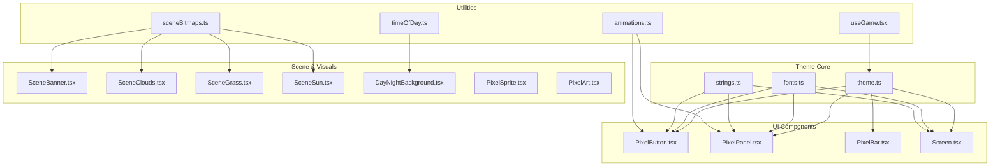
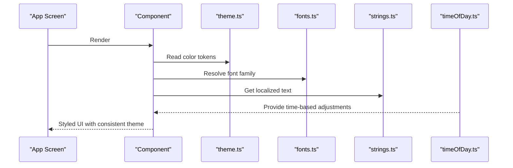
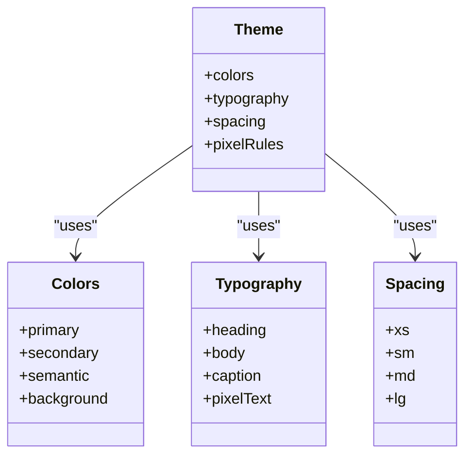
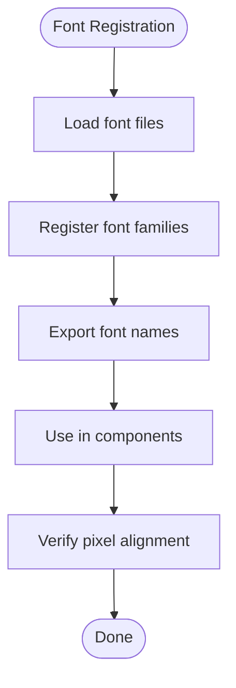
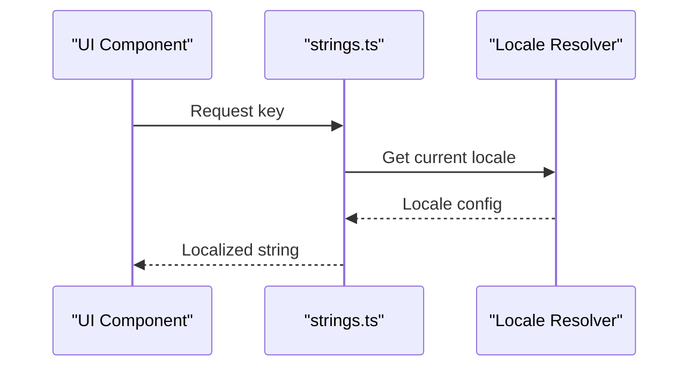
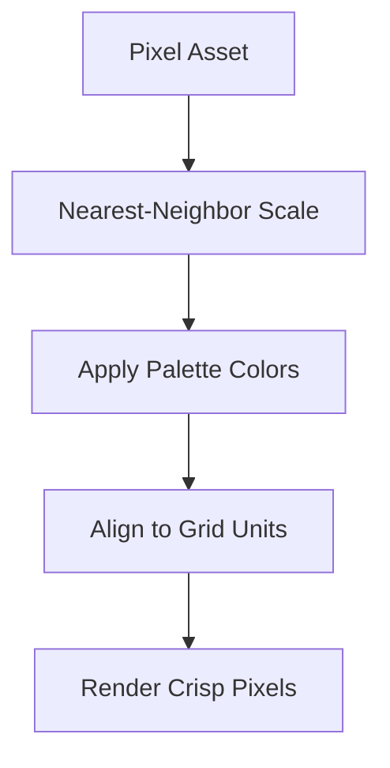
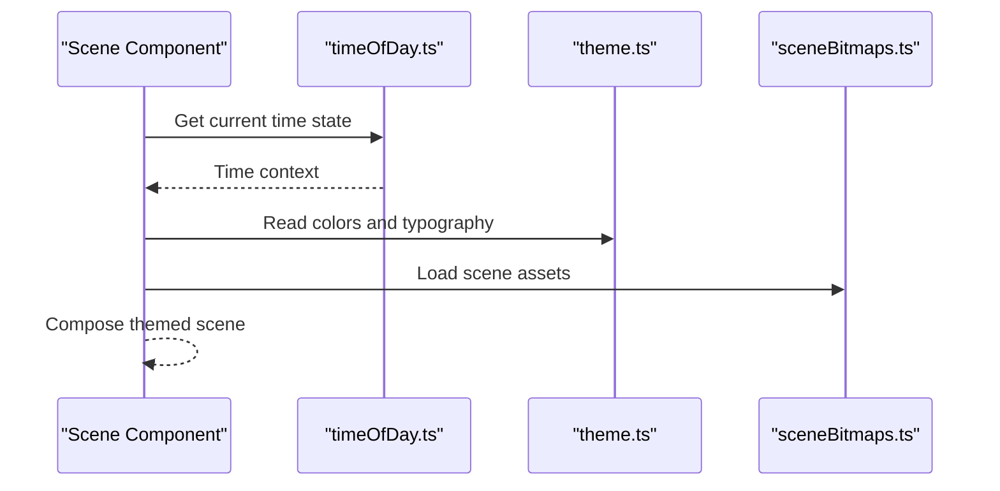
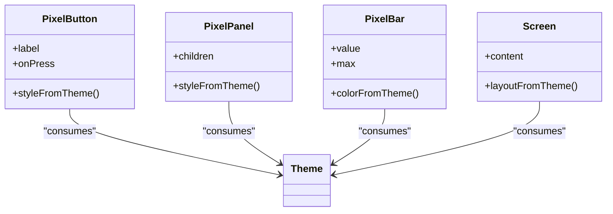
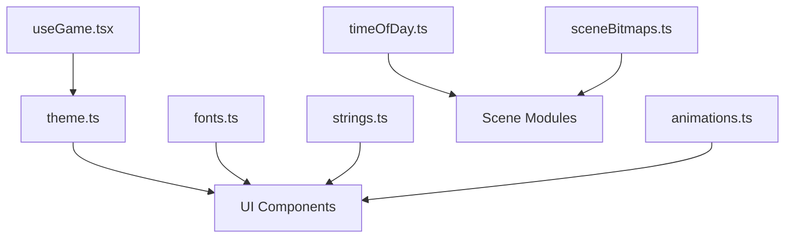

# Theme System

<cite>
**Referenced Files in This Document**
- [theme.ts](file://src/ui/theme.ts)
- [fonts.ts](file://src/ui/fonts.ts)
- [strings.ts](file://src/ui/strings.ts)
- [PixelButton.tsx](file://src/ui/PixelButton.tsx)
- [PixelPanel.tsx](file://src/ui/PixelPanel.tsx)
- [PixelBar.tsx](file://src/ui/PixelBar.tsx)
- [Screen.tsx](file://src/ui/Screen.tsx)
- [animations.ts](file://src/ui/animations.ts)
- [sceneBitmaps.ts](file://src/ui/sceneBitmaps.ts)
- [timeOfDay.ts](file://src/ui/timeOfDay.ts)
- [DayNightBackground.tsx](file://src/ui/DayNightBackground.tsx)
- [SceneBanner.tsx](file://src/ui/SceneBanner.tsx)
- [SceneClouds.tsx](file://src/ui/SceneClouds.tsx)
- [SceneGrass.tsx](file://src/ui/SceneGrass.tsx)
- [SceneSun.tsx](file://src/ui/SceneSun.tsx)
- [PixelSprite.tsx](file://src/ui/PixelSprite.tsx)
- [PixelArt.tsx](file://src/ui/PixelArt.tsx)
- [useGame.tsx](file://src/ui/useGame.tsx)
- [palette.json](file://tools/palette.json)
</cite>

## Table of Contents

1. [Introduction](#introduction)
2. [Project Structure](#project-structure)
3. [Core Components](#core-components)
4. [Architecture Overview](#architecture-overview)
5. [Detailed Component Analysis](#detailed-component-analysis)
6. [Dependency Analysis](#dependency-analysis)
7. [Performance Considerations](#performance-considerations)
8. [Troubleshooting Guide](#troubleshooting-guide)
9. [Conclusion](#conclusion)
10. [Appendices](#appendices)

## Introduction

This document explains the theme system architecture, covering color palette definitions, typography, spacing conventions, and pixel-art styling guidelines. It also details how themes are structured, extended, and applied across the application, including font management for custom pixel fonts and text styling patterns. Finally, it covers string localization and UI text management, with examples for creating custom themes, extending existing styles, and maintaining visual consistency.

## Project Structure

The theme system is centered around a dedicated theme module that defines colors, typography, spacing, and shared style tokens. UI components consume these tokens to ensure consistent visuals. Fonts are managed via a dedicated module that registers and exposes typefaces, while strings are centralized for localization. Scene assets and time-of-day utilities integrate with the theme to produce dynamic visuals.

**Diagram sources**

- [theme.ts](file://src/ui/theme.ts)
- [fonts.ts](file://src/ui/fonts.ts)
- [strings.ts](file://src/ui/strings.ts)
- [PixelButton.tsx](file://src/ui/PixelButton.tsx)
- [PixelPanel.tsx](file://src/ui/PixelPanel.tsx)
- [PixelBar.tsx](file://src/ui/PixelBar.tsx)
- [Screen.tsx](file://src/ui/Screen.tsx)
- [animations.ts](file://src/ui/animations.ts)
- [sceneBitmaps.ts](file://src/ui/sceneBitmaps.ts)
- [timeOfDay.ts](file://src/ui/timeOfDay.ts)
- [DayNightBackground.tsx](file://src/ui/DayNightBackground.tsx)
- [SceneBanner.tsx](file://src/ui/SceneBanner.tsx)
- [SceneClouds.tsx](file://src/ui/SceneClouds.tsx)
- [SceneGrass.tsx](file://src/ui/SceneGrass.tsx)
- [SceneSun.tsx](file://src/ui/SceneSun.tsx)
- [PixelSprite.tsx](file://src/ui/PixelSprite.tsx)
- [PixelArt.tsx](file://src/ui/PixelArt.tsx)
- [useGame.tsx](file://src/ui/useGame.tsx)

**Section sources**

- [theme.ts](file://src/ui/theme.ts)
- [fonts.ts](file://src/ui/fonts.ts)
- [strings.ts](file://src/ui/strings.ts)
- [PixelButton.tsx](file://src/ui/PixelButton.tsx)
- [PixelPanel.tsx](file://src/ui/PixelPanel.tsx)
- [PixelBar.tsx](file://src/ui/PixelBar.tsx)
- [Screen.tsx](file://src/ui/Screen.tsx)
- [animations.ts](file://src/ui/animations.ts)
- [sceneBitmaps.ts](file://src/ui/sceneBitmaps.ts)
- [timeOfDay.ts](file://src/ui/timeOfDay.ts)
- [DayNightBackground.tsx](file://src/ui/DayNightBackground.tsx)
- [SceneBanner.tsx](file://src/ui/SceneBanner.tsx)
- [SceneClouds.tsx](file://src/ui/SceneClouds.tsx)
- [SceneGrass.tsx](file://src/ui/SceneGrass.tsx)
- [SceneSun.tsx](file://src/ui/SceneSun.tsx)
- [PixelSprite.tsx](file://src/ui/PixelSprite.tsx)
- [PixelArt.tsx](file://src/ui/PixelArt.tsx)
- [useGame.tsx](file://src/ui/useGame.tsx)

## Core Components

- Color Palette: Centralized color tokens define primary, secondary, semantic, and background colors used consistently across components and scenes.
- Typography: A unified type scale provides headings, body, caption, and pixel-style variants, with explicit font families and sizes.
- Spacing: A modular spacing scale ensures consistent margins, paddings, and gaps.
- Pixel-Art Styling: Guidelines enforce crisp rendering, nearest-neighbor scaling, and constrained palettes for pixel assets.
- Theme Application: Components consume theme tokens directly; screens and scene modules derive dynamic values from time-of-day or game state.

Key responsibilities:

- theme.ts: Defines tokens and theme objects consumed by components.
- fonts.ts: Registers and exposes fonts, including custom pixel fonts.
- strings.ts: Centralizes localized UI text keys and values.
- UI components: Apply theme tokens for colors, typography, and spacing.
- Scene utilities: Integrate theme with bitmaps and time-of-day to render cohesive visuals.

**Section sources**

- [theme.ts](file://src/ui/theme.ts)
- [fonts.ts](file://src/ui/fonts.ts)
- [strings.ts](file://src/ui/strings.ts)
- [PixelButton.tsx](file://src/ui/PixelButton.tsx)
- [PixelPanel.tsx](file://src/ui/PixelPanel.tsx)
- [PixelBar.tsx](file://src/ui/PixelBar.tsx)
- [Screen.tsx](file://src/ui/Screen.tsx)

## Architecture Overview

The theme system follows a token-driven architecture:

- Tokens are defined centrally (colors, typography, spacing).
- Components import tokens and apply them declaratively.
- Dynamic contexts (time-of-day, game state) can adjust derived values without changing component logic.
- Fonts are registered once and referenced by name throughout the app.
- Strings are keyed and resolved at runtime for localization.

**Diagram sources**

- [theme.ts](file://src/ui/theme.ts)
- [fonts.ts](file://src/ui/fonts.ts)
- [strings.ts](file://src/ui/strings.ts)
- [timeOfDay.ts](file://src/ui/timeOfDay.ts)
- [PixelButton.tsx](file://src/ui/PixelButton.tsx)
- [Screen.tsx](file://src/ui/Screen.tsx)

## Detailed Component Analysis

### Theme Module (tokens and structure)

- Purpose: Define and export theme tokens for colors, typography, spacing, and shared style primitives.
- Usage: Components import tokens to style themselves consistently.
- Extension: Create new theme variants by composing base tokens and overriding specific properties.

**Diagram sources**

- [theme.ts](file://src/ui/theme.ts)

**Section sources**

- [theme.ts](file://src/ui/theme.ts)

### Font Management

- Purpose: Register and expose font families, including custom pixel fonts, ensuring consistent text rendering.
- Patterns:
  - Register fonts once and reference by name in components.
  - Provide pixel-safe font options for crisp rendering.
  - Expose type scales for headings, body, captions, and pixel text.

**Diagram sources**

- [fonts.ts](file://src/ui/fonts.ts)

**Section sources**

- [fonts.ts](file://src/ui/fonts.ts)

### String Localization and UI Text

- Purpose: Centralize all UI strings with keys and localized values.
- Patterns:
  - Define keys for labels, messages, and prompts.
  - Resolve strings at runtime based on locale.
  - Provide fallbacks for missing translations.

**Diagram sources**

- [strings.ts](file://src/ui/strings.ts)

**Section sources**

- [strings.ts](file://src/ui/strings.ts)

### Pixel-Art Styling Guidelines

- Purpose: Enforce crisp pixel rendering and consistent visual style.
- Guidelines:
  - Use nearest-neighbor scaling for sprites and bitmaps.
  - Constrain colors to the defined palette.
  - Align elements to grid units using the spacing scale.
  - Avoid anti-aliasing on pixel assets.

**Diagram sources**

- [PixelSprite.tsx](file://src/ui/PixelSprite.tsx)
- [PixelArt.tsx](file://src/ui/PixelArt.tsx)
- [sceneBitmaps.ts](file://src/ui/sceneBitmaps.ts)

**Section sources**

- [PixelSprite.tsx](file://src/ui/PixelSprite.tsx)
- [PixelArt.tsx](file://src/ui/PixelArt.tsx)
- [sceneBitmaps.ts](file://src/ui/sceneBitmaps.ts)

### Scene Integration with Theme

- Purpose: Combine theme tokens with scene bitmaps and time-of-day to produce cohesive visuals.
- Patterns:
  - Derive background colors from time-of-day.
  - Use theme colors for overlays and accents.
  - Maintain consistent spacing and typography across scenes.

**Diagram sources**

- [timeOfDay.ts](file://src/ui/timeOfDay.ts)
- [theme.ts](file://src/ui/theme.ts)
- [sceneBitmaps.ts](file://src/ui/sceneBitmaps.ts)
- [DayNightBackground.tsx](file://src/ui/DayNightBackground.tsx)
- [SceneBanner.tsx](file://src/ui/SceneBanner.tsx)
- [SceneClouds.tsx](file://src/ui/SceneClouds.tsx)
- [SceneGrass.tsx](file://src/ui/SceneGrass.tsx)
- [SceneSun.tsx](file://src/ui/SceneSun.tsx)

**Section sources**

- [timeOfDay.ts](file://src/ui/timeOfDay.ts)
- [theme.ts](file://src/ui/theme.ts)
- [sceneBitmaps.ts](file://src/ui/sceneBitmaps.ts)
- [DayNightBackground.tsx](file://src/ui/DayNightBackground.tsx)
- [SceneBanner.tsx](file://src/ui/SceneBanner.tsx)
- [SceneClouds.tsx](file://src/ui/SceneClouds.tsx)
- [SceneGrass.tsx](file://src/ui/SceneGrass.tsx)
- [SceneSun.tsx](file://src/ui/SceneSun.tsx)

### UI Components Using Theme

- PixelButton: Applies theme colors, typography, and spacing for buttons.
- PixelPanel: Uses theme backgrounds and borders to frame content.
- PixelBar: Leverages theme colors for progress and status indicators.
- Screen: Provides layout scaffolding with theme-aware spacing and typography.

**Diagram sources**

- [PixelButton.tsx](file://src/ui/PixelButton.tsx)
- [PixelPanel.tsx](file://src/ui/PixelPanel.tsx)
- [PixelBar.tsx](file://src/ui/PixelBar.tsx)
- [Screen.tsx](file://src/ui/Screen.tsx)
- [theme.ts](file://src/ui/theme.ts)

**Section sources**

- [PixelButton.tsx](file://src/ui/PixelButton.tsx)
- [PixelPanel.tsx](file://src/ui/PixelPanel.tsx)
- [PixelBar.tsx](file://src/ui/PixelBar.tsx)
- [Screen.tsx](file://src/ui/Screen.tsx)
- [theme.ts](file://src/ui/theme.ts)

## Dependency Analysis

- Theme consumers include UI components, scene modules, and utilities.
- Fonts and strings are foundational dependencies for all UI layers.
- Time-of-day influences scene visuals but not core theme tokens.

**Diagram sources**

- [theme.ts](file://src/ui/theme.ts)
- [fonts.ts](file://src/ui/fonts.ts)
- [strings.ts](file://src/ui/strings.ts)
- [timeOfDay.ts](file://src/ui/timeOfDay.ts)
- [sceneBitmaps.ts](file://src/ui/sceneBitmaps.ts)
- [animations.ts](file://src/ui/animations.ts)
- [useGame.tsx](file://src/ui/useGame.tsx)

**Section sources**

- [theme.ts](file://src/ui/theme.ts)
- [fonts.ts](file://src/ui/fonts.ts)
- [strings.ts](file://src/ui/strings.ts)
- [timeOfDay.ts](file://src/ui/timeOfDay.ts)
- [sceneBitmaps.ts](file://src/ui/sceneBitmaps.ts)
- [animations.ts](file://src/ui/animations.ts)
- [useGame.tsx](file://src/ui/useGame.tsx)

## Performance Considerations

- Prefer static theme tokens over computed styles where possible.
- Cache font registrations and avoid repeated loading.
- Use bitmap atlases for scene assets to reduce draw calls.
- Minimize re-renders by memoizing theme-derived values in components.
- Keep pixel assets sized appropriately to avoid unnecessary scaling.

[No sources needed since this section provides general guidance]

## Troubleshooting Guide

- Colors not applying: Ensure components import theme tokens correctly and do not override with inline styles.
- Fonts not loading: Verify font registration and file paths; check platform-specific font support.
- Strings missing: Confirm locale configuration and key existence; provide fallbacks.
- Pixel artifacts: Check scaling mode and ensure nearest-neighbor is enabled; validate asset dimensions.
- Scene visuals inconsistent: Validate time-of-day context and theme color usage in scene modules.

**Section sources**

- [theme.ts](file://src/ui/theme.ts)
- [fonts.ts](file://src/ui/fonts.ts)
- [strings.ts](file://src/ui/strings.ts)
- [timeOfDay.ts](file://src/ui/timeOfDay.ts)
- [sceneBitmaps.ts](file://src/ui/sceneBitmaps.ts)

## Conclusion

The theme system provides a robust, token-driven foundation for consistent visuals across the application. By centralizing colors, typography, spacing, and pixel-art guidelines, and by managing fonts and strings effectively, the system enables scalable theming and localization. Scene integration leverages time-of-day and bitmaps to maintain visual coherence, while UI components remain simple and theme-compliant.

[No sources needed since this section summarizes without analyzing specific files]

## Appendices

### Creating a Custom Theme

- Steps:
  - Import base theme tokens.
  - Override specific tokens (e.g., colors, typography).
  - Export the new theme object.
  - Apply the theme at the app root or within scoped providers.
- Best practices:
  - Preserve spacing and pixel rules for consistency.
  - Test contrast and readability across components.
  - Validate scene visuals under the new theme.

**Section sources**

- [theme.ts](file://src/ui/theme.ts)

### Extending Existing Styles

- Steps:
  - Extend typography scales for new heading levels.
  - Add semantic color tokens for states (e.g., success, warning).
  - Update spacing scale if new grid units are required.
- Validation:
  - Ensure components consume updated tokens.
  - Run visual regression tests for pixel assets.

**Section sources**

- [theme.ts](file://src/ui/theme.ts)
- [fonts.ts](file://src/ui/fonts.ts)
- [strings.ts](file://src/ui/strings.ts)

### Maintaining Visual Consistency

- Guidelines:
  - Always use theme tokens for colors and typography.
  - Adhere to spacing scale for layout.
  - Apply pixel-art rules to all raster assets.
  - Centralize strings and localize consistently.
- Tools:
  - Use palette definitions for asset creation.
  - Validate bitmaps against theme constraints.

**Section sources**

- [palette.json](file://tools/palette.json)
- [theme.ts](file://src/ui/theme.ts)
- [sceneBitmaps.ts](file://src/ui/sceneBitmaps.ts)
