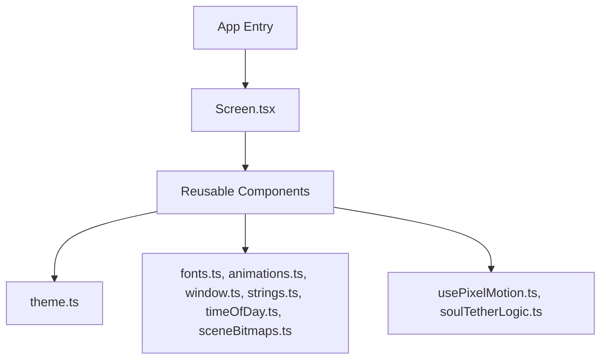
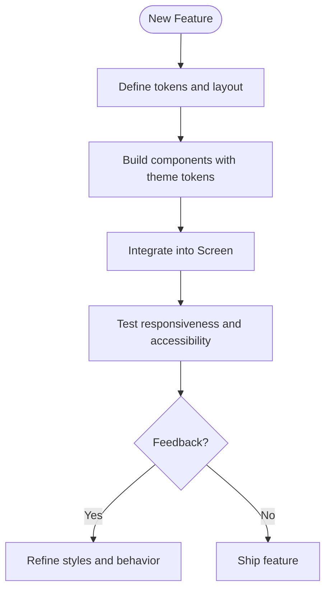
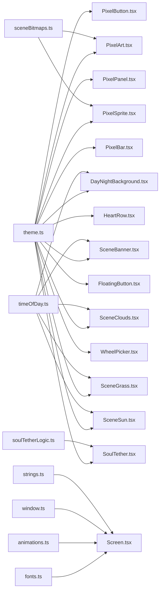

# UI Framework

<cite>
**Referenced Files in This Document**
- [theme.ts](file://src/ui/theme.ts)
- [fonts.ts](file://src/ui/fonts.ts)
- [animations.ts](file://src/ui/animations.ts)
- [Screen.tsx](file://src/ui/Screen.tsx)
- [PixelButton.tsx](file://src/ui/PixelButton.tsx)
- [PixelPanel.tsx](file://src/ui/PixelPanel.tsx)
- [PixelBar.tsx](file://src/ui/PixelBar.tsx)
- [PixelArt.tsx](file://src/ui/PixelArt.tsx)
- [PixelSprite.tsx](file://src/ui/PixelSprite.tsx)
- [usePixelMotion.ts](file://src/ui/usePixelMotion.ts)
- [window.ts](file://src/ui/window.ts)
- [strings.ts](file://src/ui/strings.ts)
- [timeOfDay.ts](file://src/ui/timeOfDay.ts)
- [sceneBitmaps.ts](file://src/ui/sceneBitmaps.ts)
- [DayNightBackground.tsx](file://src/ui/DayNightBackground.tsx)
- [SceneBanner.tsx](file://src/ui/SceneBanner.tsx)
- [SceneClouds.tsx](file://src/ui/SceneClouds.tsx)
- [SceneGrass.tsx](file://src/ui/SceneGrass.tsx)
- [SceneSun.tsx](file://src/ui/SceneSun.tsx)
- [HeartRow.tsx](file://src/ui/HeartRow.tsx)
- [FloatingButton.tsx](file://src/ui/FloatingButton.tsx)
- [WheelPicker.tsx](file://src/ui/WheelPicker.tsx)
- [SoulTether.tsx](file://src/ui/SoulTether.tsx)
- [soulTetherLogic.ts](file://src/ui/soulTetherLogic.ts)
- [index.tsx](file://app/index.tsx)
- [HomeScreen.tsx](file://src/screens/HomeScreen.tsx)
</cite>

## Table of Contents

1. [Introduction](#introduction)
2. [Project Structure](#project-structure)
3. [Core Components](#core-components)
4. [Architecture Overview](#architecture-overview)
5. [Detailed Component Analysis](#detailed-component-analysis)
6. [Dependency Analysis](#dependency-analysis)
7. [Performance Considerations](#performance-considerations)
8. [Troubleshooting Guide](#troubleshooting-guide)
9. [Conclusion](#conclusion)
10. [Appendices](#appendices)

## Introduction

This document describes a custom UI framework built on top of React Native with a strong emphasis on pixel-art aesthetics, consistent theming, and reusable components. It covers the theme system (colors, typography, spacing), pixel-art styling conventions, reusable components (PixelButton, PixelPanel, and others), the Screen base component, layout patterns, responsive design, animations, font management, visual effects, and guidelines for creating new components while maintaining consistency and extending the theme.

## Project Structure

The UI framework lives primarily under src/ui and is consumed by screens under src/screens and app entry points. Key areas:

- Theme and tokens: colors, typography, spacing, and pixel-art rules
- Fonts: loading and managing pixel fonts
- Animations: shared animation utilities and hooks
- Base screen: Screen.tsx as a common wrapper for pages
- Reusable components: buttons, panels, bars, sprites, scene elements
- Utilities: window sizing, strings, time-of-day visuals, scene bitmaps

```mermaid
graph TB
subgraph "UI Framework"
T["theme.ts"]
F["fonts.ts"]
A["animations.ts"]
S["Screen.tsx"]
PB["PixelButton.tsx"]
PP["PixelPanel.tsx"]
PBar["PixelBar.tsx"]
PArt["PixelArt.tsx"]
PSpr["PixelSprite.tsx"]
W["window.ts"]
Str["strings.ts"]
TOD["timeOfDay.ts"]
SB["sceneBitmaps.ts"]
end
subgraph "Screens"
HS["HomeScreen.tsx"]
end
HS --> S
HS --> PB
HS --> PP
HS --> PBar
HS --> PArt
HS --> PSpr
HS --> DayBg["DayNightBackground.tsx"]
HS --> SceneBanner["SceneBanner.tsx"]
HS --> SceneClouds["SceneClouds.tsx"]
HS --> SceneGrass["SceneGrass.tsx"]
HS --> SceneSun["SceneSun.tsx"]
HS --> HeartRow["HeartRow.tsx"]
HS --> FloatingBtn["FloatingButton.tsx"]
HS --> Wheel["WheelPicker.tsx"]
HS --> SoulTether["SoulTether.tsx"]
PB --> T
PP --> T
PBar --> T
PArt --> T
PSpr --> T
S --> T
DayBg --> T
SceneBanner --> T
SceneClouds --> T
SceneGrass --> T
SceneSun --> T
HeartRow --> T
FloatingBtn --> T
Wheel --> T
SoulTether --> T
SoulTether --> STLogic["soulTetherLogic.ts"]
PArt --> SB
PSpr --> SB
DayBg --> TOD
SceneBanner --> TOD
SceneClouds --> TOD
SceneGrass --> TOD
SceneSun --> TOD
S --> W
S --> F
S --> A
```

**Diagram sources**

- [theme.ts](file://src/ui/theme.ts)
- [fonts.ts](file://src/ui/fonts.ts)
- [animations.ts](file://src/ui/animations.ts)
- [Screen.tsx](file://src/ui/Screen.tsx)
- [PixelButton.tsx](file://src/ui/PixelButton.tsx)
- [PixelPanel.tsx](file://src/ui/PixelPanel.tsx)
- [PixelBar.tsx](file://src/ui/PixelBar.tsx)
- [PixelArt.tsx](file://src/ui/PixelArt.tsx)
- [PixelSprite.tsx](file://src/ui/PixelSprite.tsx)
- [window.ts](file://src/ui/window.ts)
- [strings.ts](file://src/ui/strings.ts)
- [timeOfDay.ts](file://src/ui/timeOfDay.ts)
- [sceneBitmaps.ts](file://src/ui/sceneBitmaps.ts)
- [DayNightBackground.tsx](file://src/ui/DayNightBackground.tsx)
- [SceneBanner.tsx](file://src/ui/SceneBanner.tsx)
- [SceneClouds.tsx](file://src/ui/SceneClouds.tsx)
- [SceneGrass.tsx](file://src/ui/SceneGrass.tsx)
- [SceneSun.tsx](file://src/ui/SceneSun.tsx)
- [HeartRow.tsx](file://src/ui/HeartRow.tsx)
- [FloatingButton.tsx](file://src/ui/FloatingButton.tsx)
- [WheelPicker.tsx](file://src/ui/WheelPicker.tsx)
- [SoulTether.tsx](file://src/ui/SoulTether.tsx)
- [soulTetherLogic.ts](file://src/ui/soulTetherLogic.ts)

**Section sources**

- [index.tsx](file://app/index.tsx)
- [HomeScreen.tsx](file://src/screens/HomeScreen.tsx)

## Core Components

This section outlines the foundational building blocks of the UI framework.

- Theme system (colors, typography, spacing, pixel-art conventions)
  - Centralized color palette and semantic tokens
  - Typography scale and pixel-friendly font usage
  - Spacing scale aligned to pixel grid
  - Pixel-art rendering rules (nearest neighbor scaling, crisp edges)

- Screen base component
  - Consistent page shell, safe area handling, background, and header/footer slots
  - Responsive layout helpers and device-aware behavior

- Reusable components
  - PixelButton: pixel-styled button with variants and states
  - PixelPanel: bordered panel with optional content padding and headers
  - PixelBar: progress or status bar with pixel segments
  - PixelArt and PixelSprite: render pixel art assets with proper scaling
  - Scene elements: DayNightBackground, SceneBanner, SceneClouds, SceneGrass, SceneSun
  - Interactive helpers: HeartRow, FloatingButton, WheelPicker, SoulTether

- Animation system
  - Shared animation utilities and hooks for smooth transitions
  - Motion presets for UI feedback and scene transitions

- Font management
  - Loading and caching pixel fonts
  - Fallback strategies and type-safe usage

- Visual effects
  - Time-of-day palettes and dynamic backgrounds
  - Scene bitmap composition and layering

**Section sources**

- [theme.ts](file://src/ui/theme.ts)
- [Screen.tsx](file://src/ui/Screen.tsx)
- [PixelButton.tsx](file://src/ui/PixelButton.tsx)
- [PixelPanel.tsx](file://src/ui/PixelPanel.tsx)
- [PixelBar.tsx](file://src/ui/PixelBar.tsx)
- [PixelArt.tsx](file://src/ui/PixelArt.tsx)
- [PixelSprite.tsx](file://src/ui/PixelSprite.tsx)
- [animations.ts](file://src/ui/animations.ts)
- [fonts.ts](file://src/ui/fonts.ts)
- [timeOfDay.ts](file://src/ui/timeOfDay.ts)
- [sceneBitmaps.ts](file://src/ui/sceneBitmaps.ts)

## Architecture Overview

The framework follows a layered architecture:

- Presentation layer: Screens compose reusable UI components
- Component layer: PixelButton, PixelPanel, PixelBar, PixelArt, PixelSprite, scene elements
- Theming layer: theme.ts defines tokens used across components
- Utilities layer: fonts, animations, window sizing, strings, time-of-day, scene bitmaps
- Data/behavior layer: hooks like usePixelMotion and logic modules like soulTetherLogic

**Diagram sources**

- [Screen.tsx](file://src/ui/Screen.tsx)
- [theme.ts](file://src/ui/theme.ts)
- [fonts.ts](file://src/ui/fonts.ts)
- [animations.ts](file://src/ui/animations.ts)
- [window.ts](file://src/ui/window.ts)
- [strings.ts](file://src/ui/strings.ts)
- [timeOfDay.ts](file://src/ui/timeOfDay.ts)
- [sceneBitmaps.ts](file://src/ui/sceneBitmaps.ts)
- [usePixelMotion.ts](file://src/ui/usePixelMotion.ts)
- [soulTetherLogic.ts](file://src/ui/soulTetherLogic.ts)

## Detailed Component Analysis

### Theme System

- Color palettes: semantic tokens for primary, secondary, surface, text, borders, and state colors
- Typography: pixel-friendly font families, sizes, weights, and line heights
- Spacing: grid-aligned spacing scale ensuring crisp layouts
- Pixel-art conventions: nearest-neighbor scaling, no anti-aliasing on sprites, border radii disabled for pixel look

Guidelines:

- Always reference theme tokens instead of hardcoding values
- Use spacing scale consistently for margins and paddings
- Keep text contrast within accessible thresholds
- For pixel art, ensure images are sized to multiples of their intended display size

**Section sources**

- [theme.ts](file://src/ui/theme.ts)

### Fonts Management

- Load pixel fonts at startup and expose typed accessors
- Provide fallback fonts for unsupported platforms
- Cache fonts to avoid reloads

Usage pattern:

- Import font hook or provider
- Apply font family via theme tokens or component props

**Section sources**

- [fonts.ts](file://src/ui/fonts.ts)

### Animations and Motion

- Shared animation utilities for fade, slide, and bounce effects
- Hook-based motion integration for smooth transitions
- Presets for UI feedback (press, focus, error)

Best practices:

- Prefer short durations for micro-interactions
- Use easing curves that feel snappy for pixel aesthetics
- Avoid heavy animations on low-end devices

**Section sources**

- [animations.ts](file://src/ui/animations.ts)
- [usePixelMotion.ts](file://src/ui/usePixelMotion.ts)

### Screen Base Component

Responsibilities:

- Wraps each page with consistent background, safe areas, and layout constraints
- Provides header/footer slots and content area
- Integrates theme, fonts, and responsive utilities

Responsive approach:

- Adapts layout based on window dimensions
- Uses spacing and typography scales to maintain readability

**Section sources**

- [Screen.tsx](file://src/ui/Screen.tsx)
- [window.ts](file://src/ui/window.ts)

### PixelButton

- Variants: primary, secondary, ghost
- States: default, pressed, disabled
- Accessibility: labels, touch targets, focus indicators
- Styling: pixel borders, crisp edges, consistent spacing

Customization:

- Override colors via theme tokens
- Adjust size and padding through props
- Add icons or loaders

**Section sources**

- [PixelButton.tsx](file://src/ui/PixelButton.tsx)
- [theme.ts](file://src/ui/theme.ts)

### PixelPanel

- Bordered container with optional header and footer
- Padding and gap controlled by theme spacing
- Supports scrollable content and fixed sections

Customization:

- Change border style and colors via theme
- Toggle header/footer visibility
- Customize internal spacing

**Section sources**

- [PixelPanel.tsx](file://src/ui/PixelPanel.tsx)
- [theme.ts](file://src/ui/theme.ts)

### PixelBar

- Progress/status indicator using pixel segments
- Supports indeterminate mode and color variants

Customization:

- Set value and max for determinate mode
- Choose color from theme tokens
- Adjust height and segment gaps

**Section sources**

- [PixelBar.tsx](file://src/ui/PixelBar.tsx)
- [theme.ts](file://src/ui/theme.ts)

### PixelArt and PixelSprite

- Render pixel art assets with nearest-neighbor scaling
- Support sprite sheets and frame selection
- Optimize memory by reusing textures where possible

Usage:

- Provide asset source and desired display size
- Ensure image resolution matches intended pixel density

**Section sources**

- [PixelArt.tsx](file://src/ui/PixelArt.tsx)
- [PixelSprite.tsx](file://src/ui/PixelSprite.tsx)
- [sceneBitmaps.ts](file://src/ui/sceneBitmaps.ts)
- [theme.ts](file://src/ui/theme.ts)

### Scene Elements

- DayNightBackground: dynamic background based on time-of-day
- SceneBanner: banner overlay with title and decorative elements
- SceneClouds: animated cloud layers
- SceneGrass: ground layer with pixel grass tiles
- SceneSun: sun/moon element with position and glow

Composition:

- Layered rendering with z-index ordering
- Time-of-day influences colors and positions

**Section sources**

- [DayNightBackground.tsx](file://src/ui/DayNightBackground.tsx)
- [SceneBanner.tsx](file://src/ui/SceneBanner.tsx)
- [SceneClouds.tsx](file://src/ui/SceneClouds.tsx)
- [SceneGrass.tsx](file://src/ui/SceneGrass.tsx)
- [SceneSun.tsx](file://src/ui/SceneSun.tsx)
- [timeOfDay.ts](file://src/ui/timeOfDay.ts)
- [theme.ts](file://src/ui/theme.ts)

### Interactive Helpers

- HeartRow: displays heart count with pixel hearts
- FloatingButton: action button with floating position and press feedback
- WheelPicker: pixel-styled picker for selections
- SoulTether: interactive tether visualization with logic module

Customization:

- Colors and sizes via theme tokens
- Behavior via props and logic modules

**Section sources**

- [HeartRow.tsx](file://src/ui/HeartRow.tsx)
- [FloatingButton.tsx](file://src/ui/FloatingButton.tsx)
- [WheelPicker.tsx](file://src/ui/WheelPicker.tsx)
- [SoulTether.tsx](file://src/ui/SoulTether.tsx)
- [soulTetherLogic.ts](file://src/ui/soulTetherLogic.ts)
- [theme.ts](file://src/ui/theme.ts)

### Conceptual Overview

The framework emphasizes consistency through tokens and reusable components. Screens compose these components to build rich pixel-art experiences while maintaining performance and accessibility.

[No sources needed since this diagram shows conceptual workflow, not actual code structure]

## Dependency Analysis

Components depend on the theme system and utilities. Some components encapsulate logic modules.

**Diagram sources**

- [theme.ts](file://src/ui/theme.ts)
- [PixelButton.tsx](file://src/ui/PixelButton.tsx)
- [PixelPanel.tsx](file://src/ui/PixelPanel.tsx)
- [PixelBar.tsx](file://src/ui/PixelBar.tsx)
- [PixelArt.tsx](file://src/ui/PixelArt.tsx)
- [PixelSprite.tsx](file://src/ui/PixelSprite.tsx)
- [DayNightBackground.tsx](file://src/ui/DayNightBackground.tsx)
- [SceneBanner.tsx](file://src/ui/SceneBanner.tsx)
- [SceneClouds.tsx](file://src/ui/SceneClouds.tsx)
- [SceneGrass.tsx](file://src/ui/SceneGrass.tsx)
- [SceneSun.tsx](file://src/ui/SceneSun.tsx)
- [HeartRow.tsx](file://src/ui/HeartRow.tsx)
- [FloatingButton.tsx](file://src/ui/FloatingButton.tsx)
- [WheelPicker.tsx](file://src/ui/WheelPicker.tsx)
- [SoulTether.tsx](file://src/ui/SoulTether.tsx)
- [fonts.ts](file://src/ui/fonts.ts)
- [animations.ts](file://src/ui/animations.ts)
- [window.ts](file://src/ui/window.ts)
- [strings.ts](file://src/ui/strings.ts)
- [timeOfDay.ts](file://src/ui/timeOfDay.ts)
- [sceneBitmaps.ts](file://src/ui/sceneBitmaps.ts)
- [soulTetherLogic.ts](file://src/ui/soulTetherLogic.ts)

**Section sources**

- [theme.ts](file://src/ui/theme.ts)
- [Screen.tsx](file://src/ui/Screen.tsx)
- [PixelButton.tsx](file://src/ui/PixelButton.tsx)
- [PixelPanel.tsx](file://src/ui/PixelPanel.tsx)
- [PixelBar.tsx](file://src/ui/PixelBar.tsx)
- [PixelArt.tsx](file://src/ui/PixelArt.tsx)
- [PixelSprite.tsx](file://src/ui/PixelSprite.tsx)
- [DayNightBackground.tsx](file://src/ui/DayNightBackground.tsx)
- [SceneBanner.tsx](file://src/ui/SceneBanner.tsx)
- [SceneClouds.tsx](file://src/ui/SceneClouds.tsx)
- [SceneGrass.tsx](file://src/ui/SceneGrass.tsx)
- [SceneSun.tsx](file://src/ui/SceneSun.tsx)
- [HeartRow.tsx](file://src/ui/HeartRow.tsx)
- [FloatingButton.tsx](file://src/ui/FloatingButton.tsx)
- [WheelPicker.tsx](file://src/ui/WheelPicker.tsx)
- [SoulTether.tsx](file://src/ui/SoulTether.tsx)
- [soulTetherLogic.ts](file://src/ui/soulTetherLogic.ts)
- [fonts.ts](file://src/ui/fonts.ts)
- [animations.ts](file://src/ui/animations.ts)
- [window.ts](file://src/ui/window.ts)
- [strings.ts](file://src/ui/strings.ts)
- [timeOfDay.ts](file://src/ui/timeOfDay.ts)
- [sceneBitmaps.ts](file://src/ui/sceneBitmaps.ts)

## Performance Considerations

- Use pixel-perfect assets sized for target display densities to avoid scaling overhead
- Prefer texture reuse for sprites and scene elements
- Limit animation complexity; use hardware-accelerated properties
- Debounce frequent updates in interactive components
- Batch theme token reads to minimize re-renders

[No sources needed since this section provides general guidance]

## Troubleshooting Guide

Common issues and resolutions:

- Blurry pixel art: ensure nearest-neighbor scaling and correct asset sizes
- Inconsistent colors: verify theme token usage and avoid hardcoded values
- Layout misalignment: check spacing scale and safe area insets
- Font loading errors: confirm font availability and fallback strategy
- Animation jank: simplify transitions and reduce simultaneous animations
- Scene timing mismatches: validate time-of-day calculations and updates

**Section sources**

- [theme.ts](file://src/ui/theme.ts)
- [fonts.ts](file://src/ui/fonts.ts)
- [animations.ts](file://src/ui/animations.ts)
- [timeOfDay.ts](file://src/ui/timeOfDay.ts)

## Conclusion

The UI framework provides a cohesive, pixel-art-focused experience built on React Native. By centralizing theming, standardizing components, and leveraging shared utilities, it enables consistent, performant, and accessible interfaces. Follow the guidelines to create new components, extend the theme, and maintain visual harmony across the application.

[No sources needed since this section summarizes without analyzing specific files]

## Appendices

### Guidelines for Creating New UI Components

- Start with theme tokens for colors, typography, and spacing
- Define clear props interface with defaults
- Implement accessibility labels and keyboard support
- Ensure pixel-perfect rendering and crisp edges
- Add tests for core behaviors and edge cases

### Extending the Theme System

- Add new semantic tokens in the theme file
- Update component defaults to use new tokens
- Document changes and migration steps for consumers

### Example Usage Patterns

- Compose screens using Screen base and reusable components
- Apply theme tokens directly or via component props
- Use animations sparingly for meaningful feedback
- Layer scene elements for immersive backgrounds

[No sources needed since this section provides general guidance]
