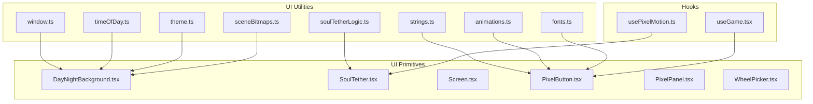
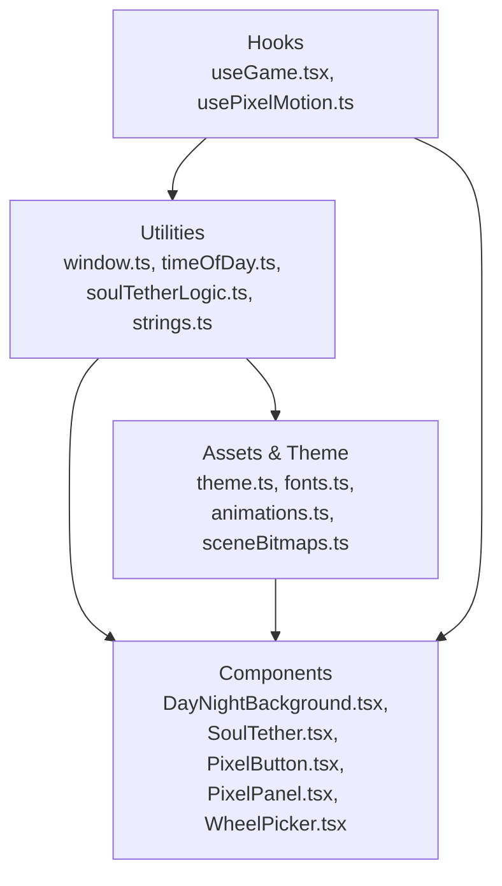
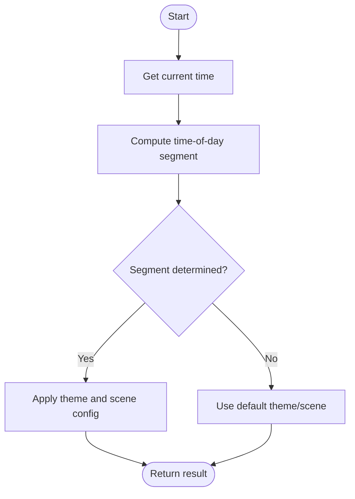
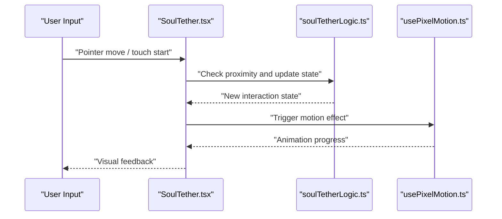
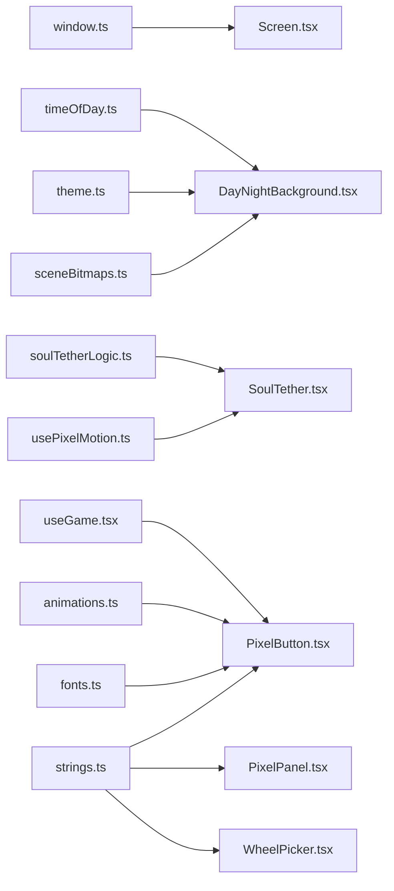

# UI Utilities & Helpers

<cite>
**Referenced Files in This Document**
- [window.ts](file://src/ui/window.ts)
- [timeOfDay.ts](file://src/ui/timeOfDay.ts)
- [soulTetherLogic.ts](file://src/ui/soulTetherLogic.ts)
- [theme.ts](file://src/ui/theme.ts)
- [strings.ts](file://src/ui/strings.ts)
- [animations.ts](file://src/ui/animations.ts)
- [fonts.ts](file://src/ui/fonts.ts)
- [sceneBitmaps.ts](file://src/ui/sceneBitmaps.ts)
- [useGame.tsx](file://src/ui/useGame.tsx)
- [usePixelMotion.ts](file://src/ui/usePixelMotion.ts)
- [DayNightBackground.tsx](file://src/ui/DayNightBackground.tsx)
- [SoulTether.tsx](file://src/ui/SoulTether.tsx)
- [Screen.tsx](file://src/ui/Screen.tsx)
- [PixelButton.tsx](file://src/ui/PixelButton.tsx)
- [PixelPanel.tsx](file://src/ui/PixelPanel.tsx)
- [WheelPicker.tsx](file://src/ui/WheelPicker.tsx)
- [soulTetherLogic.test.ts](file://src/ui/__tests__/soulTetherLogic.test.ts)
- [window.test.ts](file://src/ui/__tests__/window.test.ts)
</cite>

## Table of Contents

1. [Introduction](#introduction)
2. [Project Structure](#project-structure)
3. [Core Components](#core-components)
4. [Architecture Overview](#architecture-overview)
5. [Detailed Component Analysis](#detailed-component-analysis)
6. [Dependency Analysis](#dependency-analysis)
7. [Performance Considerations](#performance-considerations)
8. [Troubleshooting Guide](#troubleshooting-guide)
9. [Conclusion](#conclusion)
10. [Appendices](#appendices)

## Introduction

This document explains the UI utility functions and helper modules that power responsive layouts, device-specific adjustments, time-of-day theming, interactive soul tether mechanics, and common formatting/validation helpers. It is designed to help you extend the utility library and build custom components with confidence.

## Project Structure

The UI utilities live under src/ui and are organized by responsibility:

- Window management and responsive layout helpers
- Time-of-day calculation and scene theming
- Soul tether logic for interactive elements
- Shared styling, animations, fonts, and string resources
- Reusable UI primitives and hooks

**Diagram sources**

- [window.ts](file://src/ui/window.ts)
- [timeOfDay.ts](file://src/ui/timeOfDay.ts)
- [soulTetherLogic.ts](file://src/ui/soulTetherLogic.ts)
- [theme.ts](file://src/ui/theme.ts)
- [strings.ts](file://src/ui/strings.ts)
- [animations.ts](file://src/ui/animations.ts)
- [fonts.ts](file://src/ui/fonts.ts)
- [sceneBitmaps.ts](file://src/ui/sceneBitmaps.ts)
- [DayNightBackground.tsx](file://src/ui/DayNightBackground.tsx)
- [SoulTether.tsx](file://src/ui/SoulTether.tsx)
- [Screen.tsx](file://src/ui/Screen.tsx)
- [PixelButton.tsx](file://src/ui/PixelButton.tsx)
- [PixelPanel.tsx](file://src/ui/PixelPanel.tsx)
- [WheelPicker.tsx](file://src/ui/WheelPicker.tsx)
- [useGame.tsx](file://src/ui/useGame.tsx)
- [usePixelMotion.ts](file://src/ui/usePixelMotion.ts)

**Section sources**

- [window.ts](file://src/ui/window.ts)
- [timeOfDay.ts](file://src/ui/timeOfDay.ts)
- [soulTetherLogic.ts](file://src/ui/soulTetherLogic.ts)
- [theme.ts](file://src/ui/theme.ts)
- [strings.ts](file://src/ui/strings.ts)
- [animations.ts](file://src/ui/animations.ts)
- [fonts.ts](file://src/ui/fonts.ts)
- [sceneBitmaps.ts](file://src/ui/sceneBitmaps.ts)
- [DayNightBackground.tsx](file://src/ui/DayNightBackground.tsx)
- [SoulTether.tsx](file://src/ui/SoulTether.tsx)
- [Screen.tsx](file://src/ui/Screen.tsx)
- [PixelButton.tsx](file://src/ui/PixelButton.tsx)
- [PixelPanel.tsx](file://src/ui/PixelPanel.tsx)
- [WheelPicker.tsx](file://src/ui/WheelPicker.tsx)
- [useGame.tsx](file://src/ui/useGame.tsx)
- [usePixelMotion.ts](file://src/ui/usePixelMotion.ts)

## Core Components

- Window management utilities: Provide safe access to window dimensions, orientation, and safe areas for responsive layouts and device-specific adjustments.
- Time-of-day system: Computes current period (e.g., morning, day, evening, night) to drive visual theming and scene changes.
- Soul tether logic: Implements proximity-based interaction rules for UI elements and game mechanics.
- Formatting and validation helpers: Common utilities for text formatting, input validation, and consistent UI operations.
- Animation and theme helpers: Centralized animation presets and theme tokens used across components.

**Section sources**

- [window.ts](file://src/ui/window.ts)
- [timeOfDay.ts](file://src/ui/timeOfDay.ts)
- [soulTetherLogic.ts](file://src/ui/soulTetherLogic.ts)
- [strings.ts](file://src/ui/strings.ts)
- [animations.ts](file://src/ui/animations.ts)
- [theme.ts](file://src/ui/theme.ts)

## Architecture Overview

The UI utilities form a layered architecture:

- Utility layer: Pure functions for window sizing, time-of-day calculations, tether logic, formatting, and validation.
- Theme and assets layer: Centralized theme tokens, fonts, animations, and scene bitmaps.
- Component layer: Reusable UI primitives that consume utilities and expose props/hooks.
- Hook layer: Custom hooks that encapsulate stateful behavior and integrate with the engine or platform APIs.

[No sources needed since this diagram shows conceptual workflow, not actual code structure]

## Detailed Component Analysis

### Window Management Utilities

Responsibilities:

- Expose window width/height, orientation, and safe area insets.
- Normalize values across devices and orientations.
- Provide helpers for responsive breakpoints and scaling.

Usage patterns:

- Use window metrics to compute layout grids and spacing.
- Adjust component sizes based on orientation or device class.
- Combine with theme tokens for consistent scaling.

Example integration points:

- Screen container uses window metrics to set padding and margins.
- DayNightBackground adapts its layout to available space.

**Section sources**

- [window.ts](file://src/ui/window.ts)
- [Screen.tsx](file://src/ui/Screen.tsx)
- [DayNightBackground.tsx](file://src/ui/DayNightBackground.tsx)

### Time-of-Day Calculation System

Responsibilities:

- Determine current time-of-day segment from system time.
- Map segments to theme colors, scene backgrounds, and asset variants.
- Provide stable transitions and caching for performance.

Flow overview:

- Read current time
- Compute segment boundaries
- Return theme and scene configuration

**Diagram sources**

- [timeOfDay.ts](file://src/ui/timeOfDay.ts)
- [DayNightBackground.tsx](file://src/ui/DayNightBackground.tsx)
- [theme.ts](file://src/ui/theme.ts)

**Section sources**

- [timeOfDay.ts](file://src/ui/timeOfDay.ts)
- [DayNightBackground.tsx](file://src/ui/DayNightBackground.tsx)
- [theme.ts](file://src/ui/theme.ts)

### Soul Tether Logic

Responsibilities:

- Implement proximity detection between pointers/touches and interactive elements.
- Manage activation states, hover effects, and click handling.
- Integrate with motion hooks for smooth interactions.

Key behaviors:

- Distance threshold checks
- State transitions (idle, hovering, active)
- Debounced updates for performance

**Diagram sources**

- [SoulTether.tsx](file://src/ui/SoulTether.tsx)
- [soulTetherLogic.ts](file://src/ui/soulTetherLogic.ts)
- [usePixelMotion.ts](file://src/ui/usePixelMotion.ts)

**Section sources**

- [soulTetherLogic.ts](file://src/ui/soulTetherLogic.ts)
- [SoulTether.tsx](file://src/ui/SoulTether.tsx)
- [usePixelMotion.ts](file://src/ui/usePixelMotion.ts)
- [soulTetherLogic.test.ts](file://src/ui/__tests__/soulTetherLogic.test.ts)

### Formatting, Validation, and Common UI Operations

Responsibilities:

- Text formatting (dates, numbers, labels).
- Input validation helpers for forms and pickers.
- Common UI operations like safe clipping, rounding, and color normalization.

Integration examples:

- PixelButton formats label text and validates press events.
- WheelPicker validates selected values and formats display strings.

**Section sources**

- [strings.ts](file://src/ui/strings.ts)
- [PixelButton.tsx](file://src/ui/PixelButton.tsx)
- [WheelPicker.tsx](file://src/ui/WheelPicker.tsx)

### Animations, Fonts, and Scene Assets

Responsibilities:

- Centralized animation presets and easing curves.
- Font definitions and fallback strategies.
- Scene bitmap references for background layers.

Usage:

- Components import animation presets for consistent motion.
- Fonts are applied globally and per-component.
- Scene backgrounds reference preloaded bitmaps.

**Section sources**

- [animations.ts](file://src/ui/animations.ts)
- [fonts.ts](file://src/ui/fonts.ts)
- [sceneBitmaps.ts](file://src/ui/sceneBitmaps.ts)
- [DayNightBackground.tsx](file://src/ui/DayNightBackground.tsx)

### Hooks: Game Integration and Pixel Motion

Responsibilities:

- useGame: Provides game context and state integration for UI components.
- usePixelMotion: Encapsulates pixel-perfect motion and animation loops.

Usage:

- Components subscribe to game state via useGame.
- Interactive elements use usePixelMotion for smooth transitions.

**Section sources**

- [useGame.tsx](file://src/ui/useGame.tsx)
- [usePixelMotion.ts](file://src/ui/usePixelMotion.ts)

## Dependency Analysis

The following diagram highlights key dependencies among UI utilities and components:

**Diagram sources**

- [window.ts](file://src/ui/window.ts)
- [timeOfDay.ts](file://src/ui/timeOfDay.ts)
- [theme.ts](file://src/ui/theme.ts)
- [sceneBitmaps.ts](file://src/ui/sceneBitmaps.ts)
- [soulTetherLogic.ts](file://src/ui/soulTetherLogic.ts)
- [usePixelMotion.ts](file://src/ui/usePixelMotion.ts)
- [useGame.tsx](file://src/ui/useGame.tsx)
- [strings.ts](file://src/ui/strings.ts)
- [animations.ts](file://src/ui/animations.ts)
- [fonts.ts](file://src/ui/fonts.ts)
- [Screen.tsx](file://src/ui/Screen.tsx)
- [DayNightBackground.tsx](file://src/ui/DayNightBackground.tsx)
- [SoulTether.tsx](file://src/ui/SoulTether.tsx)
- [PixelButton.tsx](file://src/ui/PixelButton.tsx)
- [PixelPanel.tsx](file://src/ui/PixelPanel.tsx)
- [WheelPicker.tsx](file://src/ui/WheelPicker.tsx)

**Section sources**

- [window.ts](file://src/ui/window.ts)
- [timeOfDay.ts](file://src/ui/timeOfDay.ts)
- [soulTetherLogic.ts](file://src/ui/soulTetherLogic.ts)
- [theme.ts](file://src/ui/theme.ts)
- [strings.ts](file://src/ui/strings.ts)
- [animations.ts](file://src/ui/animations.ts)
- [fonts.ts](file://src/ui/fonts.ts)
- [sceneBitmaps.ts](file://src/ui/sceneBitmaps.ts)
- [useGame.tsx](file://src/ui/useGame.tsx)
- [usePixelMotion.ts](file://src/ui/usePixelMotion.ts)
- [Screen.tsx](file://src/ui/Screen.tsx)
- [DayNightBackground.tsx](file://src/ui/DayNightBackground.tsx)
- [SoulTether.tsx](file://src/ui/SoulTether.tsx)
- [PixelButton.tsx](file://src/ui/PixelButton.tsx)
- [PixelPanel.tsx](file://src/ui/PixelPanel.tsx)
- [WheelPicker.tsx](file://src/ui/WheelPicker.tsx)

## Performance Considerations

- Cache time-of-day results within short intervals to avoid frequent recalculations.
- Debounce pointer/touch handlers in soul tether logic to reduce re-renders.
- Use memoization for derived layout values based on window metrics.
- Prefer static assets (scene bitmaps) over runtime generation.
- Keep animation frames lightweight; batch state updates where possible.

[No sources needed since this section provides general guidance]

## Troubleshooting Guide

Common issues and resolutions:

- Incorrect layout on certain devices: Verify window metrics usage and safe area insets.
- Time-of-day mismatch: Ensure system time zone and clock settings are correct; check boundary conditions.
- Unresponsive tether interactions: Confirm proximity thresholds and event propagation; review motion hook usage.
- Inconsistent fonts or styles: Check font loading order and theme token application.
- Test coverage gaps: Run unit tests for tether logic and window utilities to catch regressions.

**Section sources**

- [window.test.ts](file://src/ui/__tests__/window.test.ts)
- [soulTetherLogic.test.ts](file://src/ui/__tests__/soulTetherLogic.test.ts)

## Conclusion

The UI utilities provide a robust foundation for responsive layouts, dynamic theming, and interactive mechanics. By leveraging window management, time-of-day calculations, soul tether logic, and shared formatting/validation helpers, you can build consistent, performant, and accessible components. Extend the library by adding new utilities, composing existing ones, and integrating with hooks for stateful behavior.

[No sources needed since this section summarizes without analyzing specific files]

## Appendices

### Example Usage Patterns

- Responsive layout:
  - Import window metrics and compute breakpoints.
  - Apply theme tokens for spacing and typography.
  - Reference: [window.ts](file://src/ui/window.ts), [theme.ts](file://src/ui/theme.ts)

- Dynamic theming:
  - Compute time-of-day segment and apply corresponding theme and scene assets.
  - Reference: [timeOfDay.ts](file://src/ui/timeOfDay.ts), [DayNightBackground.tsx](file://src/ui/DayNightBackground.tsx)

- Interactive elements:
  - Wrap components with SoulTether and configure proximity thresholds.
  - Reference: [SoulTether.tsx](file://src/ui/SoulTether.tsx), [soulTetherLogic.ts](file://src/ui/soulTetherLogic.ts)

- Form inputs and pickers:
  - Use formatting and validation helpers for labels and values.
  - Reference: [strings.ts](file://src/ui/strings.ts), [WheelPicker.tsx](file://src/ui/WheelPicker.tsx)

- Animations and motion:
  - Apply animation presets and motion hooks for smooth transitions.
  - Reference: [animations.ts](file://src/ui/animations.ts), [usePixelMotion.ts](file://src/ui/usePixelMotion.ts)

[No sources needed since this section provides general guidance]
