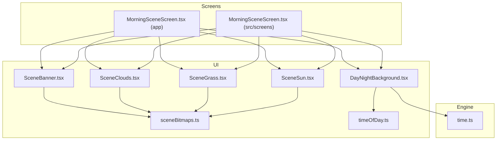
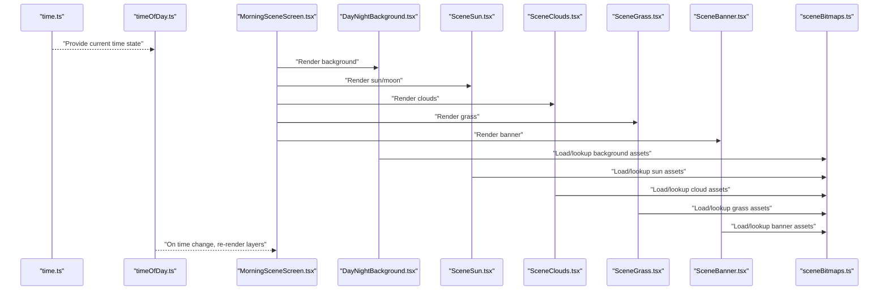
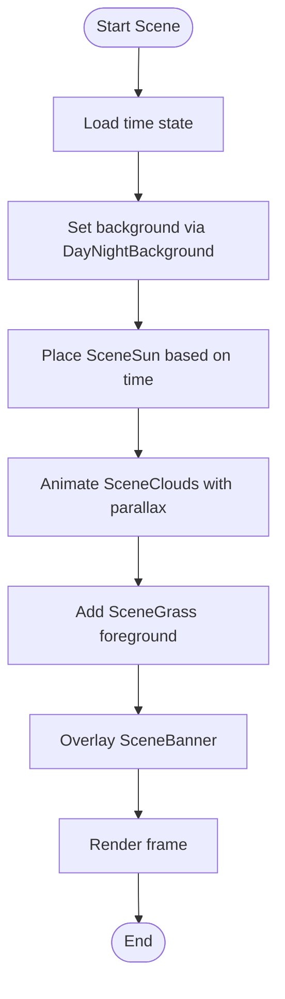
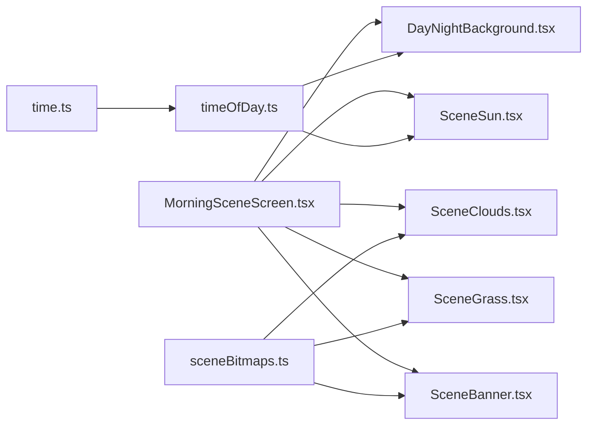

# Visual Effects & Scene Components

<cite>
**Referenced Files in This Document**
- [DayNightBackground.tsx](file://src/ui/DayNightBackground.tsx)
- [SceneBanner.tsx](file://src/ui/SceneBanner.tsx)
- [SceneClouds.tsx](file://src/ui/SceneClouds.tsx)
- [SceneGrass.tsx](file://src/ui/SceneGrass.tsx)
- [SceneSun.tsx](file://src/ui/SceneSun.tsx)
- [sceneBitmaps.ts](file://src/ui/sceneBitmaps.ts)
- [timeOfDay.ts](file://src/ui/timeOfDay.ts)
- [time.ts](file://src/engine/time.ts)
- [MorningSceneScreen.tsx](file://app/morning-scene.tsx)
- [MorningSceneScreen.tsx](file://src/screens/MorningSceneScreen.tsx)
</cite>

## Table of Contents

1. [Introduction](#introduction)
2. [Project Structure](#project-structure)
3. [Core Components](#core-components)
4. [Architecture Overview](#architecture-overview)
5. [Detailed Component Analysis](#detailed-component-analysis)
6. [Dependency Analysis](#dependency-analysis)
7. [Performance Considerations](#performance-considerations)
8. [Troubleshooting Guide](#troubleshooting-guide)
9. [Conclusion](#conclusion)
10. [Appendices](#appendices)

## Introduction

This document explains the visual effects and scene composition system used to build rich, time-aware environments. It focuses on:

- DayNightBackground for dynamic time-based backgrounds
- Scene composition components: SceneBanner, SceneClouds, SceneGrass, SceneSun
- The scene bitmap system for optimized rendering
- Layering techniques, parallax effects, and performance optimization
- Examples for building custom scenes and integrating with the time system

The goal is to help you compose complex scenes efficiently while maintaining smooth performance across devices.

## Project Structure

The visual system lives primarily under src/ui, with supporting engine logic in src/engine and usage screens under app and src/screens. Key files include:

- UI components for day/night background and scene elements
- A dedicated module for scene bitmaps and caching
- Time utilities that expose current time state and transitions

**Diagram sources**

- [DayNightBackground.tsx](file://src/ui/DayNightBackground.tsx)
- [SceneBanner.tsx](file://src/ui/SceneBanner.tsx)
- [SceneClouds.tsx](file://src/ui/SceneClouds.tsx)
- [SceneGrass.tsx](file://src/ui/SceneGrass.tsx)
- [SceneSun.tsx](file://src/ui/SceneSun.tsx)
- [sceneBitmaps.ts](file://src/ui/sceneBitmaps.ts)
- [timeOfDay.ts](file://src/ui/timeOfDay.ts)
- [time.ts](file://src/engine/time.ts)
- [MorningSceneScreen.tsx](file://app/morning-scene.tsx)
- [MorningSceneScreen.tsx](file://src/screens/MorningSceneScreen.tsx)

**Section sources**

- [DayNightBackground.tsx](file://src/ui/DayNightBackground.tsx)
- [SceneBanner.tsx](file://src/ui/SceneBanner.tsx)
- [SceneClouds.tsx](file://src/ui/SceneClouds.tsx)
- [SceneGrass.tsx](file://src/ui/SceneGrass.tsx)
- [SceneSun.tsx](file://src/ui/SceneSun.tsx)
- [sceneBitmaps.ts](file://src/ui/sceneBitmaps.ts)
- [timeOfDay.ts](file://src/ui/timeOfDay.ts)
- [time.ts](file://src/engine/time.ts)
- [MorningSceneScreen.tsx](file://app/morning-scene.tsx)
- [MorningSceneScreen.tsx](file://src/screens/MorningSceneScreen.tsx)

## Core Components

- DayNightBackground: Renders a background that adapts to the current time of day. It reads time state and applies appropriate colors or assets to create dawn, day, dusk, and night visuals.
- SceneBanner: Provides a top banner layer for scene branding or contextual information.
- SceneClouds: Adds atmospheric depth with cloud layers that can be animated or parallaxed.
- SceneGrass: Ground-level detail layer that enhances immersion.
- SceneSun: Displays sun/moon elements whose position and opacity reflect the time of day.
- sceneBitmaps: Centralized asset management and caching for scene elements to reduce memory churn and improve render performance.

These components are designed to be composed together within a screen to form a cohesive environment.

**Section sources**

- [DayNightBackground.tsx](file://src/ui/DayNightBackground.tsx)
- [SceneBanner.tsx](file://src/ui/SceneBanner.tsx)
- [SceneClouds.tsx](file://src/ui/SceneClouds.tsx)
- [SceneGrass.tsx](file://src/ui/SceneGrass.tsx)
- [SceneSun.tsx](file://src/ui/SceneSun.tsx)
- [sceneBitmaps.ts](file://src/ui/sceneBitmaps.ts)

## Architecture Overview

The scene system follows a layered architecture:

- Background layer: DayNightBackground sets the base color palette based on time.
- Midground layers: SceneSun and SceneClouds provide atmospheric elements.
- Foreground layer: SceneGrass adds ground details.
- Overlay layer: SceneBanner provides contextual overlays.

Time flows from the engine into UI via time utilities, ensuring all layers remain synchronized. Bitmaps are cached centrally to avoid repeated allocations.

**Diagram sources**

- [time.ts](file://src/engine/time.ts)
- [timeOfDay.ts](file://src/ui/timeOfDay.ts)
- [MorningSceneScreen.tsx](file://app/morning-scene.tsx)
- [MorningSceneScreen.tsx](file://src/screens/MorningSceneScreen.tsx)
- [DayNightBackground.tsx](file://src/ui/DayNightBackground.tsx)
- [SceneSun.tsx](file://src/ui/SceneSun.tsx)
- [SceneClouds.tsx](file://src/ui/SceneClouds.tsx)
- [SceneGrass.tsx](file://src/ui/SceneGrass.tsx)
- [SceneBanner.tsx](file://src/ui/SceneBanner.tsx)
- [sceneBitmaps.ts](file://src/ui/sceneBitmaps.ts)

## Detailed Component Analysis

### DayNightBackground

Purpose:

- Dynamically adjusts background visuals based on the current time of day.
- Ensures consistent color palettes across scenes during transitions.

Key behaviors:

- Reads time state from time utilities.
- Applies appropriate background colors or textures.
- Responds to time changes to animate transitions smoothly.

Integration:

- Consumes time state from time.ts via timeOfDay.ts.
- Works alongside other scene layers to maintain visual coherence.

**Section sources**

- [DayNightBackground.tsx](file://src/ui/DayNightBackground.tsx)
- [timeOfDay.ts](file://src/ui/timeOfDay.ts)
- [time.ts](file://src/engine/time.ts)

### SceneBanner

Purpose:

- Provides an overlay banner for scene context or branding.
- Positioned above other layers to ensure visibility.

Key behaviors:

- Renders static or dynamic content depending on props.
- Integrates with the overall theme and layout constraints.

Usage:

- Compose within a scene container to add informational overlays.

**Section sources**

- [SceneBanner.tsx](file://src/ui/SceneBanner.tsx)

### SceneClouds

Purpose:

- Adds atmospheric depth with cloud layers.
- Supports parallax movement for immersive effect.

Key behaviors:

- Uses cached bitmaps for efficient rendering.
- Can be configured for speed and direction of movement.

Parallax technique:

- Layers move at different speeds relative to camera or user interaction.
- Reduces perceived complexity by leveraging precomputed assets.

**Section sources**

- [SceneClouds.tsx](file://src/ui/SceneClouds.tsx)
- [sceneBitmaps.ts](file://src/ui/sceneBitmaps.ts)

### SceneGrass

Purpose:

- Renders ground-level details to enhance immersion.
- Typically placed in the foreground layer.

Key behaviors:

- Uses cached bitmaps for performance.
- May include subtle animations or variations.

**Section sources**

- [SceneGrass.tsx](file://src/ui/SceneGrass.tsx)
- [sceneBitmaps.ts](file://src/ui/sceneBitmaps.ts)

### SceneSun

Purpose:

- Displays sun or moon elements reflecting the current time.
- Adjusts position, size, and opacity based on time progression.

Key behaviors:

- Reads time state to compute celestial positioning.
- Integrates with background colors for seamless blending.

**Section sources**

- [SceneSun.tsx](file://src/ui/SceneSun.tsx)
- [timeOfDay.ts](file://src/ui/timeOfDay.ts)

### Scene Bitmap System

Purpose:

- Centralizes asset loading and caching for scene elements.
- Minimizes memory churn and improves render performance.

Key behaviors:

- Preloads and caches bitmaps for backgrounds, clouds, grass, and banners.
- Provides lookup functions to retrieve assets quickly.

Optimization strategies:

- Reuse shared assets across components.
- Avoid redundant allocations during frame updates.

**Section sources**

- [sceneBitmaps.ts](file://src/ui/sceneBitmaps.ts)

### Composition Example: Morning Scene

A typical scene composes multiple layers to create a rich environment:

- Background set by DayNightBackground according to morning time.
- SceneSun positioned for sunrise.
- SceneClouds drifting slowly.
- SceneGrass providing ground detail.
- SceneBanner adding contextual information.

**Diagram sources**

- [MorningSceneScreen.tsx](file://app/morning-scene.tsx)
- [MorningSceneScreen.tsx](file://src/screens/MorningSceneScreen.tsx)
- [DayNightBackground.tsx](file://src/ui/DayNightBackground.tsx)
- [SceneSun.tsx](file://src/ui/SceneSun.tsx)
- [SceneClouds.tsx](file://src/ui/SceneClouds.tsx)
- [SceneGrass.tsx](file://src/ui/SceneGrass.tsx)
- [SceneBanner.tsx](file://src/ui/SceneBanner.tsx)

**Section sources**

- [MorningSceneScreen.tsx](file://app/morning-scene.tsx)
- [MorningSceneScreen.tsx](file://src/screens/MorningSceneScreen.tsx)

## Dependency Analysis

Component relationships:

- DayNightBackground depends on time utilities for state.
- SceneSun computes position from time state.
- SceneClouds and SceneGrass rely on sceneBitmaps for assets.
- SceneBanner is independent but overlays other layers.

**Diagram sources**

- [time.ts](file://src/engine/time.ts)
- [timeOfDay.ts](file://src/ui/timeOfDay.ts)
- [DayNightBackground.tsx](file://src/ui/DayNightBackground.tsx)
- [SceneSun.tsx](file://src/ui/SceneSun.tsx)
- [SceneClouds.tsx](file://src/ui/SceneClouds.tsx)
- [SceneGrass.tsx](file://src/ui/SceneGrass.tsx)
- [SceneBanner.tsx](file://src/ui/SceneBanner.tsx)
- [sceneBitmaps.ts](file://src/ui/sceneBitmaps.ts)
- [MorningSceneScreen.tsx](file://app/morning-scene.tsx)
- [MorningSceneScreen.tsx](file://src/screens/MorningSceneScreen.tsx)

**Section sources**

- [time.ts](file://src/engine/time.ts)
- [timeOfDay.ts](file://src/ui/timeOfDay.ts)
- [sceneBitmaps.ts](file://src/ui/sceneBitmaps.ts)
- [DayNightBackground.tsx](file://src/ui/DayNightBackground.tsx)
- [SceneSun.tsx](file://src/ui/SceneSun.tsx)
- [SceneClouds.tsx](file://src/ui/SceneClouds.tsx)
- [SceneGrass.tsx](file://src/ui/SceneGrass.tsx)
- [SceneBanner.tsx](file://src/ui/SceneBanner.tsx)
- [MorningSceneScreen.tsx](file://app/morning-scene.tsx)
- [MorningSceneScreen.tsx](file://src/screens/MorningSceneScreen.tsx)

## Performance Considerations

- Use sceneBitmaps to cache and reuse assets across frames.
- Minimize per-frame allocations; prefer immutable data where possible.
- Apply parallax only to necessary layers to reduce overdraw.
- Keep animation loops lightweight; update positions incrementally.
- Batch renders when possible to reduce redraw overhead.
- Monitor memory usage during transitions between times of day.

[No sources needed since this section provides general guidance]

## Troubleshooting Guide

Common issues and resolutions:

- Time synchronization problems: Ensure time state is correctly propagated to all layers.
- Asset loading errors: Verify sceneBitmaps cache keys match expected assets.
- Parallax jitter: Check frame rates and animation step sizes.
- Overdraw and lag: Reduce layer count or simplify assets for lower-end devices.

**Section sources**

- [sceneBitmaps.ts](file://src/ui/sceneBitmaps.ts)
- [timeOfDay.ts](file://src/ui/timeOfDay.ts)

## Conclusion

The visual effects and scene composition system provides a modular, performant foundation for building rich, time-aware environments. By combining DayNightBackground with layered scene components and a centralized bitmap cache, you can create immersive scenes that adapt seamlessly to time changes while maintaining smooth performance.

[No sources needed since this section summarizes without analyzing specific files]

## Appendices

### Building Custom Scene Compositions

Steps:

- Create a new screen component that imports scene layers.
- Configure DayNightBackground with desired time behavior.
- Add SceneSun, SceneClouds, SceneGrass, and SceneBanner as needed.
- Use sceneBitmaps to preload and reference assets.
- Integrate time state via timeOfDay.ts to keep layers synchronized.

### Integrating with the Time System

- Subscribe to time updates from time.ts through timeOfDay.ts.
- Trigger re-renders or animations when time transitions occur.
- Ensure all layers respond consistently to time changes.

[No sources needed since this section provides general guidance]
