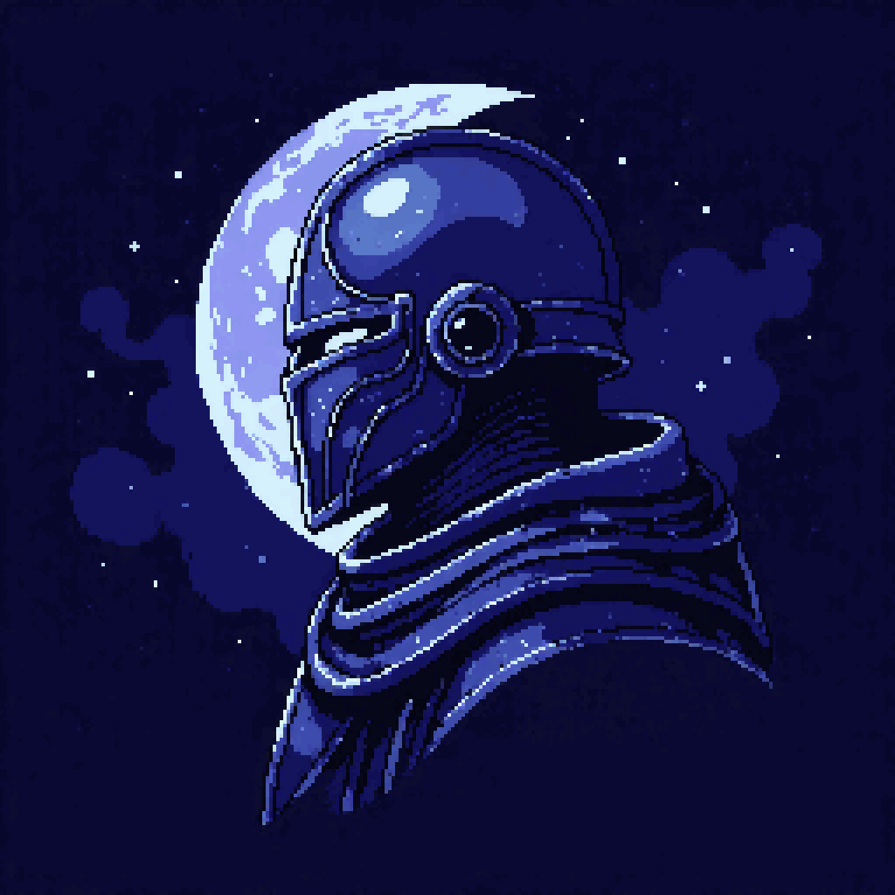

# 8bit Sleep

Pixel-art sleep tamagotchi. Your hero stays alive only while **you** sleep — bad nights deal damage, a perfect week levels you up and opens a loot chest.

<p align="center">
  
</p>

<p align="center">
  
  
  
  
  
  
  
</p>

## Stack

- **App:** Expo SDK 54 · React Native · TypeScript · Expo Router
- **State:** Zustand + AsyncStorage (offline-first)
- **Backend:** Go (`server/`) — AI oracle, morning chat, Mi Fitness
- **Tests and codestyle:** Jest - ESLint - Prettier

> Demo runs in store **Expo Go** — don't bump Expo past what Expo Go supports.

## Run

```bash
pnpm install
cp .env.example .env    # set EXPO_PUBLIC_API_ORIGIN if you need the API
pnpm start              # scan QR with Expo Go
```

```bash
pnpm run check          # lint + typecheck + jest (before commit)
```

Keep your sleep.
