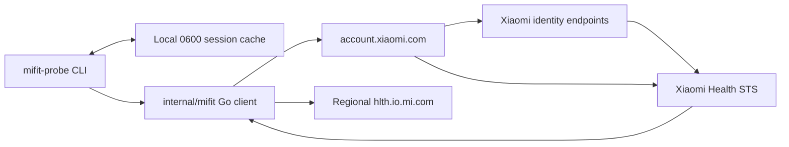
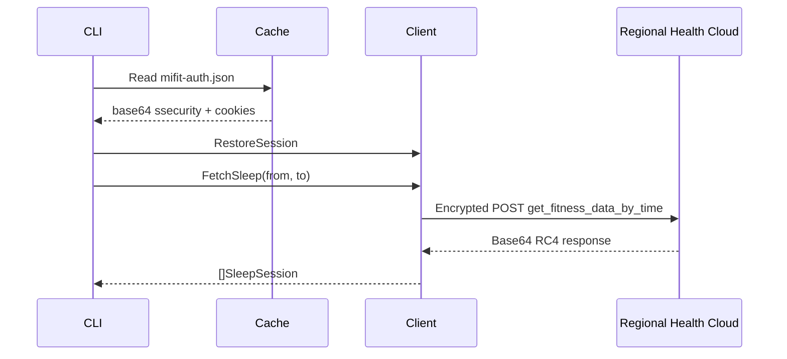
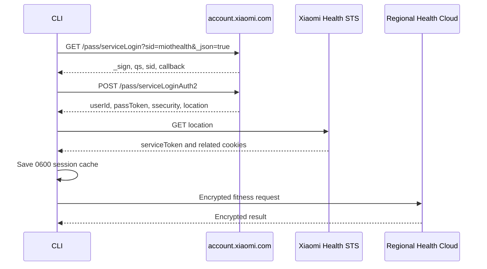
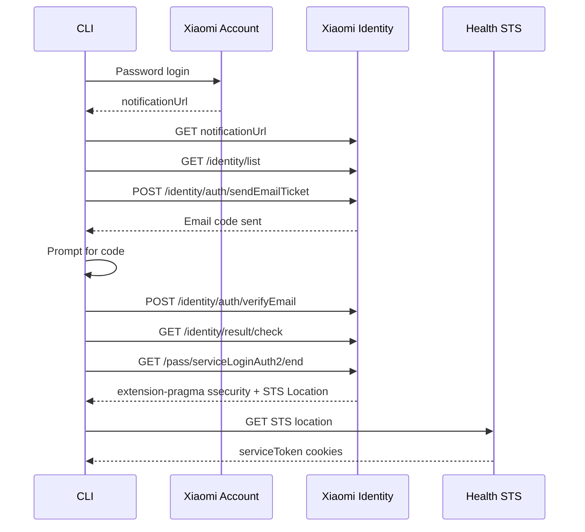

# Mi Fitness Reverse API Reference

## 1. Purpose, scope, and status

This document describes the unofficial Xiaomi Mi Fitness integration implemented
in this repository. It documents:

- the public Go methods exposed by `internal/mifit`;
- the Xiaomi Account, identity verification, STS, and Health Cloud HTTP calls;
- the exact order in which those calls are made;
- the RC4/signature transport used by Xiaomi Health Cloud;
- the CLI authentication and session-cache behavior;
- the normalized sleep model returned to callers;
- the purpose of every implementation and test file;
- the separate legacy Mi Fit/Zepp Life provider.

This is a reverse-engineered protocol, not an official Xiaomi API. Endpoint
names, request fields, response fields, cookies, cryptography, and behavior can
change without notice.

## Contents

1. [Purpose, scope, and status](#1-purpose-scope-and-status)
2. [Architecture overview](#2-architecture-overview)
3. [Public Go API](#3-public-go-api)
4. [Remote HTTP endpoints](#4-remote-http-endpoints)
5. [Complete request order](#5-complete-request-order)
6. [Health Cloud request format](#6-health-cloud-request-format)
7. [Health Cloud response format](#7-health-cloud-response-format)
8. [Sleep parsing and normalized model](#8-sleep-parsing-and-normalized-model)
9. [How to obtain access](#9-how-to-obtain-access)
10. [CLI command reference](#10-cli-command-reference)
11. [Diagnostics](#11-diagnostics)
12. [Error model and CLI exit codes](#12-error-model-and-cli-exit-codes)
13. [File map](#13-file-map)
14. [Legacy Mi Fit/Zepp Life flow](#14-legacy-mi-fitzepp-life-request-flow)
15. [Security constraints](#15-security-constraints)
16. [Known limitations](#16-known-limitations)
17. [Sources and licensing](#17-sources-and-licensing)

Requested documentation map:

| Question                          | Primary sections                                                                                                                                              |
| --------------------------------- | ------------------------------------------------------------------------------------------------------------------------------------------------------------- |
| Which methods exist?              | [Public Go API](#3-public-go-api) and [Remote HTTP endpoints](#4-remote-http-endpoints)                                                                       |
| In which order are requests sent? | [Complete request order](#5-complete-request-order), [request format](#6-health-cloud-request-format), and [response format](#7-health-cloud-response-format) |
| How is access obtained?           | [How to obtain access](#9-how-to-obtain-access) and [CLI reference](#10-cli-command-reference)                                                                |
| What is implemented in each file? | [File map](#13-file-map)                                                                                                                                      |

The modern provider targets:

```text
Application: Mi Fitness / Xiaomi Wear
Android package: com.xiaomi.wearable
Xiaomi Account service ID: miothealth
```

The legacy provider targets:

```text
Application: old Mi Fit / Zepp Life
Android package: com.xiaomi.hm.health
```

The two providers are unrelated at the protocol level. A successful legacy
request does not prove that modern Mi Fitness works.

### Current implementation status

| Capability                                | Status                             |
| ----------------------------------------- | ---------------------------------- |
| Xiaomi Account email/password login       | Implemented                        |
| Xiaomi Account `userId + passToken` login | Implemented                        |
| Xiaomi email verification challenge       | Implemented                        |
| Captcha challenge                         | Detected, not solved               |
| Phone-only identity challenge             | Not implemented                    |
| Xiaomi STS cookie exchange                | Implemented                        |
| Reusable local authorization cache        | Implemented                        |
| Health Cloud RC4/signature transport      | Implemented and unit-tested        |
| Regional Health Cloud hosts               | `cn`, `de`, `i2`, `ru`, `sg`, `us` |
| Sleep retrieval and pagination            | Implemented                        |
| Sleep normalization                       | Implemented                        |
| Region discovery by sleep count           | Implemented                        |
| Raw source diagnostics                    | Implemented                        |
| Production backend HTTP endpoints         | Not implemented in this spike      |
| React Native integration                  | Not implemented in this spike      |

## 2. Architecture overview

The CLI does not call Mi Fitness through a third-party data service. Requests
go directly to Xiaomi or, for the legacy provider, directly to Huami.



There are four distinct layers:

1. **Xiaomi Account authentication** validates email/password or
   `userId/passToken`.
2. **Identity verification** handles Xiaomi's optional email-code challenge.
3. **STS exchange** converts account credentials into Health Cloud cookies.
4. **Health Cloud transport** signs, RC4-encrypts, sends, decrypts, paginates,
   and normalizes fitness records.

## 3. Public Go API

The Go package is:

```go
import "github.com/advx2026/8bit-sleep/backend/internal/mifit"
```

Because it is an `internal` package, it can only be imported by code located
inside the parent Go module tree.

### 3.1 Common provider interface

```go
type Provider interface {
    Name() string
    FetchSleep(
        context.Context,
        time.Time,
        time.Time,
    ) ([]SleepSession, error)
}
```

Both modern Mi Fitness and legacy Huami implement this interface.

### 3.2 `NewMiFitness`

```go
func NewMiFitness(config MiFitnessConfig) (*MiFitnessClient, error)
```

Creates a modern Mi Fitness client.

Configuration:

```go
type MiFitnessConfig struct {
    Region      string
    HTTPClient  *http.Client
    AccountBase string
    HealthBase  string
    Now         func() time.Time
}
```

| Field         | Meaning                                                                        |
| ------------- | ------------------------------------------------------------------------------ |
| `Region`      | Xiaomi Health Cloud IDC: `cn`, `de`, `i2`, `ru`, `sg`, or `us`                 |
| `HTTPClient`  | Optional caller-controlled client; the constructor adds a cookie jar if absent |
| `AccountBase` | Test-only override for `https://account.xiaomi.com`                            |
| `HealthBase`  | Test-only override for the regional Health Cloud host                          |
| `Now`         | Test-only clock override used when generating request nonces                   |

The constructor creates one random 16-character `deviceId` and keeps it stable
for the lifetime of the client.

### 3.3 `Login`

```go
func (c *MiFitnessClient) Login(
    ctx context.Context,
    username string,
    password string,
) error
```

Starts Xiaomi Account email/password authentication.

Important behavior:

- the plaintext password is not stored on `MiFitnessClient`;
- the password is converted to uppercase MD5 because that is what Xiaomi's
  protocol requires;
- HTTPS still protects the request in transit;
- a successful direct login continues to STS automatically;
- an email challenge returns `VerificationRequiredError`;
- captcha is detected and returned as an unsupported authentication error.

MD5 here is protocol compatibility, not password storage or a recommended
password-hashing design.

### 3.4 `LoginWithToken`

```go
func (c *MiFitnessClient) LoginWithToken(
    ctx context.Context,
    userID string,
    passToken string,
) error
```

Authenticates using Xiaomi Account cookies obtained from an existing browser
session. It is the fallback for challenge types that the CLI cannot complete.

Both values are secrets. `passToken` must never be logged, committed, or passed
as a CLI argument.

### 3.5 `BeginEmailVerification`

```go
func (c *MiFitnessClient) BeginEmailVerification(
    ctx context.Context,
) error
```

Uses the `notificationUrl` from the failed password-login response to:

1. enter Xiaomi's identity session;
2. retrieve the available identity methods;
3. request a one-time code by email;
4. retain the identity `context` and `ick` cookie for completion.

It must be called on the same `MiFitnessClient` instance that returned
`VerificationRequiredError`.

### 3.6 `CompleteEmailVerification`

```go
func (c *MiFitnessClient) CompleteEmailVerification(
    ctx context.Context,
    code string,
) error
```

Submits the one-time email code, follows the identity result chain, extracts
`ssecurity` from the `extension-pragma` header, and completes the Health STS
exchange.

The code is trimmed, used for the request, and never retained in the client or
session cache.

### 3.7 `FetchSleep`

```go
func (c *MiFitnessClient) FetchSleep(
    ctx context.Context,
    from time.Time,
    to time.Time,
) ([]SleepSession, error)
```

Reads all sleep records in the inclusive timestamp range.

It:

1. verifies that `ssecurity` and session cookies exist;
2. requests `key=sleep`;
3. follows `next_key` pagination;
4. rejects repeated cursors;
5. limits pagination to 100 pages;
6. parses every `data_list[].value`;
7. sorts normalized sessions by start time.

### 3.8 `ExportSession` and `RestoreSession`

```go
func (c *MiFitnessClient) ExportSession() (MiFitnessSession, error)
func (c *MiFitnessClient) RestoreSession(session MiFitnessSession) error
```

`ExportSession` returns the minimum reusable Health Cloud state:

```go
type MiFitnessSession struct {
    Security string `json:"security"`
    Cookies  string `json:"cookies"`
}
```

`Security` is base64-encoded `ssecurity`. `Cookies` is the serialized Xiaomi
cookie header, normally containing `userId`, `cUserId`, and `serviceToken`.

This structure does not contain:

- the Xiaomi password;
- the email verification code;
- the email address.

It is still equivalent to an active authenticated session and must be treated
as a secret.

`RestoreSession` validates that both fields exist, rejects newline injection in
the cookie string, base64-decodes `Security`, and installs the state into a new
client.

### 3.9 Diagnostic methods

```go
func (c *MiFitnessClient) DiagnoseSleepSources(
    ctx context.Context,
    from time.Time,
    to time.Time,
) []MiFitnessDiagnostic

func (c *MiFitnessClient) DiagnoseSleepRegions(
    ctx context.Context,
    from time.Time,
    to time.Time,
) []MiFitnessRegionDiagnostic
```

`DiagnoseSleepSources` reports counts for:

- confirmed raw endpoint with `sleep`;
- confirmed raw endpoint with `steps`;
- confirmed raw endpoint with `heart_rate`;
- two experimental aggregated endpoint guesses.

The aggregated endpoints are diagnostic only and have returned HTTP 404 in
live testing. They are not part of the working API.

`DiagnoseSleepRegions` sends exactly one `sleep` request to each supported IDC.
It reports only region, base URL, count, pagination presence, or a safe error.
It never returns record values.

### 3.10 Legacy public methods

```go
func NewHuamiLegacy(config HuamiLegacyConfig) *HuamiLegacyClient
func (c *HuamiLegacyClient) Login(
    ctx context.Context,
    email string,
    password string,
) error
func (c *HuamiLegacyClient) FetchSleep(
    ctx context.Context,
    from time.Time,
    to time.Time,
) ([]SleepSession, error)
```

These methods target old Mi Fit/Zepp Life, not modern Mi Fitness.

## 4. Remote HTTP endpoints

### 4.1 Xiaomi Account and identity endpoints

All account and identity calls use:

```text
Base URL: https://account.xiaomi.com
Service ID: miothealth
```

| Method | Path                                                 | Purpose                                                      | Status      |
| ------ | ---------------------------------------------------- | ------------------------------------------------------------ | ----------- |
| `GET`  | `/pass/serviceLogin`                                 | Start account login or exchange `userId/passToken`           | Implemented |
| `POST` | `/pass/serviceLoginAuth2`                            | Submit username and uppercase MD5 password hash              | Implemented |
| `GET`  | URL returned as `notificationUrl`                    | Enter the same identity challenge session                    | Implemented |
| `GET`  | `/identity/list`                                     | Initialize/list identity verification methods                | Implemented |
| `POST` | `/identity/auth/sendEmailTicket`                     | Send one-time email code                                     | Implemented |
| `POST` | `/identity/auth/verifyEmail`                         | Verify one-time email code                                   | Implemented |
| `GET`  | `/identity/result/check`                             | Resolve identity result when verify response has no location | Implemented |
| `GET`  | `/pass/serviceLoginAuth2/end` or redirect equivalent | Finish challenge and expose `ssecurity`                      | Implemented |
| `GET`  | STS `location` returned by Xiaomi                    | Obtain Health Cloud cookies                                  | Implemented |

### 4.2 Regional Health Cloud hosts

| Region flag | Base URL                    | Typical profile location                  |
| ----------- | --------------------------- | ----------------------------------------- |
| `cn`        | `https://hlth.io.mi.com`    | China Mainland                            |
| `de`        | `https://de.hlth.io.mi.com` | Europe, including Finland                 |
| `i2`        | `https://i2.hlth.io.mi.com` | India                                     |
| `ru`        | `https://ru.hlth.io.mi.com` | Russia IDC                                |
| `sg`        | `https://sg.hlth.io.mi.com` | Singapore/selected international profiles |
| `us`        | `https://us.hlth.io.mi.com` | United States                             |

The Xiaomi Account country does not necessarily equal the Mi Fitness data
region. The region selected in Mi Fitness when records were synchronized is
the important value.

### 4.3 Health data endpoints

| Method | Path                                       | Purpose                                    | Status                     |
| ------ | ------------------------------------------ | ------------------------------------------ | -------------------------- |
| `POST` | `/app/v1/data/get_fitness_data_by_time`    | Read time-bounded records for one data key | Implemented                |
| `POST` | `/app/v1/data/get_aggregated_data_by_time` | Diagnostic aggregated-data guess           | Experimental; observed 404 |
| `POST` | `/app/v1/data/get_aggregated_data`         | Diagnostic aggregated-data guess           | Experimental; observed 404 |

The production candidate uses only:

```text
POST /app/v1/data/get_fitness_data_by_time
```

### 4.4 Confirmed and referenced data keys

The generic endpoint accepts one `key` per request.

| Key          | Used by this repository                | Parsing status              |
| ------------ | -------------------------------------- | --------------------------- |
| `sleep`      | Export and diagnostics                 | Fully normalized            |
| `steps`      | Diagnostics                            | Count only                  |
| `heart_rate` | Diagnostics                            | Count only                  |
| `calories`   | Referenced by external implementations | Not requested by normal CLI |
| `weight`     | Referenced by external implementations | Not requested by normal CLI |
| `spo2`       | Referenced by external implementations | Not requested by normal CLI |
| `stress`     | Referenced by external implementations | Not requested by normal CLI |

Only `sleep` is part of the `Provider` abstraction in this spike.

## 5. Complete request order

### 5.1 Fast path: cached session

This is the normal path after the first successful login.



Order:

1. Resolve the cache path.
2. Validate that the file is regular and has no group/other permissions.
3. Decode versioned JSON.
4. Restore `ssecurity` and cookies.
5. Skip username, password, and email verification.
6. Call the regional Health Cloud endpoint.

If the saved session is rejected, the CLI returns an authentication error and
asks the user to rerun with `--reauth`. It does not silently trigger another
email verification.

### 5.2 Password login without a challenge



### Request 1: start login

```http
GET /pass/serviceLogin?_json=true&sid=miothealth HTTP/1.1
Host: account.xiaomi.com
User-Agent: Android-16-3.55.0i-8bit-sleep
Cookie: sdkVersion=accountsdk-18.8.15; deviceId=<random>; userId=<login>
```

Expected response prefix:

```text
&&&START&&&
```

Expected JSON fields:

```json
{
  "qs": "...",
  "_sign": "...",
  "sid": "miothealth",
  "callback": "..."
}
```

The prefix is removed before JSON decoding.

### Request 2: submit password proof

```http
POST /pass/serviceLoginAuth2 HTTP/1.1
Host: account.xiaomi.com
Content-Type: application/x-www-form-urlencoded
User-Agent: Android-16-3.55.0i-8bit-sleep
Cookie: sdkVersion=accountsdk-18.8.15; deviceId=<same-device-id>; userId=<login>
```

Form fields:

| Field      | Value                                     |
| ---------- | ----------------------------------------- |
| `_json`    | `true`                                    |
| `hash`     | Uppercase hexadecimal MD5 of the password |
| `sid`      | Value returned by request 1               |
| `callback` | Value returned by request 1               |
| `_sign`    | Value returned by request 1               |
| `qs`       | Value returned by request 1               |
| `user`     | Xiaomi login/email                        |

Direct-success response fields:

```json
{
  "code": 0,
  "userId": 123456789,
  "passToken": "<secret>",
  "ssecurity": "<base64-secret>",
  "location": "https://...mi.com/.../sts"
}
```

`ssecurity` is base64-decoded and retained in memory. `location` is validated
before being followed.

### Request 3: STS exchange

```http
GET <location returned by Xiaomi> HTTP/1.1
```

Redirect rules:

- at most ten redirects;
- every HTTPS target must remain under `xiaomi.com` or `mi.com`;
- plain HTTP is accepted only for injected local test servers.

The client collects response and cookie-jar cookies, including:

```text
userId
cUserId
serviceToken
```

The exact cookie set can vary.

### 5.3 Token login

Token login avoids sending the password:

```http
GET /pass/serviceLogin?_json=true&sid=miothealth HTTP/1.1
Host: account.xiaomi.com
Cookie: sdkVersion=accountsdk-18.8.15; deviceId=<random>; userId=<id>; passToken=<secret>
```

If valid, the response already includes `ssecurity`, `userId`, `passToken`, and
STS `location`. The flow then continues with the same STS exchange.

### 5.4 Password login with email verification

Xiaomi may accept the password but omit session credentials and return:

```json
{
  "code": 0,
  "description": "成功",
  "securityStatus": 1,
  "notificationUrl": "https://account.xiaomi.com/fe/service/identity/authStart?..."
}
```

The translated description may say “success,” but the missing credentials and
presence of `notificationUrl` mean that identity verification is required.

The notification URL must be used from the same HTTP cookie jar. Opening it in
an unrelated browser session can produce `Something went wrong`.



### Request 3A: enter identity context

```http
GET <notificationUrl> HTTP/1.1
```

The client extracts the `context` query parameter and allows Xiaomi to set the
identity `ick` cookie.

### Request 3B: initialize identity methods

```http
GET /identity/list?sid=miothealth&context=<context>&_locale=en_US HTTP/1.1
Host: account.xiaomi.com
```

This response is used to initialize the identity session. The current
implementation selects mask `0` and the email-ticket endpoint.

### Request 3C: request email code

```http
POST /identity/auth/sendEmailTicket?... HTTP/1.1
Host: account.xiaomi.com
Content-Type: application/x-www-form-urlencoded
```

Query parameters:

| Field     | Value                             |
| --------- | --------------------------------- |
| `_dc`     | Current Unix time in milliseconds |
| `sid`     | `miothealth`                      |
| `context` | Context from `notificationUrl`    |
| `mask`    | `0`                               |
| `_locale` | `en_US`                           |

Form fields:

| Field   | Value                 |
| ------- | --------------------- |
| `retry` | `0`                   |
| `icode` | Empty string          |
| `_json` | `true`                |
| `ick`   | Identity cookie value |

### Request 3D: verify email code

```http
POST /identity/auth/verifyEmail?... HTTP/1.1
Host: account.xiaomi.com
Content-Type: application/x-www-form-urlencoded
```

Query parameters:

| Field     | Value                  |
| --------- | ---------------------- |
| `_flag`   | `8`                    |
| `_json`   | `true`                 |
| `sid`     | `miothealth`           |
| `context` | Saved identity context |
| `mask`    | `0`                    |
| `_locale` | `en_US`                |

Form fields:

| Field    | Value                 |
| -------- | --------------------- |
| `_flag`  | `8`                   |
| `ticket` | One-time email code   |
| `trust`  | `false`               |
| `_json`  | `true`                |
| `ick`    | Identity cookie value |

The endpoint may return JSON, an empty body, HTML, or a redirect. The
implementation obtains the next location from:

1. the HTTP `Location` header;
2. a JSON `location` field;
3. an identity result URL embedded in the response body;
4. a fallback request to `/identity/result/check`.

### Request 3E: resolve result and finish Auth2

The client follows the identity result to an Auth2-end URL without automatic
redirects so it can read:

```http
extension-pragma: {"ssecurity":"<base64-secret>", ...}
Location: https://...mi.com/.../sts
```

Some Xiaomi deployments return an intermediate HTML page named
`Xiaomi Account - Tips`. In that case the same end URL is requested once more.

The recovered `ssecurity` and STS location then continue through the standard
STS exchange.

## 6. Health Cloud request format

### 6.1 Plain logical request

Sleep retrieval begins as this JSON object:

```json
{
  "start_time": 1776960000,
  "end_time": 1784995199,
  "key": "sleep"
}
```

Timestamps are Unix seconds.

For subsequent pages:

```json
{
  "start_time": 1776960000,
  "end_time": 1784995199,
  "key": "sleep",
  "next_key": "<cursor>"
}
```

The CLI interprets `--from` and `--to` as calendar dates in `--timezone`.
`--to` includes the entire final day through `23:59:59`.

### 6.2 Nonce generation

The 12-byte nonce is:

```text
bytes 0..7   = cryptographically random bytes
bytes 8..11  = big-endian uint32(floor(current Unix seconds / 60))
```

Pseudocode:

```text
nonce = random(8) || uint32_be(now_unix / 60)
```

It is transmitted as:

```text
_nonce = Base64(nonce)
```

### 6.3 Per-request key

The original login `ssecurity` is combined with the nonce:

```text
signedNonce = SHA-256(ssecurity || nonce)
```

`signedNonce` is the RC4 key and is also included in both signature source
strings as base64.

### 6.4 Plaintext signature (`rc4_hash__`)

First serialize the JSON compactly into form field `data`.

Signature source:

```text
POST&/app/v1/data/get_fitness_data_by_time&data=<plaintext-json>&<Base64(signedNonce)>
```

Then:

```text
rc4_hash__ = Base64(SHA-1(signature-source))
```

SHA-1 is used only because the Xiaomi wire protocol requires it.

### 6.5 RC4 encryption

`data` and `rc4_hash__` are encrypted independently with the same
`signedNonce`.

For each field:

1. initialize RC4 with `signedNonce`;
2. generate and discard the first 1024 keystream bytes;
3. encrypt the UTF-8 field value;
4. base64-encode the ciphertext.

```text
encryptedData = Base64(RC4-drop1024(signedNonce, plaintextData))
encryptedHash = Base64(RC4-drop1024(signedNonce, plaintextRc4Hash))
```

### 6.6 Final request signature

The final signature covers the encrypted field values:

```text
POST&/app/v1/data/get_fitness_data_by_time
&data=<encryptedData>
&rc4_hash__=<encryptedHash>
&<Base64(signedNonce)>
```

The actual source is one continuous string with `&` separators.

```text
signature = Base64(SHA-1(final-signature-source))
```

### 6.7 HTTP request

```http
POST /app/v1/data/get_fitness_data_by_time HTTP/1.1
Host: <regional-host>
Content-Type: application/x-www-form-urlencoded
Cookie: userId=<redacted>; cUserId=<redacted>; serviceToken=<redacted>
User-Agent: Android-12-3.53.1-vivo-V2284A
region_tag: <region>
handleparams: true
```

Form body:

```text
data=<url-encoded-base64-ciphertext>
&rc4_hash__=<url-encoded-base64-ciphertext>
&signature=<url-encoded-base64-signature>
&_nonce=<url-encoded-base64-original-nonce>
```

Do not attempt to reproduce the Health request with a static curl command.
Every request needs a fresh nonce, signatures, and RC4 encryption.

### 6.8 Retry and timeout behavior

The CLI HTTP client uses:

| Setting                     |       Value |
| --------------------------- | ----------: |
| TCP dial timeout            |  20 seconds |
| TCP keep-alive              |  30 seconds |
| TLS handshake timeout       |  30 seconds |
| Response-header timeout     |  30 seconds |
| Total per-request timeout   |  45 seconds |
| Normal operation budget     | 100 seconds |
| `--diagnose` budget         |   2 minutes |
| `--discover-region` budget  |   4 minutes |
| Per-region discovery budget |  60 seconds |

A transient `net.Error` timeout/temporary failure is retried once for the
read-only Health request. Login is never retried automatically.

## 7. Health Cloud response format

The HTTP body is a base64 string, not plaintext JSON.

Decode order:

1. trim surrounding whitespace;
2. base64-decode the body;
3. RC4-decrypt with the request's `signedNonce`;
4. parse the JSON envelope;
5. require `code == 0`;
6. decode `result` into the endpoint-specific type.

Decrypted envelope:

```json
{
  "code": 0,
  "message": "ok",
  "result": {
    "data_list": [],
    "has_more": false,
    "next_key": ""
  }
}
```

Authentication-like envelope failures include explicit auth/session messages
or code `-10001`.

### Data page

```json
{
  "data_list": [
    {
      "sid": "device-or-record-source",
      "time": 1784900000,
      "zone_offset": 10800,
      "zone_name": "Europe/Moscow",
      "value": "{\"bedtime\":1784860000,\"wake_up_time\":1784890000}"
    }
  ],
  "has_more": false,
  "next_key": ""
}
```

`value` may be:

- a JSON string containing an object; or
- a JSON object directly.

## 8. Sleep parsing and normalized model

### 8.1 Accepted sleep field variants

Start time is the first present value among:

```text
bedtime
device_bedtime
bed_timestamp
deviceBedTime
```

End time is the first present value among:

```text
wake_up_time
device_wake_up_time
out_bed_timestamp
deviceWakeupTime
```

If no end field exists, the outer record's `time` is used.

Other fields:

| Normalized field | Source variants                               |
| ---------------- | --------------------------------------------- |
| Duration         | `duration`, otherwise `(end-start)/60`        |
| Awake minutes    | `awake_duration`, `sleep_awake_duration`      |
| Score            | `score`, `sleep_score`                        |
| Nap              | `is_nap`, `isNap`                             |
| Timezone name    | Outer `zone_name`, otherwise formatted offset |
| UTC offset       | Outer `zone_offset`                           |
| Stage array      | `items`                                       |

### 8.2 Sleep stages

Each `items[]` stage accepts:

```text
start_time or start
end_time or end
state or mode
```

Stage mapping:

| Numeric value | Normalized name |
| ------------: | --------------- |
|           `1` | `deep`          |
|           `2` | `light`         |
|           `3` | `light`         |
|           `4` | `awake`         |
|           `5` | `rem`           |
|         Other | `unknown`       |

Stage duration is `(end-start)/60`.

### 8.3 Normalized `SleepSession`

```json
{
  "provider": "mifitness",
  "external_id": "deviceSid_1784900000",
  "start": "2026-07-24T00:00:00+03:00",
  "end": "2026-07-24T08:00:00+03:00",
  "duration_minutes": 480,
  "awake_minutes": 12,
  "score": 88,
  "is_nap": false,
  "timezone": "Europe/Moscow",
  "utc_offset_seconds": 10800,
  "stages": [
    {
      "name": "deep",
      "minutes": 95
    }
  ]
}
```

External ID is:

```text
<sid-or-unknown>_<outer-record-time>
```

Malformed JSON, empty values, invalid start time, or end time not later than
start produce a decode error instead of silently dropping the record.

## 9. How to obtain access

### 9.1 Interactive CLI login

From `backend`:

```bash
go run ./cmd/mifit-probe \
  --provider mifitness \
  --region de \
  --timezone Europe/Moscow \
  --from 2026-04-24 \
  --to 2026-07-24 \
  --json
```

The CLI prompts:

```text
Xiaomi login:
Xiaomi password:
```

Password input is hidden.

If Xiaomi requires email verification:

```text
Xiaomi requires email verification; requesting a one-time code...
Xiaomi email code:
```

After successful authentication, the CLI saves the reusable session.

### 9.2 Non-interactive password login

```bash
export MIFIT_USERNAME='user@example.com'
read -rs MIFIT_PASSWORD
export MIFIT_PASSWORD

go run ./cmd/mifit-probe \
  --provider mifitness \
  --region de \
  --json

unset MIFIT_PASSWORD
```

If a verification code is known:

```bash
export MIFIT_VERIFICATION_CODE='...'
```

Unset it immediately after use.

### 9.3 Token login

Obtain `userId` and `passToken` from the cookies of the user's own authenticated
`account.xiaomi.com` browser session.

```bash
export MIFIT_USER_ID='...'
read -rs MIFIT_PASS_TOKEN
export MIFIT_PASS_TOKEN

go run ./cmd/mifit-probe \
  --provider mifitness \
  --region de \
  --json

unset MIFIT_USER_ID MIFIT_PASS_TOKEN
```

The CLI intentionally has no password or token flags because command-line
arguments are visible in shell history and process listings.

### 9.4 Session cache

Default Linux path:

```text
~/.config/8bit-sleep/mifit-auth.json
```

Other platforms use Go's `os.UserConfigDir`.

Redacted structure:

```json
{
  "version": 1,
  "provider": "mifitness",
  "region": "de",
  "saved_at": "2026-07-24T12:00:00Z",
  "session": {
    "security": "<base64-ssecurity>",
    "cookies": "cUserId=<redacted>; serviceToken=<redacted>; userId=<redacted>"
  }
}
```

Storage protections:

- parent directory is created with `0700`;
- temporary file is created in the same directory;
- temporary file is changed to `0600`;
- data is written and synchronized;
- the temporary file atomically replaces the destination;
- final permissions are enforced as `0600`;
- files with group/other permissions are rejected on load;
- JSON is size-limited and unknown fields are rejected.

The cache is permission-protected, not encrypted. Anyone who can read it can
act as the Xiaomi Health session until the credentials expire.

Cache flags:

```text
--auth-cache PATH   use an explicit cache file
--reauth            ignore cache and authenticate again
--no-auth-cache     do not load or save a session
```

The cache metadata records the region used when it was created, but the
session itself can be reused to test other Xiaomi regional IDCs.

### 9.5 Direct Go use

Simplified example:

```go
package example

import (
    "context"
    "time"

    "github.com/advx2026/8bit-sleep/backend/internal/mifit"
)

func fetch(ctx context.Context, session mifit.MiFitnessSession) ([]mifit.SleepSession, error) {
    client, err := mifit.NewMiFitness(mifit.MiFitnessConfig{
        Region: "de",
    })
    if err != nil {
        return nil, err
    }
    if err := client.RestoreSession(session); err != nil {
        return nil, err
    }
    from := time.Date(2026, 7, 1, 0, 0, 0, 0, time.UTC)
    to := time.Date(2026, 7, 24, 23, 59, 59, 0, time.UTC)
    return client.FetchSleep(ctx, from, to)
}
```

For a first login, call `Login`. If `errors.As` finds
`*mifit.VerificationRequiredError`, call `BeginEmailVerification`, collect the
user's email code, then call `CompleteEmailVerification`.

## 10. CLI command reference

| Flag                | Default              | Meaning                                  |
| ------------------- | -------------------- | ---------------------------------------- |
| `--provider`        | `mifitness`          | `mifitness` or `huami-legacy`            |
| `--region`          | `cn`                 | Health Cloud IDC                         |
| `--from`            | 13 days before today | First date, `YYYY-MM-DD`                 |
| `--to`              | Today                | Last date, `YYYY-MM-DD`, inclusive       |
| `--timezone`        | `Europe/Moscow`      | IANA timezone for date boundaries/output |
| `--json`            | `false`              | Print normalized sessions as JSON        |
| `--require-sleep`   | `false`              | Return exit code 6 when result is empty  |
| `--auth-cache`      | OS config path       | Explicit authorization-cache file        |
| `--reauth`          | `false`              | Ignore existing cache and log in again   |
| `--no-auth-cache`   | `false`              | Disable cache load/save                  |
| `--diagnose`        | `false`              | Print safe source counts/errors          |
| `--discover-region` | `false`              | Probe sleep count in all supported IDCs  |

Environment variables:

| Variable                  | Purpose                          |
| ------------------------- | -------------------------------- |
| `MIFIT_USERNAME`          | Xiaomi Account login             |
| `MIFIT_PASSWORD`          | Xiaomi Account password          |
| `MIFIT_VERIFICATION_CODE` | Xiaomi email code                |
| `MIFIT_USER_ID`           | Token-login user ID              |
| `MIFIT_PASS_TOKEN`        | Token-login pass token           |
| `MIFIT_AUTH_CACHE`        | Authorization-cache path         |
| `MIFIT_LEGACY_EMAIL`      | Legacy Zepp Life email           |
| `MIFIT_LEGACY_PASSWORD`   | Legacy Zepp Life password        |
| `HTTPS_PROXY`             | Optional standard Go HTTPS proxy |

## 11. Diagnostics

### 11.1 Source diagnostics

```bash
go run ./cmd/mifit-probe \
  --provider mifitness \
  --region de \
  --from 2026-04-24 \
  --to 2026-07-24 \
  --diagnose
```

Output contains endpoint, key, count, pagination presence, and error only.

Interpretation:

- non-zero `sleep` count: raw sleep records exist;
- `steps` or `heart_rate` non-zero but `sleep` zero: account and region are
  likely correct, but sleep is absent for the range;
- every confirmed key zero: wrong IDC, different Xiaomi Account, or no cloud
  upload;
- HTTP 404 from aggregated endpoints: expected for experimental probes;
- timeout: region was not successfully checked.

### 11.2 Region discovery

```bash
go run ./cmd/mifit-probe \
  --provider mifitness \
  --from 2026-04-24 \
  --to 2026-07-24 \
  --discover-region
```

An errored region omits `count`. It must not be interpreted as an empty
successful result.

### 11.3 Connectivity check

For a European profile:

```bash
curl -4 -I --connect-timeout 60 https://de.hlth.io.mi.com/
```

Any HTTP response, including 204, 404, or 405, proves that DNS, TCP, and TLS
completed. A timeout before an HTTP response is a network-route problem.

## 12. Error model and CLI exit codes

Library errors carry a stable `ErrorKind`.

| Error kind      | Meaning                                                               |
| --------------- | --------------------------------------------------------------------- |
| `KindConfig`    | Invalid region, dates, missing input, bad cache, request construction |
| `KindAuth`      | Login/session/challenge failure                                       |
| `KindTransport` | Network, timeout, HTTP, or non-auth remote failure                    |
| `KindDecode`    | Prefix, base64, RC4, JSON, schema, pagination failure                 |
| `KindUnknown`   | Error outside the typed library model                                 |

CLI mapping:

| Exit code | Meaning                                                      |
| --------: | ------------------------------------------------------------ |
|       `0` | Success, including an empty result without `--require-sleep` |
|       `2` | Configuration/input failure                                  |
|       `3` | Authentication/session failure                               |
|       `4` | Transport/HTTP/timeout failure                               |
|       `5` | Decode/crypto/schema/pagination failure                      |
|       `6` | API returned no sessions while `--require-sleep` was enabled |

Exit code 6 is not an authentication or network error. It means:

- Health Cloud returned a successful envelope;
- the response was decrypted and decoded;
- all pages were processed;
- zero normalized sleep sessions remained.

## 13. File map

### 13.1 Modern Mi Fitness library

| File                                | Responsibility                                                                             |
| ----------------------------------- | ------------------------------------------------------------------------------------------ |
| `internal/mifit/types.go`           | Provider names, common `Provider` interface, normalized `SleepSession` and `SleepStage`    |
| `internal/mifit/modern.go`          | Client/config construction, password login, token login, login bootstrap, sleep pagination |
| `internal/mifit/modern_auth.go`     | Login credential decoding, challenge detection, account cookies, accepted challenge URLs   |
| `internal/mifit/modern_verify.go`   | Email-code verification state machine and Auth2-end/STS handoff                            |
| `internal/mifit/modern_identity.go` | Identity HTTP helper, safe redirects, cookie lookup, response/location extraction          |
| `internal/mifit/modern_request.go`  | STS completion, regional hosts, encrypted Health request/response, retry, envelopes        |
| `internal/mifit/crypto.go`          | Nonce generation, SHA-256 signed nonce, RC4-drop1024, SHA-1 signatures                     |
| `internal/mifit/parse.go`           | Modern sleep JSON variants, timezone, score, nap, and stage normalization                  |
| `internal/mifit/session.go`         | Export and restore reusable `ssecurity`/cookie state                                       |
| `internal/mifit/diagnose.go`        | Safe source diagnostics and cross-region sleep-count discovery                             |
| `internal/mifit/errors.go`          | Typed error categories used by the CLI                                                     |

### 13.2 CLI

| File                            | Responsibility                                                                          |
| ------------------------------- | --------------------------------------------------------------------------------------- |
| `cmd/mifit-probe/main.go`       | Flags, date range, operation selection, output, exit codes                              |
| `cmd/mifit-probe/auth.go`       | HTTP timeouts, provider selection, credential prompts, email verification orchestration |
| `cmd/mifit-probe/auth_cache.go` | Versioned cache format, default path, permission checks, atomic save                    |

### 13.3 Legacy provider

| File                             | Responsibility                                                        |
| -------------------------------- | --------------------------------------------------------------------- |
| `internal/mifit/legacy.go`       | Huami redirect login, access-token exchange, `band_data.json` request |
| `internal/mifit/legacy_parse.go` | Base64 summary decode and `slp` normalization                         |

### 13.4 Tests

| File                                     | Coverage                                                                         |
| ---------------------------------------- | -------------------------------------------------------------------------------- |
| `internal/mifit/crypto_test.go`          | Fixed nonce/signature/RC4 vectors                                                |
| `internal/mifit/modern_test.go`          | Password/token login, headers, encrypted response, pagination, timeout redaction |
| `internal/mifit/modern_auth_test.go`     | Redirect allowlist and verification detection                                    |
| `internal/mifit/modern_verify_test.go`   | Complete email verification flow through STS                                     |
| `internal/mifit/modern_retry_test.go`    | One retry after transient Health timeout                                         |
| `internal/mifit/parse_test.go`           | Sleep field variants, stages, naps, timezones                                    |
| `internal/mifit/session_test.go`         | Session round-trip and cookie-injection rejection                                |
| `internal/mifit/diagnose_region_test.go` | Region diagnostic metadata without health values                                 |
| `internal/mifit/legacy_test.go`          | Legacy login forms, redirect parsing, base64 sleep summary                       |
| `cmd/mifit-probe/main_test.go`           | Date ranges and error-kind/exit-code mapping                                     |
| `cmd/mifit-probe/auth_cache_test.go`     | Cache permissions, round-trip, validation                                        |

### 13.5 Documentation and module files

| File                   | Responsibility                                                   |
| ---------------------- | ---------------------------------------------------------------- |
| `MIFIT_PROBE.md`       | Operator quick start, commands, smoke tests, and troubleshooting |
| `MIFIT_REVERSE_API.md` | Full protocol and implementation reference                       |
| `go.mod` / `go.sum`    | Go 1.24 module and hidden-terminal-input dependency              |

## 14. Legacy Mi Fit/Zepp Life request flow

This flow exists only to reproduce the original Python research. It is not the
production candidate for modern Mi Fitness.

### Request 1: Huami redirect access token

```http
POST https://api-user.huami.com/registrations/<email>/tokens
Content-Type: application/x-www-form-urlencoded
```

Form fields:

```text
state=REDIRECTION
client_id=HuaMi
redirect_uri=https://s3-us-west-2.amazonws.com/hm-registration/successsignin.html
token=access
password=<password>
```

Redirects are disabled so the client can parse:

```text
Location: ...?access=<token>&country_code=<country>
```

### Request 2: exchange access token

```http
POST https://account.huami.com/v2/client/login
Content-Type: application/x-www-form-urlencoded
```

Important fields:

```text
app_name=com.xiaomi.hm.health
device_id=02:00:00:00:00:00
device_model=android_phone
app_version=4.0.9
grant_type=access_token
country_code=<redirect-country>
code=<redirect-access-token>
```

Expected response:

```json
{
  "token_info": {
    "app_token": "<secret>",
    "user_id": 123456
  }
}
```

### Request 3: read band summaries

```http
GET https://api-mifit.huami.com/v1/data/band_data.json
    ?query_type=summary
    &device_type=android_phone
    &userid=<user-id>
    &from_date=YYYY-MM-DD
    &to_date=YYYY-MM-DD
apptoken: <app-token>
```

Each `data[].summary` is base64-decoded into JSON. Sleep is under `slp`:

```json
{
  "tz": 10800,
  "slp": {
    "st": 1784860000,
    "ed": 1784890000,
    "dp": 95,
    "lt": 350,
    "stage": [
      {
        "start": 60,
        "stop": 120,
        "mode": 5
      }
    ]
  }
}
```

Legacy stage modes:

|  Mode | Name      |
| ----: | --------- |
|   `4` | `light`   |
|   `5` | `deep`    |
| Other | `unknown` |

## 15. Security constraints

- Use only the account owner's credentials and health data.
- Never log the password, email code, `passToken`, `serviceToken`, cookies, or
  `ssecurity`.
- Do not put secrets in CLI flags, URLs, screenshots, bug reports, or commits.
- Treat the cache file as an active login session.
- Keep account and identity redirects restricted to Xiaomi-owned domains.
- Do not automatically bypass captcha, phone verification, or other account
  protections.
- Login is not automatically retried to avoid repeated security challenges.
- Health requests are read-only in this implementation.
- Health/sleep data is wellness data, not a medical diagnosis.
- Put any future production integration behind authenticated backend endpoints;
  the application's public `device_id` is not sufficient protection.
- Encrypt stored production credentials with a managed key. The CLI's `0600`
  file is a diagnostic convenience, not production secret storage.

## 16. Known limitations

1. Xiaomi provides no stability guarantee for these endpoints.
2. The current account may authenticate successfully while returning no Health
   Cloud records.
3. Records visible in Mi Fitness can be local to the phone and absent from the
   cloud API.
4. The correct IDC depends on the Mi Fitness profile region, not necessarily
   Xiaomi Account country.
5. `de` is the expected IDC for European profiles such as Finland.
6. Captcha and phone-only challenges require token-login fallback.
7. Session-cache expiry requires `--reauth`.
8. Only sleep is normalized as a public provider result.
9. Aggregated endpoints in diagnostics are speculative and may return 404.
10. Direct device BLE synchronization and Android local-database extraction are
    outside this implementation.
11. No React Native or production backend endpoint consumes this client yet.

## 17. Sources and licensing

Modern protocol references:

- [SmartScaleConnect](https://github.com/AlexxIT/SmartScaleConnect)
- [mi-fitness-mcp-cn](https://github.com/binglua/mi-fitness-mcp-cn)
- [Xiaomi Cloud Tokens Extractor](https://github.com/PiotrMachowski/Xiaomi-cloud-tokens-extractor)

Legacy protocol reference:

- [hacking-mifit-api](https://github.com/micw/hacking-mifit-api/blob/master/mifit_api.py)

These projects are research references. They are not contacted at runtime.
The probe communicates directly with Xiaomi Account, Xiaomi Health Cloud, or
the explicitly selected legacy Huami endpoints.
